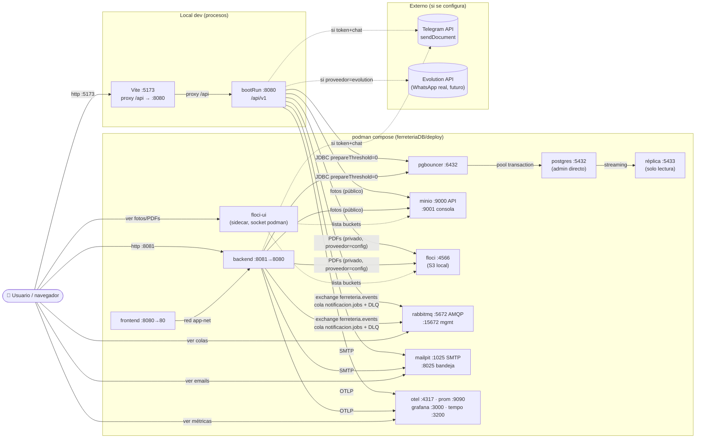

# Sistema Integral de Ferretería

Monorepo con tres proyectos que componen el sistema completo: base de datos, API REST y
aplicación web (SPA).

| Proyecto | Descripción | Stack |
|---|---|---|
| [`ferreteriaDB/`](ferreteriaDB/) | Modelo de datos y despliegue de la BD | PostgreSQL 14+, Podman Compose / Kubernetes / Terraform |
| [`ferreteriaBackend/`](ferreteriaBackend/) | API REST | Spring Boot 3, Java 21, Flyway, JUnit/JaCoCo |
| [`ferreteriaFront/`](ferreteriaFront/) | SPA de caja, inventario y reportes | React 19, Vite 8, TypeScript, TanStack Query, Tailwind |

## Arquitectura

- **Datos** — PostgreSQL con esquemas por módulo (`cat`, `cfg`, `rh`, `seg`, `inv`,
  `com`, `ven`, `fin`, `fis`, `notif`), integridad vía triggers/funciones y zona
  `America/Mexico_City`. Los scripts de `ferreteriaDB/scripts` son la fuente de verdad;
  el backend los consolida en migraciones Flyway.
- **Backend** — API REST en `http://localhost:8080` (`/api/v1`), autenticación JWT con
  refresh rotativo y sesión única, errores RFC 7807 con códigos estables y mensajes
  i18n. Tests unitarios + gates de cobertura JaCoCo (≥80% global).
- **Frontend** — SPA servida por Vite (dev `http://localhost:5173` con proxy `/api →
  :8080`; prod `VITE_API_URL`). Autenticación, roles, POS, caja/cortes, inventario,
  compras, reportes y dashboard.

### Mapa del sistema (contenedores, puertos y conexiones)



Notas:
- En dev local el backend (`bootRun :8080`) habla con la infra de compose por
  `localhost` (PgBouncer `:6432`, MinIO `:9000`, Floci `:4566`, RabbitMQ
  `:5672`, Mailpit `:1025`); dentro de compose usa DNS interno
  (`pgbouncer`, `minio`, `floci`, `rabbitmq`, `mailpit`) con los mismos puertos
  de contenedor.
- El backend **nunca** toca Postgres directo (`:5432` es solo admin) ni la
  réplica (`:5433`, lectura para reportes).
- Buckets: `ferreteria-fotos` (público) en MinIO o Floci según
  `STORAGE_PROVEEDOR`; `ferreteria-tickets` (privado) en el mismo proveedor.
- Observabilidad (`otel`, `prometheus`, `grafana`, `tempo`,
  `postgres-exporter`) es opcional y no afecta el flujo funcional.

## Quickstart (todo el stack)

```bash
# 1) Base de datos (PostgreSQL + PgBouncer)
cd ferreteriaDB/deploy && cp .env.example .env && podman compose up -d

# 2) Backend (aplica migraciones al arrancar; Gradle carga `.env` solo con JWT_SECRET, obligatorio sin default)
cd ../../ferreteriaBackend
./gradlew bootRun

# 3) Frontend
cd ../ferreteriaFront && bun install && bun run dev
```

Detalles y comandos de pruebas/build en el README de cada proyecto.

> **Tras reiniciar el host nada arranca solo** (podman sin linger): repetir
> `podman compose up -d` en `ferreteriaDB/deploy` y luego `bootRun` + `bun run dev`.
> El `.env` del backend ya incluye el bloque de notificaciones
> (`APP_NOTIF_ENABLED=true`, `RABBITMQ_*`, `MAIL_*`), así que el `bootRun`
> levanta con jobs+email sin exports extra. La UI de Floci (`floci-ui`)
> reaparece ~1 min después de `floci`; recargar la página para ver las bandejas.

## Tests (cómo correrlos)

### Backend (`ferreteriaBackend/`)

```bash
./gradlew test                                         # suite completa (~1195 tests)
./gradlew test --tests "mx.ferreteria.api.ven.service.VentaServiceTest"  # uno solo
./gradlew build                                        # compila + tests + gates JaCoCo
```

- **Gates** — JaCoCo ≥80% global y ≥85% en `common/i18n`, `common/error`,
  `common/web` (estado: 85.4% global, `build` en verde).
- **Convenciones** — unitarios JUnit5 + Mockito (`LENIENT`,
  `@Mock`/`@InjectMocks`), excepciones asertadas por `ErrorCode` (nunca por
  texto), sin contexto Spring ni BD. Los `*IT` (ej. `AuthFlowIT`) requieren
  socket Docker/Podman y se saltan sin él.
- **Reglas ArchUnit** (`MensajesSoloDesdeErrorCodeTest`, 8 reglas): mensajes
  solo vía `ErrorCode`, sin ciclos entre módulos, naming `@Service`/`@Controller`,
  controllers sin `*Repository`, sin `@Service` en `common.web`, entidades no
  expuestas como controllers, y cada `*Gateway` con exactamente una
   implementación. Los ciclos `cat↔inv/ven` se rompieron con ports lado-consumidor
   (`StockPort`/`CreditoPort` en `cat` + adapters en `inv`/`ven`); igual el ciclo
   `seg→notif` del OTP (`OtpWhatsappPort` en `seg` + adapter en `notif`).

### Frontend (`ferreteriaFront/`)

```bash
bunx vitest run                   # suite completa (113 archivos, ~1190 tests)
bunx vitest run src/test/ventas   # por carpeta/archivo
bunx vitest run --coverage        # con reporte + gate de thresholds
bun run lint && bun run build     # los tests también deben tipar (tsc)
```

- **Gate** — thresholds 80% en líneas/funciones/ramas/statements
  (estado: 98.7% / 89.8% / 91.5% / 98.7%).
- **Convenciones** — todos los tests en `src/test/` como espejo de `src/`
  (config `include` solo `src/test/**`; nada de `*.test.*` junto al fuente),
  imports con `@/...`, red mockeada con `vi.mock("@/lib/api/*")`, providers
  `MemoryRouter` + `QueryClientProvider(retry:false)` + `ToastProvider`, roles
  vía `useAuthStore.setState`. Sin backend real.
- **Exclusiones de cobertura** — `src/main.tsx`, `src/vite-env.d.ts` y
  `src/telemetry/otel.ts` (la rama OTLP real exige collector con red;
  en jsdom solo se cubre el modo noop).

## Puertos y conexiones (dev local)

La app corre con `bootRun` + `bun run dev` en el host; solo datos, storage y
observabilidad van en contenedores (`ferreteriaDB/deploy`, red `db-net`/`app-net`/`obs-net`).

| Servicio | Contenedor / proceso | Puerto host | URL / uso |
|---|---|---|---|
| Frontend Vite | host (`bun run dev`) | 5173 | http://localhost:5173 · proxy `/api → :8080` |
| Backend API | host (`./gradlew bootRun`) | 8080 | http://localhost:8080/`api/v1` · `/actuator/health` |
| PostgreSQL primario | `ferreteria-postgres-primary` | 5432 | admin directo (la app usa PgBouncer) |
| PostgreSQL réplica | `ferreteria-postgres-replica` | 5433 | solo lectura |
| PgBouncer | `ferreteria-pgbouncer` | 6432 | conexión de la app (`PG_HOST/PORT`) |
| MinIO API (fotos) | `ferreteria-minio` | 9000 | S3 + URLs públicas `http://localhost:9000/ferreteria-fotos/…` |
| MinIO consola | `ferreteria-minio` | 9001 | http://localhost:9001 (usuario `MINIO_ROOT_USER`) |
| Floci S3 (fotos) | `ferreteria-floci` | 4566 | S3 local; backend lo usa con `STORAGE_PROVEEDOR=floci` (default: `minio`) |
| Floci consola web | sidecar `floci-ui` | 4500 | http://localhost:4500 (o vía http://localhost:4566/_floci/ui); requiere socket del motor (ver `PODMAN_SOCKET`) |
| Backend contenerizado (opcional) | `ferreteria-backend` | 8081 | swagger/health directo; dentro de compose usa `MINIO_ENDPOINT=http://minio:9000` |
| Frontend contenerizado (opcional) | `ferreteria-frontend` | 8080 | Nginx `:80`; solo prod/staging (choca con bootRun) |
| RabbitMQ (notificaciones) | `ferreteria-rabbitmq` | 5672 + 15672 | AMQP (`RABBITMQ_USER/PASSWORD`) y consola mgmt http://localhost:15672 |
| Mailpit (email dev) | `ferreteria-mailpit` | 1025 + 8025 | SMTP de mentira; bandeja en http://localhost:8025 |

Notas:
- Proveedor de fotos (`STORAGE_PROVEEDOR=minio|floci`, default `minio`):
  MinIO (`minio:9000` interno, `MINIO_PUBLIC_URL` al browser) o Floci S3
  (`floci:4566` interno, `FLOCI_PUBLIC_URL` al browser). En ambos hay dos
  URLs distintas con propósito distinto: **ENDPOINT** = lo que usa el backend
  en red interna para subir; **PUBLIC_URL** = base de la URL que se guarda en
  `foto_url`/`imagen_url` y resuelve el browser (debe ser alcanzable desde
  quien use la app, no necesariamente localhost).
- `bootRun` en host usa `MINIO_ENDPOINT=http://localhost:9000` (el DNS `minio`
  solo existe dentro de la red compose). `MINIO_PUBLIC_URL` debe ser alcanzable
  desde el browser (dev: `http://localhost:9000`). Con Floci es igual:
  `FLOCI_ENDPOINT=http://localhost:4566` en host, `http://floci:4566` en compose.
- Subir fotos: `POST /api/v1/archivos/imagen` (multipart `archivo`,
  jpeg/png/webp ≤5 MB, requiere rol operativo + header `X-XSRF-TOKEN`) →
  `201 { data: { url } }` → esa URL pública va en `fotoUrl`/`imagenUrl` del
  create/update. El backend optimiza a JPEG, renombra a UUID y crea el bucket
  público solo si no existe. Con Floci la consola muestra los objetos en
  http://localhost:4500.
- Floci va con `FLOCI_ENFORCE_AUTH=false` (default upstream): con `true` la
  consola `floci-ui` no lista nada (firma como cuenta `000000000000` y Floci
  solo reconoce la key `test` → 403 `InvalidAccessKeyId`). El backend siempre
  firma con `test`/`test`, así que el flujo no se ve afectado.
- La imagen de subida requiere imagen `quay.io/minio/minio` (Docker Hub
  rechaza el pull del tag fijado en el compose).

## Notificaciones (ticket PDF / nómina pagada)

- **Flujo** — `checkout`/`pagar` publican eventos de dominio (`VentaCreadaEvent`,
  `NominaPagadaEvent`; los dominios no dependen del módulo `notif`). El hook
  `AFTER_COMMIT` crea el job en `notif.notificacion_jobs` y lo procesa en tx
  propia (`REQUIRES_NEW`): genera el PDF (OpenPDF, datos solo de BD), lo sube al
  bucket PRIVADO `ferreteria-tickets` (claves `tickets/`/`nominas/`, proveedor
  `minio|floci`), refleja la clave en
  `ven.ventas.pdf_url`, publica en el exchange `ferreteria.events` y el consumer
  envía por **email** (adjunto) / **Telegram** (`sendDocument`, si hay token+chat) /
  **WhatsApp** (mock en proceso por default; Evolution API real con
  `WHATSAPP_PROVEEDOR=evolution` + base-url/instancia/api-key, sin cambiar
  código). Destinatario venta =
  `Cliente.email/whatsapp`; nómina = `rh.empleados.email/whatsapp` (columna V21).
  Fallos → job en `ERROR` + reconciler cada 30 s (cola durable + DLQ
  `notificacion.jobs.dlq`).
- **Endpoint** — `GET /api/v1/ventas/{id}/ticket.pdf` (`application/pdf`, mismos
  roles de lectura que ventas).
- **Informe diario del dashboard** — PDF con los 11 KPIs (`GET /reportes/dashboard`)
  + cierre diario (`GET /reportes/cierre-diario`), enviado por **correo y WhatsApp**
  a usuarios activos con rol `GERENTE`/`ADMINISTRADOR` que tengan correo en
  `seg.usuarios` o WhatsApp en `rh.empleados`. Dos vías: botón **Enviar informe**
  en el dashboard (solo GERENTE/ADMINISTRADOR; si ya se envió en el día pide
  confirmación de reenvío vía `GET .../informe/estado`) y JOB diario 1 vez al día
  (`POST .../dashboard/informe`). Auditoría en `notif.notificacion_jobs`
  (`tipo=INFORME_DASHBOARD`, un registro por día). Vars:
  `INFORME_DASHBOARD_CRON` (default `0 0 7 * * *`), `INFORME_DASHBOARD_ZONA`,
  `INFORME_DASHBOARD_JOB_ENABLED=false` (solo manual) / `true` (manual + JOB);
  requiere `APP_NOTIF_ENABLED=true`.
- **Activación** — `APP_NOTIF_ENABLED=true` (compose lo trae; en `bootRun` local
  default `false`: los jobs quedan `PENDIENTE` y se procesan al habilitar).
  Vars: `RABBITMQ_*`, `NOTIF_MAX_INTENTOS`, `MAIL_HOST/PORT` (dev: Mailpit),
  `TELEGRAM_BOT_TOKEN/CHAT_ID`, `WHATSAPP_ENABLED=false`,
  `WHATSAPP_PROVEEDOR=mock` (mock) o `evolution` (real).
- **Tiempo real (SSE) + bandeja + chat** — cada evento de dominio y cada
  recordatorio deja una fila por destinatario en `notif.notificacion_bandeja`
  (V30, idempotente por usuario+tipo+ref, retención 90 días con purga 03:00) y
  empuja por **Server-Sent Events** a los conectados
  (`GET /api/v1/notificaciones/stream`, `text/event-stream`, auth por cookie
  HttpOnly como cualquier endpoint). El desconectado lo ve como contador +
  historial al entrar (`GET /api/v1/notificaciones`, `GET /no-leidas`,
  `PATCH /{id}/leida`, `PATCH /leidas`; campana en el header + página
  `/notificaciones`). Eventos: venta creada/cancelada, compra creada,
  apertura/corte de caja, nómina creada/pagada y los 7 recordatorios
  (GERENTES/ADMINISTRADORES + el usuario propio: vendedor, cajero, empleado).
  El **chat interno** (`/chat`, 1 a 1 idempotente + grupos, V31) reutiliza el
  mismo stream (tipo `CHAT_MENSAJE`): enviar es `POST /api/v1/chat/{id}/mensajes`
  y el hilo se refresca por SSE con polling de 5 s como respaldo.
- **Decisión SSE vs WebSocket (registrada)** — se usa SSE porque el flujo es
  unidireccional (servidor→navegador; el envío va por POST), reusa la auth por
  cookies sin handshake custom, no añade dependencias (`SseEmitter` viene en
  `spring-boot-starter-web`; nada de `socket.io`/`stomp` en el front),
  reconecta solo (`EventSource` + `Last-Event-ID` + historial) y nginx ya trae
  `proxy_buffering off`. **Futura migración a WebSocket**: revisar solo si se
  pide algo realmente bidireccional (p. ej. "X está escribiendo…" en vivo o
  edición colaborativa); implicaría `spring-boot-starter-websocket` + STOMP +
  auth propia del handshake + cliente STOMP en el front. El contrato no
  cambiaría: mismos eventos, misma bandeja (`notificacion_bandeja` es
  agnóstica al transporte) y mismo `RealtimePushService` como punto de
  sustitución (hoy emisores en memoria por réplica; con N réplicas, fanout por
  el exchange `ferreteria.events` existente antes de pensar en WS).
- **Buckets** — `ferreteria-fotos` (público, fotos de entidades) vs
  `ferreteria-tickets` (privado, PDFs de ticket/nómina con claves
  `tickets/`/`nominas/`). Separados a propósito: las fotos se sirven por URL
  pública y los PDFs traen datos de cliente, así que nunca comparten policy.
  El backend crea `ferreteria-tickets` solo si no existe (sin política
  pública); override con `MINIO_DOCS_BUCKET`/`FLOCI_DOCS_BUCKET`.
- **Verificación E2E** — tras un `POST /api/v1/ventas`: job en `ENVIADA` con
  `pdf_url` en `notif.notificacion_jobs` (= `ven.ventas.pdf_url`), objeto en el
  bucket `ferreteria-tickets` (`tickets/<id>.pdf`, visible en `floci-ui` →
  Storage o MinIO consola),
  1 publicado/1 entregado en la cola `notificacion.jobs` (DLQ vacía) y email con
  el PDF adjunto en Mailpit (http://localhost:8025). Los POST mutantes exigen
  CSRF (`GET /api/v1/auth/csrf-init` + header `X-XSRF-TOKEN`).
- **Troubleshooting floci-ui** — si el explorador responde 403
  `InvalidAccessKeyId` al listar: debe estar `FLOCI_ENFORCE_AUTH=false` (la
  consola firma como cuenta `000000000000` y Floci solo reconoce la key `test`)
  y recrear el servicio (`podman compose up -d floci`, el sidecar reaparece
  solo). Credenciales de la consola: `test`/`test`.
- **BD existentes** — Flyway va deshabilitado en la app, así que un volumen con
  esquema viejo no se migra solo: aplicar en orden los deltas idempotentes de
  `ferreteriaDB/migrations/` (p. ej. `delta_ventas_motivo_cancelacion.sql`,
  `delta_notificacion_jobs.sql`, `delta_informe_dashboard.sql`) con superusuario.

## Observabilidad (OTel + Prometheus)

| Servicio | Contenedor | Puerto host | Uso |
|---|---|---|---|
| OTel Collector | `ferreteria-otel-collector` | 4317 gRPC / 4318 HTTP / 8889 prom | OTLP del backend (4317) y del browser (4318, con CORS); `VITE_OTEL_ENABLED=false` en dev local |
| Tempo | `ferreteria-tempo` | 3200 | trazas (datasource de Grafana) |
| Prometheus | `ferreteria-prometheus` | 9090 | métricas (scrapea collector :8889 y postgres-exporter :9187) |
| Postgres exporter | `ferreteria-postgres-exporter` | 9187 | métricas de PG |
| Grafana | `ferreteria-grafana` | 3000 | dashboards (Tempo + Prometheus) |

## Scripts de soporte

- `collector/` — colección de requests HTTP de apoyo (collections para probar la API).


DoD global: `./gradlew build` (JaCoCo ≥80%), `bun test` en verde, validadores en
PASS y cada historia con test que falla antes y pasa después + replay en staging.
