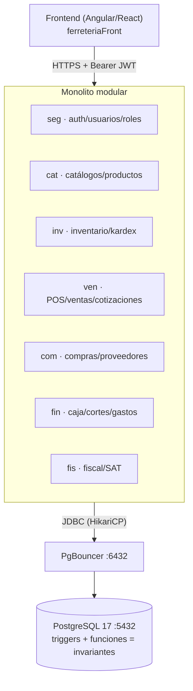
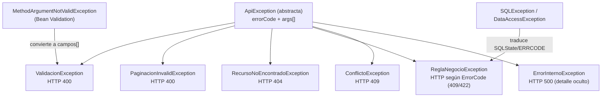

# Plan de Implementación — Backend Ferretería

**REST API · Spring Boot 3 · Java 21 · PostgreSQL**

> Documento maestro para construir el backend sobre la base de datos ya diseñada e
> instalada (`../ferreteriaDB/`): 71 tablas en 9 esquemas, 24 vistas, triggers y
> funciones que garantizan los invariantes del negocio. El backend **consume y respeta**
> esa capa; no la duplica.

---

## 1. Objetivos y principios

| Principio | Aplicación concreta |
|---|---|
| **Robusto** | La BD es el último guardián (triggers/FKs/CHECKs). El API valida entrada (Bean Validation), traduce errores SQL a HTTP semántico con sobre estándar (§4.6) y jamás confía solo en validación cliente |
| **Estable** | Contratos versionados `/api/v1`, migraciones Flyway inmutables, pruebas de integración contra PostgreSQL real (Testcontainers) |
| **Eficiente** | Consultas paginadas obligatorias, proyecciones para reportes, `JOIN FETCH` anti N+1, pool calibrado, reportes sobre vistas SQL ya optimizadas |
| **Simple** | Monolito modular (no microservicios): un despliegue, una BD, transacciones ACID locales |

**Regla de oro:** lo que la BD ya garantiza con funciones/triggers NO se reprograma en Java:

| Invariante | Dueño (BD) | Rol del backend |
|---|---|---|
| Folio consecutivo V-/C-/F- | `cfg.fn_siguiente_folio()` vía trigger | No genera folios; solo lee el asignado |
| Stock + kardex append-only | Trigger en `inv.movimientos_inventario` | Inserta movimientos; nunca UPDATE/DELETE directo |
| Totales de venta/compra | Triggers recálculo por detalle | Inserta detalles; lee totales calculados |
| Crédito vs línea | `ven.fn_valida_credito()` (trigger) | Maneja excepción de negocio → HTTP 422 |
| Cuentas cobrar/pagar + pagos CONTADO | Triggers de totales | No crea pagos automáticos manualmente |
| Corte de caja histórico | `fin.fn_cerrar_turno()` | La llama al cerrar turno (POST cortes) |
| Movimientos de caja | `fin.fn_movimiento_caja()` (trigger) | Inserta en `movimientos_caja`; valida turno abierto |

---

## 2. Stack tecnológico

| Capa | Tecnología | Versión | Por qué |
|---|---|---|---|
| Lenguaje | Java (Temurin) | **21 LTS** | Records, sealed, pattern matching, virtual threads listos |
| Framework | Spring Boot | **3.3.x** | Madurez, seguridad, actuator |
| Build | **Gradle + wrapper (`gradlew`)** | 8.x | Kotlin DSL, builds reproducibles, sin instalar Gradle localmente |
| ORM | Spring Data JPA (Hibernate 6) | — | Productividad; SQL nativo donde conviene |
| Migraciones | **Flyway** | 10.x | Migraciones GENERADAS desde `ferreteriaDB/scripts/` vía tarea Gradle (§9) |
| Seguridad | Spring Security 6 + **JWT** (jjwt o spring-boot-starter-oauth2-resource-server) | — | Stateless, roles desde `seg.*` |
| Boilerplate | **Lombok** | 1.18.x | Reduce ruido en entidades/servicios (reglas §8) |
| Docs API | springdoc-openapi | 2.x | Swagger UI en `/swagger-ui.html` |
| Respuesta estándar | Envelope propio `{ok,data|codigo}` + `ResponseBodyAdvice` | — | Salida uniforme; error minimalista solo-código (ADR-005, §4.6) |
| Pruebas | JUnit 5, Mockito, **Testcontainers**, MockMvc/RestAssured, JaCoCo | — | Integración real contra PG 17 |
| Observabilidad | Actuator + Micrometer (+ Prometheus opcional) | — | Health/metrics estándar |

### ADRs clave (resumen)

- **ADR-001 Monolito modular vs microservicios** → Monolito. Una tienda/cadena local, transacciones POS requieren ACID fuerte entre venta↔inventario↔caja; microservicios añaden complejidad sin beneficio a esta escala. Los módulos Gradle/paquetes permiten extraer servicios después si crece.
- **ADR-002 JPA + SQL nativo híbrido** → JPA para CRUD/dominio; SQL nativo para reportes (mapean 1:1 las vistas existentes) y llamadas a funciones. Alternativa jOOQ descartada: curva extra sin necesidad con este volumen.
- **ADR-003 JWT propio stateless** → Emisión propia (login contra `seg.usuarios`, hash BCrypt compatible pgcrypto `$2a$`). OAuth2 externo se pospone: no hay proveedor de identidad en el contexto actual.
- **ADR-005 Standard API Responses** → TODAS las respuestas usan el sobre único `{success, data, errorCode?, codigo?, errorMessage?, details?}` (§4.6): éxito plano y error autodescriptivo con código numérico HTTP + código estable de negocio + mensaje localizado. Tradeoff: se abandona RFC 7807 — aceptado por contrato homogéneo y fácil de consumir desde cualquier cliente.
- **ADR-004 PgBouncer modo transaction** → El compose de ferreteriaDB fija `max_prepared_statements=100` en el ini renderizado (obligatorio para Hibernate/JDBC). Los tests de integración y el arranque del backend pasan **siempre por PgBouncer (:6432)**, nunca por el puerto directo — paridad dev/prod verificada, no asumida. Fallback documentado como último recurso: `prepareThreshold=0` en el JDBC URL.

---

## 3. Arquitectura



### 3.1 Estructura de paquetes (package-by-module)

```
mx.ferreteria.api
├── common/            # error/, security/, config/, paging/
├── seg/               # auth (controller, service, dto, mapper)
├── cat/
├── inv/
├── ven/
├── com/
├── fin/
└── fis/
```

Cada módulo: `*Controller` (HTTP) → `*Service` (@Transactional, negocio) → `*Repository`
(JPA/nativo) → entidades mapeadas a las tablas reales. Sin dependencias cruzadas salvo
hacia `common` y catálogos.

### 3.2 Entidades ↔ tablas (convenciones)

- Esquemas explícitos: `@Table(name="ventas", schema="ven")`.
- IDs `BIGINT` generados por BD (`IDENTITY`) — nunca generar en Java.
- Enums Java ↔ VARCHAR de BD (p.ej. estado venta: `BORRADOR,COMPLETADA,CANCELADA`).
- `TIMESTAMPTZ` ↔ `Instant`; **zona horaria única `America/Mexico_City`** en TODA la pila:
  el clúster PostgreSQL ya corre con `timezone='America/Mexico_City'`, Hibernate se alinea
  con `spring.jpa.properties.hibernate.jdbc.time_zone=America/Mexico_City`, y la JVM arranca
  con `-Duser.timezone=America/Mexico_City`. El API serializa ISO-8601 con offset
  (`2026-08-25T16:30:00-06:00`); los cortes de caja usan `fecha_local` generada por la BD.
- Columnas generadas (`fecha_local`, `utilidad_bruta`, `margen_pct`) →
  `@Generated(event={INSERT,UPDATE})` o simplemente omitirlas del mapping de escritura.

### 3.3 Transacciones y concurrencia

| Caso | Patrón |
|---|---|
| Checkout POS (venta+detalles+pago) | Una sola `@Transactional`; la BD dispara triggers de totales/folios/crédito. Si algo falla → rollback total |
| Lectura de reportes | `@Transactional(readOnly = true)` + proyección DTO directa desde vista |
| Cierre de turno | Llama `SELECT fin.fn_cerrar_turno(:turno,:monto,:usuario,:notas)` dentro de TX; captura el ERRCODE de negocio (convención P00xx, §4.3) → `ReglaNegocioException(TURNO_YA_CERRADO)` → 409 |
| Doble submit / carrera de folio | La BD arbitra (`ON CONFLICT` en folios); el API devuelve 409 con reintento seguro |
| Optimista en edición admin | `@Version` solo donde aplique (productos, clientes) — columnas no existen hoy; alternativa aceptada: `updated_at` check en WHERE (opcional fase M4) |

---

## 4. Convenciones del API

| Aspecto | Regla |
|---|---|
| Base | `/api/v1` |
| Recursos | Sustantivos plurales kebab-case: `/api/v1/productos`, `/api/v1/cortes-caja` |
| Métodos | GET lectura, POST creación/acciones de dominio (sub-recurso verbo permitido p.ej. `POST /ventas/{id}/devoluciones`), PUT/PATCH edición, DELETE lógico |
| Paginación | `?page=0&size=20&sort=campo,desc` → respuesta `{ content[], page, size, totalElements, totalPages }`. Máximo `size=100` |
| Filtrado | Query params exactos + `q=` búsqueda textual donde aplique |
| Idempotencia | POST de pagos/cortes acepta header `Idempotency-Key` (fase M5) |
| Respuestas | Sobre único `{success,data,meta}` / NOK `{success:false,data:null,errorCode,codigo,errorMessage,requestId,details}` (§4.6). HTTP status sigue siendo semántico |
| Fechas | ISO-8601 con offset (`2026-08-25T16:30:00-06:00`) |

### 4.1 Validación de paginación (obligatoria en todos los GET de colecciones)

Toda colección valida y normaliza sus parámetros en un solo punto (`common/paging`).
Parámetros inválidos → **400 con `codigo=PAGINACION_INVALIDA`** (RFC 7807), nunca 500 ni silenciosos.

| Parámetro | Regla | Default |
|---|---|---|
| `page` | entero ≥ 0 | 0 |
| `size` | 1 ≤ size ≤ **100** | 20 |
| `sort` | `campo,asc|desc`; campo contra **whitelist por endpoint**; campo desconocido o dirección inválida → 400 | campo de fecha DESC |

```java
// common/paging/PageQuery.java — DTO de entrada validado
public record PageQuery(
        @PositiveOrZero Integer page,
        @Min(1) @Max(100) Integer size,
        String sort) {

    public PageRequest toPageRequest(Set<String> camposPermitidos, Sort defaultSort) {
        Sort sort = resolverSort(this.sort, camposPermitidos); // lanza PaginacionInvalidException(ErrorCode.PAGINACION_INVALIDA)
        return PageRequest.of(page == null ? 0 : page,
                              size  == null ? 20 : size,
                              sort);
    }
}
```

```java
@GetMapping
public Page<ProductoResponse> listar(@Valid PageQuery query) {
    return service.listar(query.toPageRequest(CAMPOS_ORDEN_PRODUCTOS,
                                              Sort.by(Sort.Direction.DESC, "creado_en")));
}
```

El `@RestControllerAdvice` traduce `PaginacionInvalidException` al sobre estándar (§4.6):

```json
{
  "success": false,
  "data": null,
  "errorCode": 400,
  "codigo": "PAGINACION_INVALIDA",
  "errorMessage": "'size' debe estar entre 1 y 100.",
  "requestId": "bf19e595-9475-4fff-bdee-51a80ea66afd"
}
```

### 4.2 Catálogo de errores (mapeo BD → HTTP → ErrorCode)

| Origen | HTTP | `codigo` (ErrorCode, estable e independiente del idioma) |
|---|---|---|
| Bean Validation / DTO inválido | 400 | `CAMPO_REQUERIDO`, `VALOR_INVALIDO` |
| Paginación inválida (page/size/sort) | 400 | `PAGINACION_INVALIDA` (§4.1) |
| FK inexistente en payload (23503) | 400 | `REFERENCIA_INVALIDA` |
| Unique violado (23505) | 409 | `REGISTRO_DUPLICADO` / `FOLIO_DUPLICADO` |
| RAISE EXCEPTION negocio (clase P0: P0100…) | 409/422 | `STOCK_INSUFICIENTE`, `CREDITO_EXCEDIDO`, `TURNO_YA_CERRADO`, … |
| CHECK violado (23514) | 422 | `VALOR_INVALIDO` |
| Token ausente/expirado o credenciales malas | 401 | `CREDENCIALES_INVALIDAS` / `TOKEN_EXPIRADO` |
| Rol insuficiente | 403 | `ACCESO_DENEGADO` |
| Recurso inexistente | 404 | `RECURSO_NO_ENCONTRADO` |
| Error no controlado | 500 (sin stack al cliente, correlación `X-Request-Id`) | `ERROR_INTERNO` |

### 4.3 Arquitectura global de excepciones

Un solo `@RestControllerAdvice` (`GlobalExceptionHandler`) maneja TODO y emite el sobre NOK estándar §4.6. Regla inviolable:
**ninguna excepción se construye con texto literal** — solo con un `ErrorCode` (constante
tipada, §4.4) y argumentos opcionales para interpolar.



| Excepción | Cuándo usarla | Ejemplo real |
|---|---|---|
| `ValidacionException` | DTO inválido manual o Bean Validation | precio negativo, RFC malformado |
| `PaginacionInvalidException` | page/size/sort fuera de regla §4.1 | size=500 |
| `RecursoNoEncontradoException` | id inexistente | venta 999 |
| `ReglaNegocioException` | violación de regla de negocio, incluye TODAS las traducidas desde triggers/funciones BD | stock insuficiente, crédito excedido, turno ya cerrado |
| `ConflictoException` | duplicados y carreras concurrentes | RFC repetido, doble corte simultáneo |
| `ErrorInternoException` | fallo no previsto; loguea stack completo servidor, devuelve solo correlación | NPE, timeout BD |

**Traducción BD → excepción tipada (contrato YA APLICADO Y PROBADO en la BD viva):**
los RAISE EXCEPTION de funciones/triggers usan `USING ERRCODE` propios de clase `P0`
(definida por la aplicación; se evita `P0001` porque es el default de PL/pgSQL):

| ERRCODE | Significado | ErrorCode Java | HTTP |
|---|---|---|---|
| `P0100` | stock insuficiente / negativo no permitido | `STOCK_INSUFICIENTE` | 409 |
| `P0200` | crédito insuficiente | `CREDITO_EXCEDIDO` | 422 |
| `P0201` | cliente sin línea activa / venta a crédito requiere cliente | `CREDITO_NO_DISPONIBLE` | 422 |
| `P0300` | turno ya cerrado / no abierto | `TURNO_YA_CERRADO` | 409 |
| `P0301` | turno inexistente | `RECURSO_NO_ENCONTRADO` | 404 |
| `P0302` | monto contado negativo/nulo | `VALOR_INVALIDO` | 400 |
| `P0400` | promoción agotada | `PROMOCION_AGOTADA` | 409 |
| `P0401` | límite de usos por cliente alcanzado | `PROMOCION_LIMITE_CLIENTE` | 409 |
| `P0999` | intento de UPDATE/DELETE en kardex | `KARDEX_APPEND_ONLY` | 409 |

El handler mapea errcode → `ErrorCode` → HTTP + mensaje localizado. Un mismo handler,
cero parsing de textos. **Fuente única: `ferreteriaDB/scripts/02_tablas.sql`** — los
ERRCODE están integrados en el script original (lo único que monta la imagen al
construirse). Para BDs provisionadas ANTES de la integración existe la copia legacy
aplicable: `ferreteriaDB/migrations/delta_errcodes_negocio.sql` (idempotente). Ambas rutas
validadas en clúster limpio con conteos idénticos: **72 tablas (71 + refresh_tokens del backend) / 24 vistas / 7 funciones con errcode**.

```java
// Lanzar SIEMPRE así (nunca new Exception("texto")):
throw new ReglaNegocioException(ErrorCode.STOCK_INSUFICIENTE, sku, disponible);
```

### 4.4 Catálogo único de mensajes (i18n es/en)

**Una sola clase de constantes** define todas las claves: `common/i18n/ErrorCode.java`.
Los textos viven EXCLUSIVAMENTE en bundles de recursos — prohibido escribir mensajes
dentro del código, de las excepciones o de los controllers.

```java
package mx.ferreteria.api.common.i18n;

/** Única fuente de claves de mensaje. Cada clave existe en ESPAÑOL e INGLÉS. */
public enum ErrorCode {
    // auth
    CREDENCIALES_INVALIDAS   ("error.auth.credenciales-invalidas",  HttpStatus.UNAUTHORIZED),
    TOKEN_EXPIRADO           ("error.auth.token-expirado",          HttpStatus.UNAUTHORIZED),
    ACCESO_DENEGADO          ("error.auth.acceso-denegado",         HttpStatus.FORBIDDEN),
    // validación / paginación
    CAMPO_REQUERIDO          ("error.validacion.campo-requerido",   HttpStatus.BAD_REQUEST),
    PAGINACION_INVALIDA      ("error.validacion.paginacion-invalida",HttpStatus.BAD_REQUEST),
    VALOR_INVALIDO           ("error.validacion.valor-invalido",    HttpStatus.BAD_REQUEST),
    REFERENCIA_INVALIDA      ("error.validacion.referencia-invalida",HttpStatus.BAD_REQUEST),
    FALTA_REQUEST_ID         ("error.validacion.falta-request-id",  HttpStatus.BAD_REQUEST),
    REQUEST_ID_INVALIDO      ("error.validacion.request-id-invalido",HttpStatus.BAD_REQUEST),
    // negocio
    STOCK_INSUFICIENTE       ("error.negocio.stock-insuficiente",   HttpStatus.CONFLICT),
    CREDITO_EXCEDIDO         ("error.negocio.credito-excedido",     HttpStatus.UNPROCESSABLE_ENTITY),
    CREDITO_NO_DISPONIBLE    ("error.negocio.credito-no-disponible",HttpStatus.UNPROCESSABLE_ENTITY),
    TURNO_YA_CERRADO         ("error.negocio.turno-ya-cerrado",     HttpStatus.CONFLICT),
    FOLIO_DUPLICADO          ("error.negocio.folio-duplicado",      HttpStatus.CONFLICT),
    REGISTRO_DUPLICADO       ("error.negocio.registro-duplicado",   HttpStatus.CONFLICT),
    RECURSO_NO_ENCONTRADO    ("error.negocio.recurso-no-encontrado",HttpStatus.NOT_FOUND),
    PROMOCION_AGOTADA        ("error.negocio.promocion-agotada",    HttpStatus.CONFLICT),
    PROMOCION_LIMITE_CLIENTE ("error.negocio.promocion-limite-cliente", HttpStatus.CONFLICT),
    KARDEX_APPEND_ONLY       ("error.negocio.kardex-append-only",   HttpStatus.CONFLICT),
    // genéricas / internas
    ERROR_INTERNO            ("error.interno.inesperado",           HttpStatus.INTERNAL_SERVER_ERROR),
    SERVICIO_NO_DISPONIBLE   ("error.interno.servicio-no-disponible",HttpStatus.SERVICE_UNAVAILABLE);

    private final String key;
    private final HttpStatus http;
    ErrorCode(String key, HttpStatus http) { this.key = key; this.http = http; }
    public String key() { return key; }
    public HttpStatus http() { return http; }
}
```

Bundles (Spring `MessageSource`, sin dependencias nuevas):

```properties
# src/main/resources/i18n/messages_es.properties  (idioma por defecto: es-MX)
error.negocio.stock-insuficiente=Stock insuficiente para el producto {0}. Disponible: {1}.
error.negocio.credito-excedido=El crédito disponible del cliente ({0}) es menor al cargo de {1}.
error.negocio.credito-no-disponible=El cliente no tiene línea de crédito activa para venta a crédito.
error.validacion.falta-request-id=Falta el header X-Request-Id (se requiere un UUID en modo estricto).
error.validacion.request-id-invalido=El header X-Request-Id no es un UUID válido: {0}.
error.negocio.turno-ya-cerrado=El turno {0} ya fue cerrado a las {1}.
error.validacion.paginacion-invalida=''{0}'' debe estar entre {1} y {2}.
error.interno.inesperado=Ocurrió un error inesperado. Contacte a soporte con el folio {0}.
```

```properties
# src/main/resources/i18n/messages_en.properties
error.negocio.stock-insuficiente=Insufficient stock for product {0}. Available: {1}.
error.negocio.credito-excedido=Customer available credit ({0}) is lower than the {1} charge.
error.negocio.credito-no-disponible=The customer has no active credit line for credit sales.
error.validacion.falta-request-id=Missing X-Request-Id header (a UUID is required in strict mode).
error.validacion.request-id-invalido=X-Request-Id header is not a valid UUID: {0}.
error.negocio.turno-ya-cerrado=Shift {0} was already closed at {1}.
error.validacion.paginacion-invalida=''{0}'' must be between {1} and {2}.
error.interno.inesperado=An unexpected error occurred. Contact support with ticket {0}.
```

| Regla | Detalle |
|---|---|
| Idioma | Se resuelve por header `Accept-Language`; default `es`. El cliente puede forzar con `Accept-Language: en` |
| Cobertura bilingüe | **Toda clave debe existir en AMBOS bundles.** Test `I18nCompletenessTest` compara keysets y falla si difieren |
| Sin mensajes en código | Test ArchUnit: prohíbe literales String en constructores de `ApiException*` fuera de `common/i18n`; las clases de dominio solo referencian `ErrorCode` |
| Interpolación | Argumentos `{0},{1}` pasados en la excepción; el formato ocurre SOLO en el handler con el locale elegido |
| Respuesta | Sobre NOK §4.6: `errorMessage` se toma de estos bundles según Accept-Language; `ERROR_INTERNO/SERVICIO_NO_DISPONIBLE` usan su texto genérico con requestId. `codigo` es el nombre del enum, estable e independiente del idioma |

### 4.5 X-Request-Id — correlación obligatoria en TODA llamada

Un `OncePerRequestFilter` (`common/web/RequestIdFilter`) registrado primero en la cadena
gobierna el header `X-Request-Id` en cada request. Dos modos por configuración
(`app.request-id.mode`):

| Modo | Request SIN header | Header presente |
|---|---|---|
| `GENERATE` (default) | El filtro genera **UUID v4**, lo inyecta en MDC de logging y lo devuelve como `X-Request-Id` en la respuesta | Valida formato UUID; inválido → 400 `REQUEST_ID_INVALIDO`; válido → se respeta y se ecoa |
| `STRICT` | **Rechaza** la llamada con 400 `FALTA_REQUEST_ID` ("el UUID no existe") | Igual que GENERATE |

```java
@Component
@Order(Ordered.HIGHEST_PRECEDENCE)
@RequiredArgsConstructor
public class RequestIdFilter extends OncePerRequestFilter {
    private final RequestIdProperties props;          // mode: GENERATE | STRICT

    @Override
    protected void doFilterInternal(HttpServletRequest req, HttpServletResponse res,
                                    FilterChain chain) throws ServletException, IOException {
        String incoming = req.getHeader("X-Request-Id");
        if (incoming == null || incoming.isBlank()) {
            if (props.mode() == Mode.STRICT)
                throw new ValidacionException(ErrorCode.FALTA_REQUEST_ID);   // 400, mensaje i18n
            incoming = UUID.randomUUID().toString();
        } else try {
            UUID.fromString(incoming);
        } catch (IllegalArgumentException e) {
            throw new ValidacionException(ErrorCode.REQUEST_ID_INVALIDO, incoming);
        }
        MDC.put("requestId", incoming);
        res.setHeader("X-Request-Id", incoming);
        try { chain.doFilter(req, res); } finally { MDC.remove("requestId"); }
    }
}
```

Reglas complementarias: todo log de aplicación imprime `%X{requestId}`; los errores 500
incluyen ese UUID en el sobre de error (§4.6); Swagger UI documenta el
header como opcional-global.

### 4.6 Standard API Responses — sobre único de salida

TODA llamada que devuelva datos usa este sobre. Nada viaja fuera de él.

#### Respuesta OK

```json
{
  "success": true,
  "data": { "ventaId": 11, "folio": "V-00000011", "total": 571.54 },
  "meta": { "page": 0, "size": 20, "totalElements": 137, "totalPages": 7 }
}
```

* `data`: payload real (objeto, lista o resultado de acción). `null` nunca en éxito.
* `meta`: SOLO en listados paginados (o metadatos útiles: folio generado, etc.). Ausente en GET unitario/POST simple.

#### Respuesta NOK (error)

```json
{
  "success": false,
  "data": null,
  "errorCode": 409,
  "codigo": "STOCK_INSUFICIENTE",
  "errorMessage": "Stock insuficiente para el producto LLA-002. Disponible: 3.",
  "requestId": "bf19e595-9475-4fff-bdee-51a80ea66afd",
  "details": [
    { "field": "detalles[0].cantidad", "message": "excede el stock disponible" }
  ]
}
```

| Campo | Regla |
|---|---|
| `success` | `true`/`false`; el cliente ramifica por aquí primero |
| `data` | Payload en éxito; **siempre `null` en NOK** (un error nunca devuelve datos parciales) |
| `errorCode` | Numérico = **HTTP status** (409, 422, 401…). El cliente puede mapear familias sin conocer dominio |
| `codigo` | Código ESTABLE de negocio (nombre del enum `ErrorCode`, §4.3/§4.4): la llave del catálogo del frontend, independiente de idioma y de números |
| `errorMessage` | Mensaje humano localizado (es-MX default; `Accept-Language: en` lo cambia) generado desde los bundles §4.4. Para `ERROR_INTERNO` se sustituye por mensaje genérico + `requestId` (nunca detalles internos) |
| `requestId` | Siempre presente (también en header `X-Request-Id`); es lo que soporte pedirá al reportar |
| `details` | SOLO errores de validación (400): arreglo `[{field,message}]` con reglas por campo. Ausente en el resto |

#### Ejemplos por familia

| Caso | HTTP | Body resumido |
|---|---|---|
| `GET /productos/{id}` existente | 200 | `{success:true, data:{…}}` |
| Lista paginada | 200 | `{success:true, data:[…], meta:{…}}` |
| Checkout POS aplicado | 201 | `{success:true, data:{venta completa}}` |
| Stock insuficiente (P0100) | 409 | `{success:false, data:null, errorCode:409, codigo:"STOCK_INSUFICIENTE", errorMessage:"…", requestId:"…"}` |
| Crédito excedido (P0200) | 422 | `{…, errorCode:422, codigo:"CREDITO_EXCEDIDO", …}` |
| Bean Validation | 400 | `{…, errorCode:400, codigo:"CAMPO_REQUERIDO", errorMessage:"Revise los campos marcados.", details:[{field,message},…]}` |
| Token ausente/expirado | 401 | `{…, errorCode:401, codigo:"TOKEN_EXPIRADO", …}` |
| STRICT sin X-Request-Id | 400 | `{…, errorCode:400, codigo:"FALTA_REQUEST_ID", …}` |
| Turno ya cerrado (P0300) | 409 | `{…, errorCode:409, codigo:"TURNO_YA_CERRADO", …}` |
| Falla no controlada | 500 | `{…, errorCode:500, codigo:"ERROR_INTERNO", errorMessage:"Ocurrió un error inesperado. Contacte a soporte con el folio {requestId}."}` |

#### Implementación

1. `common/web/EnvelopeAdvice` (`ResponseBodyAdvice`): envuelve automáticamente toda respuesta 2xx en `{success:true,data,meta?}` — los controllers nunca construyen el sobre ni devuelven `ResponseEntity`.
2. `GlobalExceptionHandler` + filtros (`RequestIdFilter`, entry point): producen directamente el shape NOK con `ErrorCode` → `errorCode=http().value()`, `codigo=name()`, `errorMessage` vía MessageSource según Accept-Language.
3. Bundles i18n: fuente única de `errorMessage` es/en por cada clave `error.*` (§4.4). Sin modo alternativo: el mensaje SIEMPRE va, pero `ERROR_INTERNO`/`SERVICIO_NO_DISPONIBLE` usan su texto genérico ya definido.
4. Swagger: se documenta el esquema `ApiResponse[T]` (genérico OpenAPI) para que todas las operaciones muestren el mismo sobre.
5. Tests: `EnvelopeAdviceTest` (2xx envuelto; `meta` solo si Page), handler asserts `success=false` + `errorCode` numérico + `codigo` estable + `errorMessage` localizado es/en + `details` solo en validación; ITs actualizados a leer `success/codigo`.

---

## 5. Seguridad

- **Login**: `POST /api/v1/auth/login {username,password}` → verifica contra
  `seg.usuarios.password_hash` (BCrypt `$2a$` generado por pgcrypto es compatible con
  `BCryptPasswordEncoder`). Respuesta: `accessToken` (15 min) + `refreshToken` (8 h,
  rotación en tabla `seg.refresh_tokens` nueva vía migración V2).
- **Claims JWT**: `sub`=username, `uid`=usuario_id, `emp`=empleado_id, `alm`=almacén
  principal, `roles=[...]` (desde `seg.usuarios_roles`→`seg.roles.clave`),
  `perms=[...]` (permisos finos opcionales).
- **Autorización**: `SecurityFilterChain` stateless + `@PreAuthorize("hasRole('CAJERO')")`
  por endpoint. Roles semilla: ADMIN, GERENTE, CAJERO, ALMACENISTA, COMPRAS, RRHH.
- **Auditoría**: interceptor que propaga `SET LOCAL app.usuario_id` (o auditoría en Java
  escribiendo `seg.auditoria_acciones`: usuario, acción, entidad, antes/después JSONB).
- **Headers**: CORS restrictivo por origen configurado, HSTS detrás de proxy TLS.

---

## 6. Catálogo de endpoints (v1)

> ✔ = CRUD completo estándar (list paginado/get/post/put/delete-lógico cuando aplica).

### seg — Identidad
| Endpoint | Métodos | Roles |
|---|---|---|
| `/auth/login`, `/auth/refresh`, `/auth/logout` | POST | público/autenticado |
| `/usuarios`, `/usuarios/{id}`, `/usuarios/{id}/password`, `/usuarios/{id}/roles` | ✔ + PATCH | ADMIN |
| `/roles`, `/roles/{id}/permisos` | ✔ | ADMIN |
| `/empleados`, `/empleados/{id}` (rh) | ✔ | ADMIN, RRHH |
| `/auditoria/acciones` | GET (filtros usuario/fecha/entidad) | ADMIN, GERENTE |

### cat — Catálogos
| Endpoint | Métodos | Roles |
|---|---|---|
| `/productos` (+`?q=&categoriaId=&marcaId=&tipo=`) | ✔ | ADMIN,GERENTE editan; resto lee |
| `/productos/{id}/precios`, `/productos/{id}/proveedores` | GET/PUT | GERENTE, COMPRAS |
| `/categorias` (árbol), `/marcas`, `/unidades`, `/impuestos`, `/formas-pago`, `/metodos-pago-sat`, `/usos-cfdi`, `/motivos-movimiento` | GET (+✔ ADMIN en catálogos editables) | autenticado |
| `/clientes` (+búsqueda q), `/clientes/{id}`, `/clientes/{id}/credito` | ✔ | CAJERO crea/lee; GERENTE ajusta crédito |
| `/promociones`, `/promociones/{id}` | ✔ | ADMIN, GERENTE |
| `/descuentos` (autorización por rol) | ✔ | ADMIN, GERENTE |

### inv — Inventario
| Endpoint | Métodos | Roles |
|---|---|---|
| `/almacenes` | ✔ | ADMIN |
| `/inventario?almacenId=&soloBajoStock=` | GET (vista existencias) | ALMACENISTA,GERENTE |
| `/movimientos` GET (kardex filtrable), `/entradas`, `/salidas`, `/ajustes` | POST (crean kardex+stock vía trigger) | ALMACENISTA (ajustes también GERENTE) |
| `/traslados` | POST origen→destino, GET | ALMACENISTA |
| `/reportes/stock-bajo`, `/reportes/productos-sin-movimiento` | GET | GERENTE,ALMACENISTA |

### ven — Punto de venta
| Endpoint | Métodos | Roles |
|---|---|---|
| `/cotizaciones`, `/cotizaciones/{id}`, `/cotizaciones/{id}/convertir` | ✔ + POST | CAJERO |
| `/ventas` POST **checkout** (detalles+pagos atómicos), GET paginado con filtros fecha/caja/vendedor | — | CAJERO (cancelar: GERENTE) |
| `/ventas/{id}/cancelar` | PATCH estado + devolución automática de inventario | GERENTE |
| `/ventas/{id}/devoluciones` | POST parcial | GERENTE, CAJERO c/autorización |
| `/rentas`, `/rentas/{id}/devolucion` | ✔ + POST | CAJERO, ALMACENISTA |
| `/creditos/cobranza?estado=VENCIDO` , `/creditos/{clienteId}` | GET | GERENTE, CAJERO |
| `/pagos-cliente` | POST abono (cuenta+turno) | CAJERO |
| `/reportes/top-productos`, `/mejores-clientes`, `/ventas-totales`, `/mejores-vendedores`, `/horas-pico` | GET (vistas) | GERENTE, ADMIN |

### com — Compras
| Endpoint | Métodos | Roles |
|---|---|---|
| `/proveedores`, `/proveedores/{id}` | ✔ | COMPRAS |
| `/compras` POST (recepción → kardex), GET filtros | — | COMPRAS, GERENTE |
| `/compras/{id}/pagos` | POST | COMPRAS, ADMIN |
| `/cuentas-pagar?estado=VENCIDA`, `/reportes/facturas-vencidas`, `/facturas-proveedor/{provId}` | GET (vistas) | COMPRAS, ADMIN |

### fin — Dinero y caja
| Endpoint | Métodos | Roles |
|---|---|---|
| `/cajas` | GET lista/estado | ADMIN,GERENTE |
| `/cajas/{id}/turnos` POST abrir, `/turnos/{id}/movimientos` POST entrada/salida | POST | CAJERO (salidas grandes: GERENTE) |
| `/turnos/{id}/corte` POST `{montoContado, notas}` → llama `fn_cerrar_turno`, retorna corte completo | POST | CAJERO dueño o GERENTE |
| `/cortes-caja` GET histórico paginado (vw_historico_cortes), `/cierre-diario?fecha=` (vw_cierre_diario) | GET | GERENTE, ADMIN |
| `/gastos`, `/ingresos-otros`, `/nomina`(M6) | ✔ | GERENTE, ADMIN |

### fis — Fiscal (fase M6, lectura primero)
| Endpoint | Métodos | Nota |
|---|---|---|
| `/facturas` GET, `/facturas/{id}/xml` GET | GET | Timbrado PAC real queda como integración futura; hoy persistencia y consulta |

---

## 7. Flujos críticos (contratos de comportamiento)

### 7.1 Checkout POS — `POST /api/v1/ventas`

```json
{
  "cajaId": 1,
  "clienteId": null,
  "detalles": [
    {"productoId": 101, "cantidad": 2, "precioUnitario": 249.00}
  ],
  "pagos": [{"formaPago": "EFECTIVO", "monto": 571.54}]
}
```

Responsabilidades Java: validar stock suficiente ANTES (consulta `inventario` para UX),
insertar cabecera + detalles + pagos en UNA transacción, responder venta completa con
folio/totales/IVA calculados por trigger.
La BD hace: folio único, subtotal/IVA/descuento, kardex SALIDA VENTA + decremento stock
(respetando `permitir_stock_negativo`), cuenta_cobrar/pago CONTADO según forma, validación
de línea de crédito si `CREDITO`.
Errores esperados → 409 `codigo=STOCK_INSUFICIENTE` (ERRCODE `P0100`),
422 `codigo=CREDITO_EXCEDIDO` (ERRCODE `P0200`) — ambos probados en la BD viva.

### 7.2 Corte de caja — `POST /api/v1/cajas/{cajaId}/turnos/{turnoId}/corte`

Java llama `SELECT fin.fn_cerrar_turno(:turnoId, :montoContado, :usuarioId, :notas)`
y luego relee `fin.vw_historico_cortes` para responder el snapshot completo
(vendido, utilidad, margen, pérdidas, desgloses JSONB, diferencia CUADRADO/SOBRANTE/FALTANTE).
409 si el turno ya estaba cerrado (idempotencia de negocio).

---

## 8. Lombok — reglas de uso

| Contexto | Usar | Evitar |
|---|---|---|
| Entidades JPA | `@Getter @Setter @NoArgsConstructor(access=PROTECTED)` (+`@Builder` con `@SuperBuilder` si hereda); `equals/hashCode` basados en id natural o negocio | `@Data` (genera equals/hashCode peligrosos con lazy associations), `@ToString` con relaciones cargadas |
| DTOs | `record` preferente; `@Value @Builder` cuando se necesite mutable-parcial | Clases con getters/setters manuales |
| Servicios/Controllers | `@RequiredArgsConstructor` (inyección por constructor final) | `@Autowired` en campos |
| Logging | `@Slf4j` | Logger manual |
| Config tipada | `@ConfigurationProperties` + `@ConstructorBinding` record | `@Value` dispersos |

## 9. Configuración (muestras)

### build.gradle.kts (dependencias núcleo)

```kotlin
plugins {
    java
    id("org.springframework.boot") version "3.3.4"
    id("io.spring.dependency-management") version "1.1.6"
}

group = "mx.ferreteria"
version = "0.0.1-SNAPSHOT"

java { toolchain { languageVersion = JavaLanguageVersion.of(21) } }

repositories { mavenCentral() }

dependencies {
    implementation("org.springframework.boot:spring-boot-starter-web")
    implementation("org.springframework.boot:spring-boot-starter-data-jpa")
    implementation("org.springframework.boot:spring-boot-starter-security")
    implementation("org.springframework.boot:spring-boot-starter-validation")
    implementation("org.springframework.boot:spring-boot-starter-actuator")
    implementation("org.flywaydb:flyway-database-postgresql")
    implementation("org.springdoc:springdoc-openapi-starter-webmvc-ui:2.6.0")
    implementation("io.jsonwebtoken:jjwt-api:0.12.6")
    runtimeOnly("io.jsonwebtoken:jjwt-impl:0.12.6")
    runtimeOnly("io.jsonwebtoken:jjwt-jackson:0.12.6")
    runtimeOnly("org.postgresql:postgresql")

    compileOnly("org.projectlombok:lombok")
    annotationProcessor("org.projectlombok:lombok")

    testImplementation("org.springframework.boot:spring-boot-starter-test")
    testImplementation("org.springframework.security:spring-security-test")
    testImplementation("org.testcontainers:postgresql")
    testImplementation("org.testcontainers:junit-jupiter")

    tasks.withType<Test>().useJUnitPlatform()
}
```

Comandos estándar del proyecto (siempre vía wrapper): `./gradlew build` (compila+test),
`./gradlew test`, `./gradlew check`, `./gradlew bootRun`.

### application.yml (producción-like)

```yaml
spring:
  datasource:
    url: jdbc:postgresql://${PG_HOST:localhost}:${PG_PORT:6432}/ferreteria
    username: ${PG_USER:ferreteria_app}
    password: ${PG_PASSWORD}          # NUNCA en repo
    hikari:
      maximum-pool-size: 10           # <= pool de PgBouncer (default_pool_size)
      minimum-idle: 2
      connection-timeout: 3000
  jpa:
    open-in-view: false
    properties:
      hibernate.jdbc.time_zone: America/Mexico_City   # alineado con el clúster PG
      hibernate.jdbc.batch_size: 50
      hibernate.order_inserts: true
  flyway:
    locations: classpath:db/migration  # V1__base.sql = scripts ferreteriaDB
server:
  port: 8080
  compression.enabled: true
app:
  jwt:
    secret: ${JWT_SECRET}             # >=256 bits
    access-minutes: 15
    refresh-hours: 8
  zona: America/Mexico_City
management:
  endpoints.web.exposure.include: health,info,metrics,prometheus
  endpoint.health.probes.enabled: true
logging:
  level.mx.ferreteria: INFO
```

### Migraciones Flyway (generadas, nunca editadas a mano)

Los scripts canónicos viven SOLO en `../ferreteriaDB/scripts/`. Una tarea Gradle
`generateMigrations` los concatena preprocesados a `src/main/resources/db/migration/`:

```
src/main/resources/db/migration/
├── V1__base.sql              # GENERADA: 01_base_esquemas + 02_tablas + vistas_core
│                             #   sin meta-comandos psql (\ir se resuelve al concatenar)
├── V2__parametria.sql        # GENERADA: 03_parametria (+ refresh_tokens)
├── V3__errcodes_negocio.sql  # ERRCODE propios (contrato §4.3) — fuente: 02_tablas integrado;
│                             #   para BDs previas usar ferreteriaDB/migrations/delta_errcodes_negocio.sql
└── V4+…                      # escritas a mano SOLO hacia adelante, inmutables una vez aplicadas
```

Reglas:
- **Roles/passwords (`04_admin`, `99_app_password.sh`) NUNCA dentro de Flyway** — requieren
  superuser; son paso operativo post-migración (GUIA_PODMAN §6).
- Prohibido editar migraciones ya aplicadas; corrección = nueva `V(n)__fix.sql`.
- CI valida: PG vacío en Testcontainers → `flyway migrate` completo → aserción de conteo
  **72 tablas (71 + refresh_tokens) / 24 vistas**.
- Datos demo (`05_dummy.sql`) NO es migración: solo perfil `demo` de desarrollo.

---

## 10. Calidad y pruebas

| Nivel | Alcance | Herramientas | Meta |
|---|---|---|---|
| Unitario | Servicios, mapeadores, utilidades JWT | JUnit5+Mockito | cobertura ≥85% líneas en `service/common` |
| Slice | Controllers (validación+seguridad), repos críticos | `@WebMvcTest`, `@DataJpaTest` | todos los endpoints |
| Integración | Flujos completos contra PG real con las migraciones generadas V1–V3 montadas | Testcontainers + RestAssured/MockMvc (vía PgBouncer, ADR-004) | checkout POS, corte doble→409, crédito→422 con `codigo` estable, cancelación restaura stock |
| Contract | OpenAPI lint | redocly CLI | 0 errores |
| Rendimiento básico | Endpoints calientes (checkout, inventario) | k6/Gatling smoke | p95 <300ms local |

Prueba canónica de robustez (integración): ejecutar dos cortes del mismo turno en paralelo →
exactamente uno exitoso (FOR UPDATE de la función), otro 409; verificar fila única en
`fin.cortes_caja`.

### 10.1 Catálogo de pruebas (naming y alcance fijos)

| Clase de test | Tipo | Qué fija (comportamiento observable) |
|---|---|---|
| `RequestIdFilterTest` | Unitario (MockHttpServletRequest) | sin header en modo GENERATE → genera UUID v4 + ecoa en respuesta; header inválido → `ValidacionException(REQUEST_ID_INVALIDO)`; modo STRICT sin header → 400 `FALTA_REQUEST_ID`; UUID válido pasa íntegro |
| `GlobalExceptionHandlerTest` | Unitario/slice | cada ErrorCode produce HTTP correcto + sobre `{success:false,data:null,errorCode,codigo}` con `errorMessage` localizado es/en; `details[]` SOLO en validación; ERROR_INTERNO nunca filtra stack |
| `EnvelopeAdviceTest` | Unitario/MockMvc | toda respuesta 2xx sale envuelta `{success:true,data,…}`; listados Page incluyen `meta`; simples NO llevan `meta`; errores jamás pasan por el advice |
| `I18nCompletenessTest` | Unitario | keysets de `messages_es.properties` y `messages_en.properties` IDÉNTICOS; falla al agregar clave en un solo bundle |
| `MensajesSoloDesdeErrorCodeTest` | ArchUnit | ninguna clase fuera de `common/i18n` instancia excepciones con String literal; solo referencian `ErrorCode` |
| `PageQueryTest` | Unitario | page<0 / size=0 / size=101 / sort con campo fuera de whitelist → `PaginacionInvalidException`; defaults aplicados |
| `CheckoutPosIT` | Integración (Testcontainers+PgBouncer) | venta feliz: folio asignado por BD, kardex SALIDA creado, stock decrementado, cuenta/pago CONTADO generados |
| `StockInsuficienteIT` | Integración | venta que agota stock → 409 `codigo=STOCK_INSUFICIENTE` (ERRCODE P0100), transacción sin residuos |
| `CreditoExcedidoIT` | Integración | crédito insuficiente → 422 `CREDITO_EXCEDIDO` (P0200); cliente sin línea → 422 `CREDITO_NO_DISPONIBLE` (P0201) |
| `CorteDobleParaleloIT` | Integración | dos cortes concurrentes del mismo turno: exactamente 1 × 200 y 1 × 409 `TURNO_YA_CERRADO` (P0300); una sola fila en `fin.cortes_caja` |
| `KardexAppendOnlyIT` | Integración | UPDATE/DELETE sobre movimientos → 409 `KARDEX_APPEND_ONLY` (P0999); INSERT siempre permitido |
| `PaginacionIT` | Integración | `?size=500` → 400 `PAGINACION_INVALIDA` con detalle bilingüe; sort inválido idem |

Convenciones (anti-flakiness): tests independientes y reordenables (sin estado compartido,
`@Transactional` de solo-lectura donde aplique o limpieza por fixture); integración usa
fixtures propias, nunca datos demo; los errores se asertan por **`codigo`**, jamás por texto.

### 10.2 Cobertura — gates JaCoCo en Gradle

```kotlin
plugins { jacoco }

jacoco { toolVersion = "0.8.12" }

// DTOs, config y bootstrap quedan fuera del cálculo de cobertura
val coverageExclusions = listOf(
    "mx/ferreteria/api/common/config/**",
    "mx/ferreteria/api/**/dto/**",
    "**/*Application*"
)

tasks.test {
    useJUnitPlatform()
    finalizedBy(tasks.jacocoTestReport)
    extensions.configure<JacocoTaskExtension> {
        classDirectory.setFrom(
            sourceSets.main.get().output.exclude(coverageExclusions)
        )
    }
}

tasks.jacocoTestCoverageVerification {
    violationRules {
        rule {   // gate global: >= 80% instrucciones
            element = "BUNDLE"
            limit { counter = "INSTRUCTION"; value = "COVEREDRATIO"; minimum = "0.80".toBigDecimal() }
        }
        rule {   // gate estricto donde vive la lógica: >= 85%
            element = "PACKAGE"
            includes = listOf(
                "mx.ferreteria.api.common",
                "mx.ferreteria.api.common.*",
                "mx.ferreteria.api.*.service"
            )
            limit { counter = "INSTRUCTION"; value = "COVEREDRATIO"; minimum = "0.85".toBigDecimal() }
        }
    }
}

tasks.check { dependsOn(tasks.jacocoTestCoverageVerification) }
```

Reporte HTML en `build/reports/jacoco/test/html` tras `./gradlew check`. La meta §10
(≥85% en service/common, ≥80% total) queda así **obligatoria** — el build rompe si baja.

---

## 11. Flujo de trabajo (entrega por hitos)

Rama: `main` protegida, `develop` integración, features `feat/<modulo>-<tema>`; commits
Conventional Commits; PR con checklist (tests, migración, docs OpenAPI).

**Política de reversión:** Flyway forward-only (sin undo). Antes de toda migración en un
entorno real: `pg_dump -Fc` obligatorio. Simulacro de restauración mensual documentado
(GUIA_PODMAN §7). Correcciones siempre como nueva migración, nunca editando aplicadas.

| Hito | Contenido | DoD (Definition of Done) |
|---|---|---|
| **M0** Andamiaje | Proyecto Boot, tarea generateMigrations, health UP, Dockerfile multi-stage, CI build+test, perfil `demo` separado de bootstrap productivo | `./gradlew check` verde; CI migra PG vacío y cuenta 72 tablas (71 + refresh_tokens)/**24 vistas**; instalación limpia **SIN datos demo** verificada |
| **M1** Auth | login/refresh/logout, roles, method security, auditoría básica, ErrorCode+i18n+handler global | Suite seguridad verde; Swagger con bearer; I18nCompletenessTest y ArchUnit activos |
| **M2** Catálogos | productos/categorías/clientes/proveedores CRUD + búsqueda | CRUD probado, paginación validada (400 `PAGINACION_INVALIDA` probado) |
| **M3** Inventario | entradas/salidas/ajustes/traslados, kardex, alertas + **semilla de inventario inicial vía migración** | Kardex append-only respetado (test intenta UPDATE→falla); stock inicial cargado y consultable |
| **M4** POS | cotizaciones, checkout ventas, devoluciones, rentas — requiere M3 para poder reponer existencias | Flujo E2E comprar→vender→cortar verde (incluye errores 409/422 con `codigo` estable) |
| **M5** Compras+Caja | compras, pagos, turnos, movimientos, **corte histórico**, gastos/otros ingresos + **spike elección proveedor PAC (CFDI)** | Corte doble paralelo OK; cierre-diario cuadra; decisión PAC documentada |
| **M6** Fiscal+RRHH | facturas lectura, nómina básica | Reportes vencidos/facturas-proveedor expuestos |
| **M7** Endurecimiento | rate limiting (bucket4j) en auth, idempotency-keys, caché HTTP en catálogos, tuning índices según EXPLAIN | k6 smoke p95<300ms; revisión seguridad OWASP checklist |

Operación local recomendada: levantar la BD existente
(`cd ../ferreteriaDB/deploy && podman-compose up -d postgres-primary pgbouncer`) y correr
el backend con `PG_*` apuntando ahí; Testcontainers usa los mismos scripts para CI.

---

## 12. Riesgos y mitigaciones

| Riesgo | Mitigación |
|---|---|
| Prepared statements vs PgBouncer transaction mode | `max_prepared_statements=100` fijado en compose (ADR-004); tests SIEMPRE vía :6432; fallback `prepareThreshold=0` |
| Doble lógica de negocio (Java+trigger divergentes) | Java solo orquesta; RAISE con ERRCODE propio → ErrorCode tipado (§4.3); tests fijan contratos por `codigo`, no por texto |
| Cambios de esquema sin control | Todo cambio futuro vía Flyway generada/forward-only; prohibido ALTER manual en BD compartida |
| Migración destructiva aplicada por error | Respaldo pg_dump previo obligatorio + simulacro mensual de restauración (§11) |
| Datos demo en producción | Perfil `demo` separado del bootstrap productivo; DoD M0 verifica instalación limpia |
| Picos de caja simultáneos | Pool pequeño (Hikari ≤ default_pool_size), timeouts cortos, retries solo en GET |
| Secretos filtrados | Solo env vars; `.env` fuera del repo; rotación documentada en GUIA_PODMAN §7 |

---

## 13. Riesgos pre-mortem y decisiones adoptadas

Evaluación estructurada (*the-fool / pre-mortem*) sobre este plan. Los cinco escenarios
de fallo más probables y dónde quedó mitigado cada uno:

| # | Escenario de fallo | Decisión adoptada | Sección |
|---|---|---|---|
| 1 | Paridad rota dev(:5432) vs prod(PgBouncer): prepared statements intermitentes en checkout | ADR-004 endurecido: compose fija `max_prepared_statements`; todo test pasa por PgBouncer | §2, §10 |
| 2 | Flyway no soporta `\ir`: dos fuentes de verdad de esquema | Tarea Gradle genera migraciones desde scripts canónicos; CI valida conteo; roles fuera de Flyway | §9 |
| 3 | Mensajes de error parseados como texto; reglas invisibles que contradicen config | Contrato firmado: ERRCODE BD → `ErrorCode` enum → HTTP+código estable bilingüe; ArchUnit prohíbe mensajes en código | §4.3, §4.4 |
| 4 | Datos demo contaminan producción; gerente vuelve a Excel paralelo | Perfil demo aislado; checklist bootstrap limpio en DoD M0 | §11 |
| 5 | POS entregado antes de poder reponer inventario; stock muerto semana 1 | Hitos reordenados: Inventario (M3) ANTES de POS (M4); semilla inicial vía migración; spike PAC adelantado a M5 | §11 |

Señales tempranas de vigilancia: "en mi máquina funciona" con BD directa (#1), copias
aplanadas de scripts (#2), frontend parseando textos (#3), volumen productivo con dummy
(#4), UPDATE manual de stock en psql (#5).

**Registro vivo de incidencias y bloqueos:** `docs/INCIDENTES_Y_BLOQUEOS.md`
(síntoma → causa raíz → solución → prevención; consultarlo antes de depurar síntomas conocidos).

## 14. Estado de hitos

| Hito | Estado | Evidencia |
|---|---|---|
| M0 Andamiaje | ✅ | `./gradlew clean build` verde · Flyway V1/V2 migran PG vacío · health UP · sin demo · cobertura 98% |
| M1 Auth JWT | ✅ | login/refresh(rotación)/logout/me en BD viva (`admin`) · sesiones en `seg.sesiones` con ip/cierre · Swagger bearer · envelope response estándar (ADR-005) · 92 tests, cobertura 98%+ |
| M2 Catálogos | ✅ | CRUD completo: Marca, UnidadMedida, Categoría (árbol), Proveedor, Cliente, Producto · paginación validada (PAGINACION_INVALIDA) · búsqueda por `q` · soft delete · 209 tests, cobertura 93%+ en cat.service, 100% en cat.api |
| M3 Inventario | ✅ | Almacenes CRUD · Inventario/stock por almacén (bajo stock) · Kardex append-only (movimientos) · Traslados entre almacenes (SALIDA+ENTRADA) · Conteos físicos · 246 tests, cobertura 86% inv.service |
| M4 POS | ✅ | Cotizaciones CRUD + convertir-a-venta · Checkout ventas (detalles+pagos atómicos) · Cancelación ventas · Devoluciones parciales · Rentas + devolución · Créditos/cobranza · Pagos cliente · 300 tests, cobertura 90% ven.service, 86% ven.api |

---

*Documento vivo: actualizar tablas de endpoints y DoD conforme avance cada hito.*
