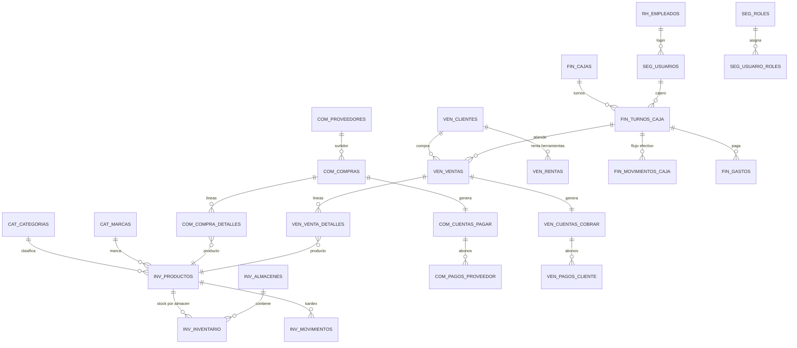
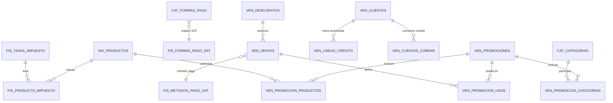

# Base de Datos — Sistema Integral de Ferretería

> **Motor objetivo:** PostgreSQL 14+ · **Zona horaria:** `America/Mexico_City` (hora local México)
> **Alcance:** Venta, Administración, Operación e Inventarios de una ferretería.
> **Documento:** especificación completa (tablas, relaciones, funciones/triggers, vistas, semillas y validación).

---

## Índice

1. [Módulos del sistema](#1-módulos-del-sistema)
2. [Convenciones y decisiones técnicas](#2-convenciones-y-decisiones-técnicas)
3. [Instalación inicial (BD, rol y zona horaria México)](#3-instalación-inicial)
4. [Esquemas de PostgreSQL](#4-esquemas-de-postgresql)
5. [Diagrama Entidad–Relación (macro)](#5-diagrama-entidadrelación-macro)
6. [DDL Módulo `cat` — Catálogos](#6-ddl-módulo-cat--catálogos)
7. [DDL Módulo `cfg` — Configuración y folios](#7-ddl-módulo-cfg--configuración-y-folios)
8. [DDL Módulo `rh` — Empleados y nómina](#8-ddl-módulo-rh--empleados-y-nómina)
9. [DDL Módulo `seg` — Seguridad y auditoría](#9-ddl-módulo-seg--seguridad-y-auditoría)
10. [DDL Módulo `inv` — Productos, almacenes e inventario](#10-ddl-módulo-inv--productos-almacenes-e-inventario)
11. [DDL Módulo `com` — Compras y cuentas por pagar](#11-ddl-módulo-com--compras-y-cuentas-por-pagar)
12. [DDL Módulo `ven` — Ventas, cotizaciones, devoluciones, rentas y cobranza](#12-ddl-módulo-ven--ventas-cotizaciones-devoluciones-rentas-y-cobranza)
13. [DDL Módulo `fin` — Caja, gastos e ingresos](#13-ddl-módulo-fin--caja-gastos-e-ingresos)
14. [Funciones y triggers (integridad centralizada)](#14-funciones-y-triggers)
15. [Índices estratégicos](#15-índices-estratégicos)
16. [Vistas de negocio (incluye las 7 solicitadas)](#16-vistas-de-negocio)
17. [Datos semilla](#17-datos-semilla)
18. [Mapa de relaciones clave](#18-mapa-de-relaciones-clave)
19. [Validación de cobertura](#19-validación-de-cobertura)
20. [Extensión fase 2 — Fiscal, crédito, descuentos y promociones](#20-extensión-fase-2--fiscal-crédito-descuentos-y-promociones)
21. [Vistas adicionales de dashboard](#21-vistas-adicionales-de-dashboard)
22. [Escalabilidad y roadmap](#22-escalabilidad-y-roadmap)

---

## 1. Módulos del sistema

| # | Módulo | Esquema | Responsabilidad |
|---|--------|---------|-----------------|
| 1 | Catálogos | `cat` | Unidades de medida, marcas, categorías, formas de pago, motivos, tipos de gasto, ubicaciones |
| 2 | Configuración | `cfg` | Parámetros del sistema, folios consecutivos por documento |
| 3 | Recursos humanos | `rh` | Empleados, puestos, nómina |
| 4 | Seguridad | `seg` | Usuarios, roles, permisos, sesiones, bitácora de auditoría |
| 5 | Inventario | `inv` | Productos, códigos de barras, almacenes/sucursales, stock, kardex (movimientos), conteos físicos, traslados |
| 6 | Compras | `com` | Órdenes de compra, recepciones/facturas de proveedor, devoluciones a proveedor, cuentas por pagar y pagos |
| 7 | Ventas | `ven` | Cotizaciones, ventas/PV, devoluciones de cliente, rentas de herramienta, servicios, cuentas por cobrar y cobranza |
| 8 | Finanzas / Caja | `fin` | Cajas registradoras, turnos con corte, movimientos de caja, gastos e ingresos diversos |
| 9 | Fiscal | `fis` | Catálogos SAT: IVA, ISR, IEPS, regímenes, usos CFDI, métodos/formas de pago SAT, claves producto/unidad, impuestos por producto |
| 10 | Promoción y Crédito | `ven` (extensión) | Líneas de crédito de clientes, catálogo de descuentos, promociones por producto / total / cantidad / NxM con vigencias por día y horario |

Cobertura de procesos: **punto de venta**, **crédito y cobranza**, **compras y pagos**, **kardex multi-almacén**, **renta de herramientas**, **cortes de caja**, **gastos operativos**, **nómina**, **auditoría**.

---

## 2. Convenciones y decisiones técnicas

### 2.1 Zona horaria (hora local México) — REGLA GLOBAL
- **Todas** las columnas de fecha/hora usan `TIMESTAMPTZ` (`timestamptz` = fecha+hora con zona).
- La base de datos y el rol de aplicación se configuran con `timezone = 'America/Mexico_City'`, de modo que `now()` y `CURRENT_DATE` **siempre devuelven hora local de México** sin cálculos manuales en la aplicación.
- Columnas solo-fecha para reportes (`fecha DATE`) usan `DEFAULT CURRENT_DATE` → respetan la zona configurada.
- Las vistas agrupan con `creado_en::date`, que convierte a fecha **local** porque la sesión está en `America/Mexico_City`.

```sql
ALTER DATABASE ferreteria SET timezone TO 'America/Mexico_City';
ALTER ROLE ferreteria_app SET timezone TO 'America/Mexico_City';
```

### 2.2 Tipos de dato
| Concepto | Tipo | Razón |
|----------|------|-------|
| Dinero | `NUMERIC(14,2)` | Exactitud monetaria (nunca float/double) |
| Cantidades | `NUMERIC(12,3)` | Ferretería vende fraccionado: cable por metro, tornillos por kg, etc. |
| PK transaccionales (alto volumen) | `BIGINT GENERATED ALWAYS AS IDENTITY` | Escala a miles de millones; estándar moderno PG (no SERIAL) |
| PK catálogos | `INTEGER GENERATED ALWAYS AS IDENTITY` | Volumen bajo |
| Texto corto acotado | `VARCHAR(n)` con `CHECK` de dominio | Integridad |
| Banderas de estado | `CHECK (col IN (...))` | Más simple que ENUM y fácil de extender (`ALTER TABLE ... DROP/ADD CONSTRAINT`) |
| JSON flexible | `JSONB` | Atributos variables de producto, metadatos de auditoría |

### 2.3 Patrones aplicados
- **Precio instantáneo (snapshot):** `venta_detalles` guarda `precio_unitario` y `costo_unitario` del momento; cambios futuros de precio no alteran el histórico ni las utilidades.
- **Borrado lógico:** maestros (`productos`, `clientes`, `proveedores`, `usuarios`) usan `activo BOOLEAN` + `eliminado_en TIMESTAMPTZ NULL`. Los documentos (ventas/compras) **nunca se borran**: se cancelan.
- **Kardex append-only:** `inv.movimientos_inventario` es la única fuente de verdad del stock; solo INSERT (nunca UPDATE/DELETE). El stock actual vive en `inventario` y lo mantiene un trigger.
- **Modelo uniforme de crédito:** toda venta genera una cuenta por cobrar; si es contado, el sistema inserta el pago automáticamente. Igual para compras → cuentas por pagar.
- **Caja como libro único de flujo de efectivo:** todo dinero que entra/sale pasa por `fin.movimientos_caja` mediante una sola función (`fn_movimiento_caja`) — un solo escritor, trazabilidad total.
- **Auditoría automática:** trigger genérico sobre tablas maestras críticas hacia `seg.auditoria` (JSONB antes/después). `inventario` no se audita por trigger: su auditoría ES el kardex.
- **Folios consecutivos atómicos:** función con `INSERT ... ON CONFLICT DO UPDATE` (sin carreras).

---

## 3. Instalación inicial

```sql
-- ============================================================
-- BASE DE DATOS Y ROL (ejecutar como superusuario)
-- ============================================================
CREATE DATABASE ferreteria
    WITH ENCODING 'UTF8'
         TEMPLATE template0
         LC_COLLATE  'es_MX.UTF-8'
         LC_CTYPE    'es_MX.UTF-8';

\c ferreteria

-- Hora local México a nivel base de datos (regla global)
ALTER DATABASE ferreteria SET timezone TO 'America/Mexico_City';

-- Rol de aplicación (el backend se conecta con este rol)
CREATE ROLE ferreteria_app LOGIN PASSWORD 'CAMBIAR_EN_PRODUCCION';
ALTER ROLE ferreteria_app SET timezone TO 'America/Mexico_City';
```

```sql
-- ============================================================
-- ESQUEMAS
-- ============================================================
CREATE SCHEMA IF NOT EXISTS cat;   -- catálogos
CREATE SCHEMA IF NOT EXISTS cfg;   -- configuración y folios
CREATE SCHEMA IF NOT EXISTS rh;    -- recursos humanos
CREATE SCHEMA IF NOT EXISTS seg;   -- seguridad y auditoría
CREATE SCHEMA IF NOT EXISTS inv;   -- inventario y productos
CREATE SCHEMA IF NOT EXISTS com;   -- compras
CREATE SCHEMA IF NOT EXISTS ven;   -- ventas
CREATE SCHEMA IF NOT EXISTS fin;   -- finanzas / caja
CREATE SCHEMA IF NOT EXISTS fis;   -- fiscal (catálogos SAT e impuestos)

GRANT USAGE ON SCHEMA cat, cfg, rh, seg, inv, com, ven, fin, fis TO ferreteria_app;
-- (los GRANT de tablas/secuencias van al final, sección 17.1)

-- Extensión opcional para búsqueda por nombre (autocompletado POS)
CREATE EXTENSION IF NOT EXISTS pg_trgm;
```

---

## 4. Esquemas de PostgreSQL

Organización por dominio → facilita permisos por rol, respaldos parciales y crecimiento (p. ej. mover `ven` a otro servidor vía replicación lógica).

```
ferreteria
├── cat   cat.unidades_medida, cat.marcas, cat.categorias, cat.formas_pago,
│         cat.motivos_movimiento, cat.tipos_gasto, cat.puestos,
│         cat.estados, cat.ciudades
├── cfg   cfg.configuracion, cfg.folios
├── rh    rh.empleados, rh.nominas
├── seg   seg.roles, seg.permisos, seg.usuarios, seg.usuario_roles,
│         seg.rol_permisos, seg.sesiones, seg.auditoria
├── inv   inv.productos, inv.producto_codigos_barras, inv.producto_proveedores,
│         inv.almacenes, inv.inventario, inv.movimientos_inventario,
│         inv.conteos_fisicos, inv.conteos_fisicos_detalle, inv.traslados,
│         inv.traslado_detalles
├── com   com.proveedores, com.ordenes_compra, com.orden_compra_detalles,
│         com.compras, com.compra_detalles, com.devoluciones_compra,
│         com.devolucion_compra_detalles, com.cuentas_pagar, com.pagos_proveedor
├── ven   ven.clientes, ven.cotizaciones, ven.cotizacion_detalles, ven.ventas,
│         ven.venta_detalles, ven.devoluciones_venta, ven.devolucion_detalles,
│         ven.rentas, ven.renta_detalles, ven.cuentas_cobrar, ven.pagos_cliente,
│         ven.lineas_credito, ven.descuentos, ven.promociones,
│         ven.promocion_productos, ven.promocion_categorias, ven.promocion_usos
├── fin   fin.cajas, fin.turnos_caja, fin.movimientos_caja,
│         fin.gastos, fin.ingresos_otros
└── fis   fis.impuestos, fis.tasas_impuesto, fis.regimenes_fiscales,
          fis.usos_cfdi, fis.formas_pago_sat, fis.metodos_pago_sat,
          fis.unidades_sat, fis.claves_prod_serv, fis.producto_impuesto
```

---

## 5. Diagrama Entidad–Relación (macro)

Relaciones principales (ver DDL completo por tabla en las secciones siguientes):



---

## 6. DDL Módulo `cat` — Catálogos

### 6.1 Unidades de medida

```sql
CREATE TABLE cat.unidades_medida (
    unidad_id      INTEGER GENERATED ALWAYS AS IDENTITY PRIMARY KEY,
    clave          VARCHAR(10)  NOT NULL UNIQUE,          -- PZA, KG, M, M2...
    nombre         VARCHAR(50)  NOT NULL,
    permite_fraccion BOOLEAN    NOT NULL DEFAULT false,    -- vender 2.5 m de cable
    activo         BOOLEAN      NOT NULL DEFAULT true
);
```

### 6.2 Marcas

```sql
CREATE TABLE cat.marcas (
    marca_id   INTEGER GENERATED ALWAYS AS IDENTITY PRIMARY KEY,
    nombre     VARCHAR(100) NOT NULL UNIQUE,
    activo     BOOLEAN NOT NULL DEFAULT true
);
```

### 6.3 Categorías (jerárquica, auto-referenciada)

```sql
CREATE TABLE cat.categorias (
    categoria_id        INTEGER GENERATED ALWAYS AS IDENTITY PRIMARY KEY,
    nombre              VARCHAR(100) NOT NULL,
    categoria_padre_id  INTEGER REFERENCES cat.categorias(categoria_id),
    ruta                TEXT,                       -- 'Herramientas > Manuales > Llaves' (denormalizado p/ reportes)
    nivel               SMALLINT NOT NULL DEFAULT 0 CHECK (nivel BETWEEN 0 AND 5),
    activo              BOOLEAN NOT NULL DEFAULT true,
    CONSTRAINT chk_cat_no_auto_padre CHECK (categoria_id <> categoria_padre_id)
);

CREATE INDEX idx_categorias_padre ON cat.categorias(categoria_padre_id);
```

### 6.4 Formas de pago

```sql
CREATE TABLE cat.formas_pago (
    forma_pago_id INTEGER GENERATED ALWAYS AS IDENTITY PRIMARY KEY,
    clave         VARCHAR(25) NOT NULL UNIQUE,       -- EFECTIVO, TARJETA_DEBITO...
    nombre        VARCHAR(60) NOT NULL,
    es_efectivo   BOOLEAN NOT NULL DEFAULT false,    -- impacta físico en caja
    requiere_referencia BOOLEAN NOT NULL DEFAULT false, -- tarjeta/transferencia piden ref
    afecta_caja   BOOLEAN NOT NULL DEFAULT true,     -- CREDITO_INTERNO = false
    activo        BOOLEAN NOT NULL DEFAULT true
);
```

### 6.5 Motivos de movimiento de inventario

```sql
CREATE TABLE cat.motivos_movimiento (
    motivo_id  INTEGER GENERATED ALWAYS AS IDENTITY PRIMARY KEY,
    clave      VARCHAR(30) NOT NULL UNIQUE,
    nombre     VARCHAR(80) NOT NULL,
    tipo_default VARCHAR(8) NOT NULL CHECK (tipo_default IN ('ENTRADA','SALIDA')),
    -- COMPRA(E), VENTA(S), DEVOLUCION_VENTA(E), DEVOLUCION_COMPRA(S),
    -- AJUSTE_INVENTARIO(*), TRASLADO_ENTRADA/SALIDA, CONTEO_FISICO(*),
    -- DETERIORO(S), USO_INTERNO(S), MUESTRA(S), INVENTARIO_INICIAL(E)
    activo     BOOLEAN NOT NULL DEFAULT true
);
```

### 6.6 Tipos de gasto

```sql
CREATE TABLE cat.tipos_gasto (
    tipo_gasto_id INTEGER GENERATED ALWAYS AS IDENTITY PRIMARY KEY,
    clave         VARCHAR(30) NOT NULL UNIQUE,
    nombre        VARCHAR(80) NOT NULL,
    es_fijo       BOOLEAN NOT NULL DEFAULT false,   -- renta local vs fletes
    activo        BOOLEAN NOT NULL DEFAULT true
);
```

### 6.7 Puestos

```sql
CREATE TABLE cat.puestos (
    puesto_id INTEGER GENERATED ALWAYS AS IDENTITY PRIMARY KEY,
    nombre    VARCHAR(80) NOT NULL UNIQUE,          -- Gerente, Cajero, Vendedor, Almacenista
    sueldo_base NUMERIC(10,2) NOT NULL DEFAULT 0 CHECK (sueldo_base >= 0),
    activo    BOOLEAN NOT NULL DEFAULT true
);
```

### 6.8 Estados y ciudades (México)

```sql
CREATE TABLE cat.estados (
    estado_id INTEGER GENERATED ALWAYS AS IDENTITY PRIMARY KEY,
    clave_inegi VARCHAR(3) NOT NULL UNIQUE,          -- 01..32
    nombre    VARCHAR(60) NOT NULL UNIQUE
);

CREATE TABLE cat.ciudades (
    ciudad_id  INTEGER GENERATED ALWAYS AS IDENTITY PRIMARY KEY,
    estado_id  INTEGER NOT NULL REFERENCES cat.estados(estado_id),
    nombre     VARCHAR(100) NOT NULL,
    UNIQUE (estado_id, nombre)
);

CREATE INDEX idx_ciudades_estado ON cat.ciudades(estado_id);
```

---

## 7. DDL Módulo `cfg` — Configuración y folios

### 7.1 Parámetros del sistema

```sql
CREATE TABLE cfg.configuracion (
    clave      VARCHAR(60) PRIMARY KEY,
    valor      TEXT NOT NULL,
    descripcion VARCHAR(200),
    actualizado_en TIMESTAMPTZ NOT NULL DEFAULT now()
);
-- Semillas esperadas (sección 17): moneda=MXN, iva_tasa=16.00,
-- permitir_stock_negativo=false, dias_credito_default=15, margen_minimo_alerta=10
```

### 7.2 Folios consecutivos por documento

```sql
CREATE TABLE cfg.folios (
    tipo        VARCHAR(25) PRIMARY KEY,     -- VENTA, COMPRA, DEVOLUCION_VENTA...
    prefijo     VARCHAR(6)  NOT NULL,        -- V-, C-, DV-...
    consecutivo BIGINT      NOT NULL DEFAULT 0,
    actualizado_en TIMESTAMPTZ NOT NULL DEFAULT now()
);
```

---

## 8. DDL Módulo `rh` — Empleados y nómina

### 8.1 Empleados

```sql
CREATE TABLE rh.empleados (
    empleado_id   INTEGER GENERATED ALWAYS AS IDENTITY PRIMARY KEY,
    puesto_id     INTEGER NOT NULL REFERENCES cat.puestos(puesto_id),
    nombre        VARCHAR(80)  NOT NULL,
    apellido_p    VARCHAR(80)  NOT NULL,
    apellido_m    VARCHAR(80),
    curp          VARCHAR(18)  UNIQUE,
    nss           VARCHAR(11)  UNIQUE,
    telefono      VARCHAR(20),
    email         VARCHAR(120) UNIQUE,
    calle         VARCHAR(150),
    colonia       VARCHAR(100),
    ciudad_id     INTEGER REFERENCES cat.ciudades(ciudad_id),
    cp            VARCHAR(10),
    fecha_ingreso DATE NOT NULL DEFAULT CURRENT_DATE,
    fecha_baja    DATE,
    sueldo_diario NUMERIC(10,2) NOT NULL DEFAULT 0 CHECK (sueldo_diario >= 0),
    activo        BOOLEAN NOT NULL DEFAULT true,
    CONSTRAINT chk_empleado_baja CHECK (fecha_baja IS NULL OR fecha_baja >= fecha_ingreso)
);

CREATE INDEX idx_empleados_puesto ON rh.empleados(puesto_id);
```

### 8.2 Nómina (percepciones/deducciones simplificadas por periodo)

```sql
CREATE TABLE rh.nominas (
    nomina_id    BIGINT GENERATED ALWAYS AS IDENTITY PRIMARY KEY,
    empleado_id  INTEGER NOT NULL REFERENCES rh.empleados(empleado_id),
    periodo_ini  DATE NOT NULL,
    periodo_fin  DATE NOT NULL,
    dias_pagados NUMERIC(4,1) NOT NULL CHECK (dias_pagados > 0),
    percepciones NUMERIC(12,2) NOT NULL DEFAULT 0,
    deducciones  NUMERIC(12,2) NOT NULL DEFAULT 0,
    neto_pagar   NUMERIC(12,2) GENERATED ALWAYS AS (percepciones - deducciones) STORED,
    estado       VARCHAR(12) NOT NULL DEFAULT 'PENDIENTE'
                 CHECK (estado IN ('PENDIENTE','PAGADA','CANCELADA')),
    fecha_pago   TIMESTAMPTZ,
    usuario_registra_id INTEGER NOT NULL REFERENCES seg.usuarios(usuario_id),
    notas        TEXT,
    CONSTRAINT chk_nomina_periodo CHECK (periodo_fin >= periodo_ini),
    CONSTRAINT uq_nomina_empleado_periodo UNIQUE (empleado_id, periodo_ini, periodo_fin)
);

CREATE INDEX idx_nominas_estado_fecha ON rh.nominas(estado, periodo_fin);
```

> FK cruzada: `usuario_registra_id` → `seg.usuarios` se crea aquí porque `seg` ya fue definido antes (sección 9). Orden de ejecución garantizado.

---

## 9. DDL Módulo `seg` — Seguridad y auditoría

### 9.1 Roles

```sql
CREATE TABLE seg.roles (
    rol_id   INTEGER GENERATED ALWAYS AS IDENTITY PRIMARY KEY,
    clave    VARCHAR(30) NOT NULL UNIQUE,     -- ADMINISTRADOR, CAJERO, VENDEDOR...
    nombre   VARCHAR(80) NOT NULL,
    descripcion VARCHAR(200),
    activo   BOOLEAN NOT NULL DEFAULT true
);
```

### 9.2 Permisos granulares

```sql
CREATE TABLE seg.permisos (
    permiso_id INTEGER GENERATED ALWAYS AS IDENTITY PRIMARY KEY,
    clave      VARCHAR(40) NOT NULL UNIQUE,   -- V.VENDER, V.CANCELAR, I.AJUSTAR_STOCK...
    descripcion VARCHAR(150) NOT NULL
);
```

### 9.3 Usuarios

```sql
CREATE TABLE seg.usuarios (
    usuario_id  INTEGER GENERATED ALWAYS AS IDENTITY PRIMARY KEY,
    empleado_id INTEGER UNIQUE REFERENCES rh.empleados(empleado_id),
    username    VARCHAR(40)  NOT NULL UNIQUE,
    email       VARCHAR(120) UNIQUE,
    password_hash VARCHAR(255) NOT NULL,        -- bcrypt/argon2 — JAMÁS texto plano
    activo      BOOLEAN NOT NULL DEFAULT true,
    ultimo_login TIMESTAMPTZ,
    creado_en   TIMESTAMPTZ NOT NULL DEFAULT now(),
    eliminado_en TIMESTAMPTZ
);

COMMENT ON COLUMN seg.usuarios.password_hash IS
    'Hash bcrypt/argon2 generado por la aplicación. Nunca almacenar contraseñas en claro.';
```

### 9.4 Asignaciones N:M

```sql
CREATE TABLE seg.usuario_roles (
    usuario_id INTEGER NOT NULL REFERENCES seg.usuarios(usuario_id) ON DELETE CASCADE,
    rol_id     INTEGER NOT NULL REFERENCES seg.roles(rol_id),
    PRIMARY KEY (usuario_id, rol_id)
);

CREATE TABLE seg.rol_permisos (
    rol_id     INTEGER NOT NULL REFERENCES seg.roles(rol_id) ON DELETE CASCADE,
    permiso_id INTEGER NOT NULL REFERENCES seg.permisos(permiso_id) ON DELETE CASCADE,
    PRIMARY KEY (rol_id, permiso_id)
);
```

### 9.5 Sesiones (trazabilidad de logins)

```sql
CREATE TABLE seg.sesiones (
    sesion_id  BIGINT GENERATED ALWAYS AS IDENTITY PRIMARY KEY,
    usuario_id INTEGER NOT NULL REFERENCES seg.usuarios(usuario_id),
    ip_address INET,
    user_agent TEXT,
    inicio     TIMESTAMPTZ NOT NULL DEFAULT now(),
    fin        TIMESTAMPTZ,
    cerrada_por_logout BOOLEAN NOT NULL DEFAULT false
);

CREATE INDEX idx_sesiones_usuario ON seg.sesiones(usuario_id, inicio DESC);
```

### 9.6 Auditoría genérica (JSONB)

```sql
CREATE TABLE seg.auditoria (
    auditoria_id BIGINT GENERATED ALWAYS AS IDENTITY PRIMARY KEY,
    esquema      VARCHAR(40)  NOT NULL,
    tabla        VARCHAR(60)  NOT NULL,
    registro_id  BIGINT       NOT NULL,
    accion       VARCHAR(8)   NOT NULL CHECK (accion IN ('INSERT','UPDATE','DELETE')),
    datos_anteriores JSONB,
    datos_nuevos     JSONB,
    usuario_id   INTEGER REFERENCES seg.usuarios(usuario_id),   -- set via app set_config('app.usuario_id')
    creado_en    TIMESTAMPTZ NOT NULL DEFAULT now()
);

CREATE INDEX idx_auditoria_tabla_registro ON seg.auditoria(esquema, tabla, registro_id);
CREATE INDEX idx_auditoria_fecha ON seg.auditoria(creado_en DESC);
```

---

## 10. DDL Módulo `inv` — Productos, almacenes e inventario

### 10.1 Productos

`tipo` unifica tres realidades del negocio: producto físico con stock, servicio (mano de obra, corte de vidrio) y herramienta de renta.

```sql
CREATE TABLE inv.productos (
    producto_id    BIGINT GENERATED ALWAYS AS IDENTITY PRIMARY KEY,
    codigo         VARCHAR(40) UNIQUE,             -- SKU interno (opcional si solo usa EAN)
    tipo           VARCHAR(20) NOT NULL DEFAULT 'PRODUCTO'
                   CHECK (tipo IN ('PRODUCTO','SERVICIO','HERRAMIENTA_RENTA')),
    nombre         VARCHAR(180) NOT NULL,
    descripcion    TEXT,
    categoria_id   INTEGER NOT NULL REFERENCES cat.categorias(categoria_id),
    marca_id       INTEGER REFERENCES cat.marcas(marca_id),
    unidad_medida_id INTEGER NOT NULL REFERENCES cat.unidades_medida(unidad_id),
    -- Precios (NUMERIC exacto; snapshot en documentos)
    costo_actual   NUMERIC(12,2) NOT NULL DEFAULT 0 CHECK (costo_actual >= 0),
    precio_menudeo NUMERIC(12,2) NOT NULL DEFAULT 0 CHECK (precio_menudeo >= 0),
    precio_mayoreo NUMERIC(12,2),
    mayoreo_desde  NUMERIC(12,3),                  -- cantidad mínima p/ precio mayoreo
    aplica_iva     BOOLEAN NOT NULL DEFAULT true,
    -- Control operativo
    stock_minimo_global NUMERIC(12,3) DEFAULT 0,   -- sugerencia; el mínimo real vive en inventario
    ubicacion_almacen VARCHAR(40),                 -- pasillo-anaquel p/ surtido rápido
    atributos      JSONB,                          -- {"potencia_w":"800","material":"acero"} flexibles
    imagen_url     TEXT,
    activo         BOOLEAN NOT NULL DEFAULT true,
    creado_en      TIMESTAMPTZ NOT NULL DEFAULT now(),
    actualizado_en TIMESTAMPTZ NOT NULL DEFAULT now()
);

CREATE INDEX idx_productos_categoria ON inv.productos(categoria_id);
CREATE INDEX idx_productos_marca     ON inv.productos(marca_id);
CREATE INDEX idx_productos_nombre_trgm ON inv.productos USING GIN (nombre gin_trgm_ops);  -- búsqueda tipo LIKE '%tornillo%'
CREATE INDEX idx_productos_activos ON inv.productos(categoria_id) WHERE activo;
```

### 10.2 Códigos de barras (un producto puede tener varios: pieza vs paquete)

```sql
CREATE TABLE inv.producto_codigos_barras (
    codigo_barras VARCHAR(50) PRIMARY KEY,
    producto_id   BIGINT NOT NULL REFERENCES inv.productos(producto_id) ON DELETE CASCADE,
    factor        NUMERIC(12,3) NOT NULL DEFAULT 1 CHECK (factor > 0)  -- escanear caja = 12 piezas
);
```

### 10.3 Proveedores ↔ productos (N:M con costo referencial)

```sql
CREATE TABLE inv.producto_proveedores (
    producto_id   BIGINT NOT NULL REFERENCES inv.productos(producto_id) ON DELETE CASCADE,
    proveedor_id  INTEGER NOT NULL REFERENCES com.proveedores(proveedor_id),
    costo_ref     NUMERIC(12,2),
    tiempo_entrega_dias SMALLINT,
    codigo_proveedor VARCHAR(40),
    es_principal  BOOLEAN NOT NULL DEFAULT false,
    PRIMARY KEY (producto_id, proveedor_id)
);
```

### 10.4 Almacenes / sucursales

```sql
CREATE TABLE inv.almacenes (
    almacen_id  INTEGER GENERATED ALWAYS AS IDENTITY PRIMARY KEY,
    nombre      VARCHAR(100) NOT NULL UNIQUE,      -- Sucursal Centro, Bodega Norte
    direccion   TEXT,
    telefono    VARCHAR(20),
    es_punto_venta BOOLEAN NOT NULL DEFAULT true,
    activo      BOOLEAN NOT NULL DEFAULT true
);
```

### 10.5 Inventario (stock actual por producto × almacén)

```sql
CREATE TABLE inv.inventario (
    producto_id  BIGINT  NOT NULL REFERENCES inv.productos(producto_id),
    almacen_id   INTEGER NOT NULL REFERENCES inv.almacenes(almacen_id),
    stock        NUMERIC(12,3) NOT NULL DEFAULT 0,
    stock_minimo NUMERIC(12,3) NOT NULL DEFAULT 0,
    stock_maximo NUMERIC(12,3),
    reservado    NUMERIC(12,3) NOT NULL DEFAULT 0,   -- apartados/cotizaciones firmes
    actualizado_en TIMESTAMPTZ NOT NULL DEFAULT now(),
    PRIMARY KEY (producto_id, almacen_id)
    -- NOTA: el CHECK stock >= 0 se aplica en el trigger (§14.3) leyendo
    -- cfg.configuracion.permitir_stock_negativo, para permitir la excepción
    -- configurada sin violar la restricción.
);

CREATE INDEX idx_inventario_almacen_stock ON inv.inventario(almacen_id, stock);  -- vista stock bajo
```

### 10.6 Kardex — movimientos de inventario (append-only)

```sql
CREATE TABLE inv.movimientos_inventario (
    movimiento_id BIGINT GENERATED ALWAYS AS IDENTITY PRIMARY KEY,
    producto_id   BIGINT  NOT NULL REFERENCES inv.productos(producto_id),
    almacen_id    INTEGER NOT NULL REFERENCES inv.almacenes(almacen_id),
    tipo          VARCHAR(8) NOT NULL CHECK (tipo IN ('ENTRADA','SALIDA')),
    cantidad      NUMERIC(12,3) NOT NULL CHECK (cantidad > 0),
    costo_unitario NUMERIC(12,2),                    -- costo histórico del momento
    motivo_id     INTEGER NOT NULL REFERENCES cat.motivos_movimiento(motivo_id),
    ref_tabla     VARCHAR(40),                       -- 'ven.ventas', 'com.compras', ...
    ref_id        BIGINT,                            -- id del documento origen
    traslado_id   BIGINT,                            -- FK añadida al final (sección 14.1)
    nota          TEXT,
    usuario_id    INTEGER REFERENCES seg.usuarios(usuario_id),
    creado_en     TIMESTAMPTZ NOT NULL DEFAULT now()
);

CREATE INDEX idx_mov_inv_producto_fecha ON inv.movimientos_inventario(producto_id, creado_en DESC);
CREATE INDEX idx_mov_inv_documento      ON inv.movimientos_inventario(ref_tabla, ref_id);
CREATE INDEX idx_mov_inv_almacen_fecha  ON inv.movimientos_inventario(almacen_id, creado_en DESC);
```

### 10.7 Conteos físicos

```sql
CREATE TABLE inv.conteos_fisicos (
    conteo_id   BIGINT GENERATED ALWAYS AS IDENTITY PRIMARY KEY,
    almacen_id  INTEGER NOT NULL REFERENCES inv.almacenes(almacen_id),
    fecha       TIMESTAMPTZ NOT NULL DEFAULT now(),
    estado      VARCHAR(12) NOT NULL DEFAULT 'EN_PROCESO'
                CHECK (estado IN ('EN_PROCESO','APLICADO','CANCELADO')),
    usuario_id  INTEGER NOT NULL REFERENCES seg.usuarios(usuario_id),
    observaciones TEXT
);

CREATE TABLE inv.conteos_fisicos_detalle (
    conteo_id     BIGINT NOT NULL REFERENCES inv.conteos_fisicos(conteo_id) ON DELETE CASCADE,
    producto_id   BIGINT NOT NULL REFERENCES inv.productos(producto_id),
    cantidad_sistema NUMERIC(12,3) NOT NULL,   -- snapshot al abrir el conteo
    cantidad_fisica  NUMERIC(12,3) NOT NULL,
    diferencia    NUMERIC(12,3) GENERATED ALWAYS AS (cantidad_fisica - cantidad_sistema) STORED,
    PRIMARY KEY (conteo_id, producto_id)
);
```

### 10.8 Traslados entre almacenes

```sql
CREATE TABLE inv.traslados (
    traslado_id     BIGINT GENERATED ALWAYS AS IDENTITY PRIMARY KEY,
    folio           TEXT NOT NULL UNIQUE,
    almacen_origen  INTEGER NOT NULL REFERENCES inv.almacenes(almacen_id),
    almacen_destino INTEGER NOT NULL REFERENCES inv.almacenes(almacen_id),
    estado          VARCHAR(12) NOT NULL DEFAULT 'APLICADO'
                    CHECK (estado IN ('APLICADO','CANCELADO')),
    usuario_id      INTEGER NOT NULL REFERENCES seg.usuarios(usuario_id),
    creado_en       TIMESTAMPTZ NOT NULL DEFAULT now(),
    CONSTRAINT chk_traslado_distinto CHECK (almacen_origen <> almacen_destino)
);

CREATE TABLE inv.traslado_detalles (
    traslado_id  BIGINT NOT NULL REFERENCES inv.traslados(traslado_id) ON DELETE CASCADE,
    producto_id  BIGINT NOT NULL REFERENCES inv.productos(producto_id),
    cantidad     NUMERIC(12,3) NOT NULL CHECK (cantidad > 0),
    PRIMARY KEY (traslado_id, producto_id)
);
```

---

## 11. DDL Módulo `com` — Compras y cuentas por pagar

### 11.1 Proveedores

```sql
CREATE TABLE com.proveedores (
    proveedor_id   INTEGER GENERATED ALWAYS AS IDENTITY PRIMARY KEY,
    razon_social   VARCHAR(180) NOT NULL,
    rfc            VARCHAR(13) CHECK (rfc ~* '^[A-ZÑ&]{3,4}[0-9]{6}[A-V1-9][0-9A-Z]{2}$'),
    regimen_fiscal VARCHAR(10),                     -- 601, 612, 626... (CFDI)
    contacto_nombre VARCHAR(120),
    telefono       VARCHAR(20),
    email          VARCHAR(120),
    calle          VARCHAR(150),
    colonia        VARCHAR(100),
    ciudad_id      INTEGER REFERENCES cat.ciudades(ciudad_id),
    cp             VARCHAR(10),
    dias_credito   SMALLINT NOT NULL DEFAULT 0 CHECK (dias_credito BETWEEN 0 AND 365),
    limite_credito NUMERIC(12,2) NOT NULL DEFAULT 0,
    activo         BOOLEAN NOT NULL DEFAULT true,
    creado_en      TIMESTAMPTZ NOT NULL DEFAULT now(),
    actualizado_en TIMESTAMPTZ NOT NULL DEFAULT now(),

    CONSTRAINT uq_proveedor_razon UNIQUE (razon_social)
);
```

### 11.2 Órdenes de compra (documento previo, no mueve stock)

```sql
CREATE TABLE com.ordenes_compra (
    orden_compra_id BIGINT GENERATED ALWAYS AS IDENTITY PRIMARY KEY,
    folio           TEXT NOT NULL UNIQUE,
    proveedor_id    INTEGER NOT NULL REFERENCES com.proveedores(proveedor_id),
    almacen_destino INTEGER NOT NULL REFERENCES inv.almacenes(almacen_id),
    fecha           TIMESTAMPTZ NOT NULL DEFAULT now(),
    fecha_esperada  DATE,
    estado          VARCHAR(12) NOT NULL DEFAULT 'EMITIDA'
                    CHECK (estado IN ('BORRADOR','EMITIDA','RECIBIDA_TOTAL','RECIBIDA_PARCIAL','CANCELADA')),
    total_estimado  NUMERIC(14,2) NOT NULL DEFAULT 0,
    usuario_id      INTEGER NOT NULL REFERENCES seg.usuarios(usuario_id),
    notas           TEXT
);

CREATE TABLE com.orden_compra_detalles (
    orden_compra_id BIGINT NOT NULL REFERENCES com.ordenes_compra(orden_compra_id) ON DELETE CASCADE,
    producto_id     BIGINT NOT NULL REFERENCES inv.productos(producto_id),
    cantidad        NUMERIC(12,3) NOT NULL CHECK (cantidad > 0),
    costo_unitario  NUMERIC(12,2) NOT NULL CHECK (costo_unitario >= 0),
    recibido        NUMERIC(12,3) NOT NULL DEFAULT 0,
    PRIMARY KEY (orden_compra_id, producto_id)
);
```

### 11.3 Compras (recepción / factura que SÍ entra al kardex)

```sql
CREATE TABLE com.compras (
    compra_id      BIGINT GENERATED ALWAYS AS IDENTITY PRIMARY KEY,
    folio          TEXT NOT NULL UNIQUE,             -- folio interno
    factura_proveedor VARCHAR(50),                   -- folio fiscal/proveedor
    proveedor_id   INTEGER NOT NULL REFERENCES com.proveedores(proveedor_id),
    orden_compra_id BIGINT REFERENCES com.ordenes_compra(orden_compra_id),
    almacen_id     INTEGER NOT NULL REFERENCES inv.almacenes(almacen_id),
    fecha          TIMESTAMPTZ NOT NULL DEFAULT now(),
    forma_pago_id  INTEGER NOT NULL REFERENCES cat.formas_pago(forma_pago_id),
    subtotal       NUMERIC(14,2) NOT NULL DEFAULT 0,
    iva            NUMERIC(14,2) NOT NULL DEFAULT 0,
    descuento_total NUMERIC(14,2) NOT NULL DEFAULT 0,
    total          NUMERIC(14,2) NOT NULL DEFAULT 0,
    estado         VARCHAR(12) NOT NULL DEFAULT 'RECIBIDA'
                   CHECK (estado IN ('PENDIENTE','RECIBIDA','CANCELADA')),
    usuario_id     INTEGER NOT NULL REFERENCES seg.usuarios(usuario_id),
    turno_caja_id  BIGINT,                           -- FK añadida en 14.1
    notas          TEXT
);

CREATE TABLE com.compra_detalles (
    compra_detalle_id BIGINT GENERATED ALWAYS AS IDENTITY PRIMARY KEY,
    compra_id       BIGINT NOT NULL REFERENCES com.compras(compra_id) ON DELETE CASCADE,
    producto_id     BIGINT NOT NULL REFERENCES inv.productos(producto_id),
    cantidad        NUMERIC(12,3) NOT NULL CHECK (cantidad > 0),
    costo_unitario  NUMERIC(12,2) NOT NULL CHECK (costo_unitario >= 0),
    importe_linea   NUMERIC(14,2) GENERATED ALWAYS AS (cantidad * costo_unitario) STORED
);

CREATE INDEX idx_compra_det_producto ON com.compra_detalles(producto_id);
```

### 11.4 Devoluciones a proveedor

```sql
CREATE TABLE com.devoluciones_compra (
    devolucion_id BIGINT GENERATED ALWAYS AS IDENTITY PRIMARY KEY,
    folio         TEXT NOT NULL UNIQUE,
    compra_id     BIGINT NOT NULL REFERENCES com.compras(compra_id),
    proveedor_id  INTEGER NOT NULL REFERENCES com.proveedores(proveedor_id),
    almacen_id    INTEGER NOT NULL REFERENCES inv.almacenes(almacen_id),
    fecha         TIMESTAMPTZ NOT NULL DEFAULT now(),
    motivo        TEXT NOT NULL,
    total         NUMERIC(14,2) NOT NULL DEFAULT 0,
    forma_abono_id INTEGER REFERENCES cat.formas_pago(forma_pago_id),  -- EFECTIVO o abono en cuenta
    usuario_id    INTEGER NOT NULL REFERENCES seg.usuarios(usuario_id)
);

CREATE TABLE com.devolucion_compra_detalles (
    devolucion_id  BIGINT NOT NULL REFERENCES com.devoluciones_compra(devolucion_id) ON DELETE CASCADE,
    producto_id    BIGINT NOT NULL REFERENCES inv.productos(producto_id),
    cantidad       NUMERIC(12,3) NOT NULL CHECK (cantidad > 0),
    costo_unitario NUMERIC(12,2) NOT NULL,
    importe_linea  NUMERIC(14,2) GENERATED ALWAYS AS (cantidad * costo_unitario) STORED,
    PRIMARY KEY (devolucion_id, producto_id)
);
```

### 11.5 Cuentas por pagar y pagos (modelo uniforme)

Toda compra crea su cuenta por pagar; si la compra fue contado, el trigger inserta el pago inmediato (sección 14).

```sql
CREATE TABLE com.cuentas_pagar (
    cuenta_pagar_id BIGINT GENERATED ALWAYS AS IDENTITY PRIMARY KEY,
    compra_id       BIGINT NOT NULL UNIQUE REFERENCES com.compras(compra_id),
    monto_total     NUMERIC(14,2) NOT NULL CHECK (monto_total > 0),
    monto_pagado    NUMERIC(14,2) NOT NULL DEFAULT 0 CHECK (monto_pagado >= 0),
    fecha_vencimiento DATE NOT NULL,
    estado          VARCHAR(12) NOT NULL DEFAULT 'VIGENTE'
                    CHECK (estado IN ('VIGENTE','PARCIAL','LIQUIDADA','CANCELADA')),
    creado_en       TIMESTAMPTZ NOT NULL DEFAULT now(),
    CONSTRAINT chk_cp_pago_monto CHECK (monto_pagado <= monto_total)
);

CREATE INDEX idx_cp_vencimiento ON com.cuentas_pagar(fecha_vencimiento) WHERE estado <> 'LIQUIDADA';

CREATE TABLE com.pagos_proveedor (
    pago_proveedor_id BIGINT GENERATED ALWAYS AS IDENTITY PRIMARY KEY,
    cuenta_pagar_id BIGINT NOT NULL REFERENCES com.cuentas_pagar(cuenta_pagar_id),
    forma_pago_id   INTEGER NOT NULL REFERENCES cat.formas_pago(forma_pago_id),
    referencia      VARCHAR(80),                     -- no. cheque/transferencia
    monto           NUMERIC(14,2) NOT NULL CHECK (monto > 0),
    fecha           TIMESTAMPTZ NOT NULL DEFAULT now(),
    usuario_id      INTEGER NOT NULL REFERENCES seg.usuarios(usuario_id),
    turno_caja_id   BIGINT                           -- FK añadida en 14.1
);

CREATE INDEX idx_pp_cuenta ON com.pagos_proveedor(cuenta_pagar_id);
```

---

## 12. DDL Módulo `ven` — Ventas, cotizaciones, devoluciones, rentas y cobranza

### 12.1 Clientes

```sql
CREATE TABLE ven.clientes (
    cliente_id     BIGINT GENERATED ALWAYS AS IDENTITY PRIMARY KEY,
    tipo_persona   VARCHAR(10) NOT NULL DEFAULT 'FISICA'
                   CHECK (tipo_persona IN ('FISICA','MORAL')),
    razon_social   VARCHAR(180) NOT NULL,            -- nombre completo si física
    nombre_comercial VARCHAR(180),
    rfc            VARCHAR(13) CHECK (rfc ~* '^[A-ZÑ&]{3,4}[0-9]{6}[A-V1-9][0-9A-Z]{2}$'),
    curp           VARCHAR(18),
    regimen_fiscal VARCHAR(10),
    telefono       VARCHAR(20),
    whatsapp       VARCHAR(20),
    email          VARCHAR(120),
    calle          VARCHAR(150),
    colonia        VARCHAR(100),
    ciudad_id      INTEGER REFERENCES cat.ciudades(ciudad_id),
    cp             VARCHAR(10),
    -- Crédito interno
    limite_credito NUMERIC(12,2) NOT NULL DEFAULT 0,
    dias_credito   SMALLINT NOT NULL DEFAULT 0 CHECK (dias_credito BETWEEN 0 AND 365),
    -- Frecuente/mayorista
    es_mayorista   BOOLEAN NOT NULL DEFAULT false,
    descuento_pct  NUMERIC(5,2) NOT NULL DEFAULT 0 CHECK (descuento_pct BETWEEN 0 AND 100),
    notas          TEXT,
    activo         BOOLEAN NOT NULL DEFAULT true,
    creado_en      TIMESTAMPTZ NOT NULL DEFAULT now(),
    actualizado_en TIMESTAMPTZ NOT NULL DEFAULT now()
);

CREATE INDEX idx_clientes_razon_trgm ON ven.clientes USING GIN (razon_social gin_trgm_ops);
CREATE INDEX idx_clientes_telefono ON ven.clientes(telefono);
```

### 12.2 Cotizaciones (prospectos convertibles a venta)

```sql
CREATE TABLE ven.cotizaciones (
    cotizacion_id BIGINT GENERATED ALWAYS AS IDENTITY PRIMARY KEY,
    folio         TEXT NOT NULL UNIQUE,
    cliente_id    BIGINT REFERENCES ven.clientes(cliente_id),
    fecha         TIMESTAMPTZ NOT NULL DEFAULT now(),
    vigencia_hasta DATE,
    subtotal      NUMERIC(14,2) NOT NULL DEFAULT 0,
    iva           NUMERIC(14,2) NOT NULL DEFAULT 0,
    total         NUMERIC(14,2) NOT NULL DEFAULT 0,
    estado        VARCHAR(12) NOT NULL DEFAULT 'VIGENTE'
                  CHECK (estado IN ('VIGENTE','CONVERTIDA','EXPIRADA','CANCELADA')),
    venta_generada_id BIGINT,                        -- FK añadida en 14.1 (dependencia circular ventas)
    usuario_id    INTEGER NOT NULL REFERENCES seg.usuarios(usuario_id)
);

CREATE TABLE ven.cotizacion_detalles (
    cotizacion_id  BIGINT NOT NULL REFERENCES ven.cotizaciones(cotizacion_id) ON DELETE CASCADE,
    producto_id    BIGINT NOT NULL REFERENCES inv.productos(producto_id),
    cantidad       NUMERIC(12,3) NOT NULL CHECK (cantidad > 0),
    precio_unitario NUMERIC(12,2) NOT NULL,
    importe_linea  NUMERIC(14,2) GENERATED ALWAYS AS (cantidad * precio_unitario) STORED,
    PRIMARY KEY (cotizacion_id, producto_id)
);
```

### 12.3 Ventas (núcleo del punto de venta)

```sql
CREATE TABLE ven.ventas (
    venta_id       BIGINT GENERATED ALWAYS AS IDENTITY PRIMARY KEY,
    folio          TEXT NOT NULL UNIQUE,             -- asignado por trigger (cfg.fn_siguiente_folio)
    cliente_id     BIGINT REFERENCES ven.clientes(cliente_id),   -- NULL = público general
    almacen_id     INTEGER NOT NULL REFERENCES inv.almacenes(almacen_id),
    cotizacion_id  BIGINT REFERENCES ven.cotizaciones(cotizacion_id),
    fecha          TIMESTAMPTZ NOT NULL DEFAULT now(),
    fecha_local    DATE GENERATED ALWAYS AS ((fecha AT TIME ZONE 'America/Mexico_City')::date) STORED,
    forma_pago_id  INTEGER NOT NULL REFERENCES cat.formas_pago(forma_pago_id),
    iva_tasa       NUMERIC(5,2)  NOT NULL DEFAULT 16.00,   -- snapshot de cfg al vender
    iva_incluido   BOOLEAN NOT NULL DEFAULT true,          -- precios al público con IVA incluido
    subtotal       NUMERIC(14,2) NOT NULL DEFAULT 0,       -- recalculado por trigger
    iva            NUMERIC(14,2) NOT NULL DEFAULT 0,
    descuento_total NUMERIC(14,2) NOT NULL DEFAULT 0,
    total          NUMERIC(14,2) NOT NULL DEFAULT 0,
    estado         VARCHAR(12) NOT NULL DEFAULT 'COMPLETADA'
                   CHECK (estado IN ('COMPLETADA','CANCELADA')),
    usuario_id     INTEGER NOT NULL REFERENCES seg.usuarios(usuario_id),
    turno_caja_id  BIGINT,                                 -- FK añadida en 14.1
    notas          TEXT
);

-- Consulta estrella del POS: ventas por fecha/turno/cajero
CREATE INDEX idx_ventas_fecha ON ven.ventas(fecha DESC);
CREATE INDEX idx_ventas_turno ON ven.ventas(turno_caja_id);
CREATE INDEX idx_ventas_cliente_fecha ON ven.ventas(cliente_id, fecha DESC) WHERE estado = 'COMPLETADA';
```

```sql
CREATE TABLE ven.venta_detalles (
    venta_detalle_id BIGINT GENERATED ALWAYS AS IDENTITY PRIMARY KEY,
    venta_id       BIGINT NOT NULL REFERENCES ven.ventas(venta_id) ON DELETE CASCADE,
    producto_id    BIGINT NOT NULL REFERENCES inv.productos(producto_id),
    cantidad       NUMERIC(12,3) NOT NULL CHECK (cantidad > 0),
    precio_unitario NUMERIC(12,2) NOT NULL CHECK (precio_unitario >= 0),  -- snapshot
    costo_unitario  NUMERIC(12,2) NOT NULL DEFAULT 0,                      -- snapshot p/ utilidad real
    descuento_linea NUMERIC(12,2) NOT NULL DEFAULT 0 CHECK (descuento_linea >= 0),
    total_linea    NUMERIC(14,2) GENERATED ALWAYS AS
                   (cantidad * precio_unitario - descuento_linea) STORED
);

CREATE INDEX idx_venta_det_venta    ON ven.venta_detalles(venta_id);
CREATE INDEX idx_venta_det_producto ON ven.venta_detalles(producto_id);
```

### 12.4 Devoluciones de cliente (reingresan stock)

```sql
CREATE TABLE ven.devoluciones_venta (
    devolucion_id  BIGINT GENERATED ALWAYS AS IDENTITY PRIMARY KEY,
    folio          TEXT NOT NULL UNIQUE,
    venta_id       BIGINT NOT NULL REFERENCES ven.ventas(venta_id),
    fecha          TIMESTAMPTZ NOT NULL DEFAULT now(),
    motivo         TEXT NOT NULL,
    total          NUMERIC(14,2) NOT NULL DEFAULT 0,
    forma_devolucion_id INTEGER NOT NULL REFERENCES cat.formas_pago(forma_pago_id),
    usuario_id     INTEGER NOT NULL REFERENCES seg.usuarios(usuario_id),
    turno_caja_id  BIGINT                                        -- FK añadida en 14.1
);

CREATE TABLE ven.devolucion_detalles (
    devolucion_id   BIGINT NOT NULL REFERENCES ven.devoluciones_venta(devolucion_id) ON DELETE CASCADE,
    venta_detalle_id BIGINT REFERENCES ven.venta_detalles(venta_detalle_id),
    producto_id     BIGINT NOT NULL REFERENCES inv.productos(producto_id),
    cantidad        NUMERIC(12,3) NOT NULL CHECK (cantidad > 0),
    precio_unitario NUMERIC(12,2) NOT NULL,
    importe_linea   NUMERIC(14,2) GENERATED ALWAYS AS (cantidad * precio_unitario) STORED,
    PRIMARY KEY (devolucion_id, producto_id)
);
```

### 12.5 Rentas de herramienta (depósito + cobro por días)

```sql
CREATE TABLE ven.rentas (
    renta_id       BIGINT GENERATED ALWAYS AS IDENTITY PRIMARY KEY,
    folio          TEXT NOT NULL UNIQUE,
    cliente_id     BIGINT NOT NULL REFERENCES ven.clientes(cliente_id),
    almacen_id     INTEGER NOT NULL REFERENCES inv.almacenes(almacen_id),
    fecha_renta    TIMESTAMPTZ NOT NULL DEFAULT now(),
    fecha_dev_esperada DATE NOT NULL,
    fecha_dev_real TIMESTAMPTZ,
    deposito       NUMERIC(12,2) NOT NULL DEFAULT 0 CHECK (deposito >= 0),
    costo_total    NUMERIC(12,2) NOT NULL DEFAULT 0,
    estado         VARCHAR(12) NOT NULL DEFAULT 'ABIERTA'
                   CHECK (estado IN ('ABIERTA','DEVUELTA','VENCIDA','CANCELADA')),
    usuario_id     INTEGER NOT NULL REFERENCES seg.usuarios(usuario_id),
    turno_caja_id  BIGINT                                         -- FK añadida en 14.1
);

CREATE TABLE ven.renta_detalles (
    renta_id      BIGINT NOT NULL REFERENCES ven.rentas(renta_id) ON DELETE CASCADE,
    producto_id   BIGINT NOT NULL REFERENCES inv.productos(producto_id),
    cantidad      NUMERIC(12,3) NOT NULL CHECK (cantidad > 0),
    costo_dia     NUMERIC(12,2) NOT NULL,
    dias_cobrados NUMERIC(6,1) NOT NULL DEFAULT 0,
    subtotal      NUMERIC(12,2) GENERATED ALWAYS AS (costo_dia * dias_cobrados) STORED,
    PRIMARY KEY (renta_id, producto_id)
);

CREATE INDEX idx_rentas_abiertas ON ven.rentas(estado, fecha_dev_esperada) WHERE estado = 'ABIERTA';
```

### 12.6 Cuentas por cobrar y cobranza

```sql
CREATE TABLE ven.cuentas_cobrar (
    cuenta_cobrar_id BIGINT GENERATED ALWAYS AS IDENTITY PRIMARY KEY,
    venta_id       BIGINT NOT NULL UNIQUE REFERENCES ven.ventas(venta_id),
    cliente_id     BIGINT NOT NULL REFERENCES ven.clientes(cliente_id),
    monto_total    NUMERIC(14,2) NOT NULL CHECK (monto_total > 0),
    monto_pagado   NUMERIC(14,2) NOT NULL DEFAULT 0 CHECK (monto_pagado >= 0),
    fecha_vencimiento DATE NOT NULL,
    estado         VARCHAR(12) NOT NULL DEFAULT 'VIGENTE'
                   CHECK (estado IN ('VIGENTE','PARCIAL','LIQUIDADA','CANCELADA')),
    creado_en      TIMESTAMPTZ NOT NULL DEFAULT now(),
    CONSTRAINT chk_cc_pago_monto CHECK (monto_pagado <= monto_total)
);

CREATE INDEX idx_cc_vencimiento ON ven.cuentas_cobrar(fecha_vencimiento) WHERE estado <> 'LIQUIDADA';

CREATE TABLE ven.pagos_cliente (
    pago_cliente_id BIGINT GENERATED ALWAYS AS IDENTITY PRIMARY KEY,
    cuenta_cobrar_id BIGINT NOT NULL REFERENCES ven.cuentas_cobrar(cuenta_cobrar_id),
    forma_pago_id  INTEGER NOT NULL REFERENCES cat.formas_pago(forma_pago_id),
    referencia     VARCHAR(80),
    monto          NUMERIC(14,2) NOT NULL CHECK (monto > 0),
    fecha          TIMESTAMPTZ NOT NULL DEFAULT now(),
    usuario_id     INTEGER NOT NULL REFERENCES seg.usuarios(usuario_id),
    turno_caja_id  BIGINT                                          -- FK añadida en 14.1
);

CREATE INDEX idx_pc_cuenta ON ven.pagos_cliente(cuenta_cobrar_id);
CREATE INDEX idx_pc_fecha  ON ven.pagos_cliente(fecha DESC);
```

---

## 13. DDL Módulo `fin` — Caja, gastos e ingresos

### 13.1 Cajas registradoras

```sql
CREATE TABLE fin.cajas (
    caja_id    INTEGER GENERATED ALWAYS AS IDENTITY PRIMARY KEY,
    nombre     VARCHAR(80) NOT NULL UNIQUE,        -- CAJA_01
    almacen_id INTEGER NOT NULL REFERENCES inv.almacenes(almacen_id),
    activa     BOOLEAN NOT NULL DEFAULT true
);
```

### 13.2 Turnos de caja (apertura → corte)

Un solo turno abierto por caja — garantizado con índice único parcial:

```sql
CREATE TABLE fin.turnos_caja (
    turno_caja_id  BIGINT GENERATED ALWAYS AS IDENTITY PRIMARY KEY,
    caja_id        INTEGER NOT NULL REFERENCES fin.cajas(caja_id),
    usuario_id     INTEGER NOT NULL REFERENCES seg.usuarios(usuario_id),
    apertura_en    TIMESTAMPTZ NOT NULL DEFAULT now(),
    monto_apertura NUMERIC(14,2) NOT NULL DEFAULT 0 CHECK (monto_apertura >= 0),
    cierre_en      TIMESTAMPTZ,
    monto_esperado NUMERIC(14,2),                    -- calculado al cortar
    monto_contado  NUMERIC(14,2),                    -- conteo físico del cajero
    diferencia     NUMERIC(14,2),                    -- contado - esperado
    estado         VARCHAR(10) NOT NULL DEFAULT 'ABIERTO'
                   CHECK (estado IN ('ABIERTO','CERRADO')),
    observaciones  TEXT
);

CREATE UNIQUE INDEX uq_turno_abierto_por_caja ON fin.turnos_caja(caja_id) WHERE estado = 'ABIERTO';
CREATE INDEX idx_turnos_fecha ON fin.turnos_caja(apertura_en DESC);
```

### 13.3 Movimientos de caja — libro único de flujo de efectivo

Escrito SOLO por `fin.fn_movimiento_caja` (sección 14.2). Append-only.

```sql
CREATE TABLE fin.movimientos_caja (
    movimiento_id BIGINT GENERATED ALWAYS AS IDENTITY PRIMARY KEY,
    turno_caja_id BIGINT NOT NULL REFERENCES fin.turnos_caja(turno_caja_id),
    tipo          VARCHAR(8)  NOT NULL CHECK (tipo IN ('ENTRADA','SALIDA')),
    concepto      VARCHAR(30) NOT NULL CHECK (concepto IN (
                      'APERTURA',              -- fondo inicial (NO es ingreso)
                      'VENTA_CONTADO',
                      'COBRANZA_CREDITO',
                      'DEPOSITO_GARANTIA_RENTA',
                      'OTRO_INGRESO',
                      'GASTO_OPERATIVO',
                      'PAGO_PROVEEDOR',
                      'NOMINA',
                      'DEVOLUCION_CLIENTE',
                      'RETIRO_EFECTIVO',
                      'DEVOLUCION_DEPOSITO_RENTA'
                  )),
    monto         NUMERIC(14,2) NOT NULL CHECK (monto > 0),
    forma_pago_id INTEGER REFERENCES cat.formas_pago(forma_pago_id),  -- NULL = efectivo
    ref_tabla     VARCHAR(40),                     -- trazabilidad al documento
    ref_id        BIGINT,
    usuario_id    INTEGER REFERENCES seg.usuarios(usuario_id),
    creado_en     TIMESTAMPTZ NOT NULL DEFAULT now()
);

CREATE INDEX idx_mc_turno  ON fin.movimientos_caja(turno_caja_id);
CREATE INDEX idx_mc_fecha  ON fin.movimientos_caja(creado_en DESC);
CREATE INDEX idx_mc_concepto_fecha ON fin.movimientos_caja(concepto, creado_en DESC);
```

### 13.4 Gastos operativos

```sql
CREATE TABLE fin.gastos (
    gasto_id      BIGINT GENERATED ALWAYS AS IDENTITY PRIMARY KEY,
    folio         TEXT NOT NULL UNIQUE,
    tipo_gasto_id INTEGER NOT NULL REFERENCES cat.tipos_gasto(tipo_gasto_id),
    descripcion   VARCHAR(250) NOT NULL,
    monto         NUMERIC(14,2) NOT NULL CHECK (monto > 0),
    fecha_gasto   DATE NOT NULL DEFAULT CURRENT_DATE,
    forma_pago_id INTEGER NOT NULL REFERENCES cat.formas_pago(forma_pago_id),
    proveedor_id  INTEGER REFERENCES com.proveedores(proveedor_id),
    turno_caja_id BIGINT REFERENCES fin.turnos_caja(turno_caja_id),  -- si pagó en efectivo desde caja
    factura_uuid  VARCHAR(64),                                       -- UUID CFDI del gasto
    usuario_id    INTEGER NOT NULL REFERENCES seg.usuarios(usuario_id),
    creado_en     TIMESTAMPTZ NOT NULL DEFAULT now()
);

CREATE INDEX idx_gastos_fecha ON fin.gastos(fecha_gasto DESC);
```

### 13.5 Otros ingresos (renta de local, intereses, etc.)

```sql
CREATE TABLE fin.ingresos_otros (
    ingreso_otro_id BIGINT GENERATED ALWAYS AS IDENTITY PRIMARY KEY,
    concepto      VARCHAR(150) NOT NULL,
    monto         NUMERIC(14,2) NOT NULL CHECK (monto > 0),
    fecha         DATE NOT NULL DEFAULT CURRENT_DATE,
    forma_pago_id INTEGER NOT NULL REFERENCES cat.formas_pago(forma_pago_id),
    turno_caja_id BIGINT REFERENCES fin.turnos_caja(turno_caja_id),
    usuario_id    INTEGER NOT NULL REFERENCES seg.usuarios(usuario_id),
    creado_en     TIMESTAMPTZ NOT NULL DEFAULT now()
);
```

### 13.6 Corte de caja e histórico diario

`fin.turnos_caja` guarda el corte **físico** (apertura/esperado/contado/diferencia). El
**histórico consolidado** vive en `fin.cortes_caja`: una fila inmutable por turno cerrado
que congela ventas, utilidad, margen, pérdidas y desgloses de flujo del día.

```sql
CREATE TABLE fin.cortes_caja (
    corte_id            BIGINT GENERATED ALWAYS AS IDENTITY PRIMARY KEY,
    turno_caja_id       BIGINT NOT NULL UNIQUE REFERENCES fin.turnos_caja(turno_caja_id),
    caja_id             INTEGER NOT NULL REFERENCES fin.cajas(caja_id),
    almacen_id          INTEGER NOT NULL REFERENCES inv.almacenes(almacen_id),
    usuario_id          INTEGER NOT NULL REFERENCES seg.usuarios(usuario_id),   -- cajero
    usuario_cierre_id   INTEGER NOT NULL REFERENCES seg.usuarios(usuario_id),   -- quien corta
    fecha               DATE NOT NULL DEFAULT CURRENT_DATE,
    apertura_en         TIMESTAMPTZ NOT NULL,
    cierre_en           TIMESTAMPTZ NOT NULL DEFAULT now(),
    num_ventas          INTEGER  NOT NULL DEFAULT 0,
    subtotal            NUMERIC(14,2) NOT NULL DEFAULT 0,
    iva                 NUMERIC(14,2) NOT NULL DEFAULT 0,
    descuentos          NUMERIC(14,2) NOT NULL DEFAULT 0,
    total_vendido       NUMERIC(14,2) NOT NULL DEFAULT 0,
    costo_ventas        NUMERIC(14,2) NOT NULL DEFAULT 0,
    utilidad_bruta      NUMERIC(14,2) GENERATED ALWAYS AS (subtotal - costo_ventas) STORED,
    margen_pct          NUMERIC(6,2)  GENERATED ALWAYS AS
                        ((subtotal - costo_ventas) / NULLIF(subtotal,0) * 100) STORED,
    fondo_apertura      NUMERIC(14,2) NOT NULL DEFAULT 0,
    entradas_efectivo   NUMERIC(14,2) NOT NULL DEFAULT 0,
    salidas_efectivo    NUMERIC(14,2) NOT NULL DEFAULT 0,
    dinero_esperado     NUMERIC(14,2) NOT NULL DEFAULT 0,
    dinero_contado      NUMERIC(14,2) NOT NULL DEFAULT 0 CHECK (dinero_contado >= 0),
    diferencia          NUMERIC(14,2) NOT NULL DEFAULT 0,
    ingresos_no_efectivo NUMERIC(14,2) NOT NULL DEFAULT 0,
    egresos_no_efectivo  NUMERIC(14,2) NOT NULL DEFAULT 0,
    perdidas_inventario  NUMERIC(14,2) NOT NULL DEFAULT 0,  -- deterioro/uso interno/muestras a costo
    desglose_entradas    JSONB NOT NULL DEFAULT '{}',        -- {"COBRANZA_CREDITO":5000,...}
    desglose_salidas     JSONB NOT NULL DEFAULT '{}',
    desglose_formas_pago JSONB NOT NULL DEFAULT '{}',
    observaciones        TEXT,
    creado_en            TIMESTAMPTZ NOT NULL DEFAULT now()
);
CREATE INDEX idx_cortes_fecha ON fin.cortes_caja(fecha DESC);
CREATE INDEX idx_cortes_caja  ON fin.cortes_caja(caja_id, fecha DESC);
```

**Función de cierre** (`fin.fn_cerrar_turno(p_turno, p_monto_contado [, p_usuario_cierre, p_notas])`):
en una sola transacción valida el turno abierto (`FOR UPDATE`), calcula ventas/costo/utilidad
del turno desde `ven.ventas`+`venta_detalles`, separa movimientos efectivo vs digital,
suma pérdidas de inventario a costo (kardex DETERIORO/USO_INTERNO/MUESTRA del periodo),
cierra el turno con `diferencia = contado − esperado` e **inserta la fila histórica** con
desgloses `JSONB` congelados. Falla si el turno ya está cerrado (idempotencia).

**Vistas de consulta** (sección 16/21): `fin.vw_historico_cortes` (detalle por corte con
`resultado_caja` CUADRADO/SOBRANTE/FALTANTE y horas_turno) y `fin.vw_cierre_diario`
(consolidado por fecha: tickets, vendido, utilidad, margen promedio, pérdidas, efectivo
depositado, `todo_cuadrado`).

---

## 14. Funciones y triggers

Integridad centralizada en la BD: la app NO puede dejar el sistema inconsistente.

### 14.1 FKs cruzadas (dependencias circulares resueltas con ALTER)

```sql
ALTER TABLE inv.movimientos_inventario
    ADD CONSTRAINT fk_mov_traslado FOREIGN KEY (traslado_id) REFERENCES inv.traslados(traslado_id);

ALTER TABLE ven.ventas
    ADD CONSTRAINT fk_venta_turno  FOREIGN KEY (turno_caja_id) REFERENCES fin.turnos_caja(turno_caja_id);
ALTER TABLE ven.devoluciones_venta
    ADD CONSTRAINT fk_dev_turno    FOREIGN KEY (turno_caja_id) REFERENCES fin.turnos_caja(turno_caja_id);
ALTER TABLE ven.rentas
    ADD CONSTRAINT fk_renta_turno  FOREIGN KEY (turno_caja_id) REFERENCES fin.turnos_caja(turno_caja_id);
ALTER TABLE ven.pagos_cliente
    ADD CONSTRAINT fk_pc_turno     FOREIGN KEY (turno_caja_id) REFERENCES fin.turnos_caja(turno_caja_id);
ALTER TABLE ven.cotizaciones
    ADD CONSTRAINT fk_cot_venta    FOREIGN KEY (venta_generada_id) REFERENCES ven.ventas(venta_id);
ALTER TABLE com.compras
    ADD CONSTRAINT fk_compra_turno FOREIGN KEY (turno_caja_id) REFERENCES fin.turnos_caja(turno_caja_id);
ALTER TABLE com.pagos_proveedor
    ADD CONSTRAINT fk_pp_turno     FOREIGN KEY (turno_caja_id) REFERENCES fin.turnos_caja(turno_caja_id);
```

### 14.2 Folios consecutivos (atómico, sin carreras)

```sql
CREATE OR REPLACE FUNCTION cfg.fn_siguiente_folio(p_tipo TEXT)
RETURNS TEXT
LANGUAGE sql AS $$
    WITH upsert AS (
        -- Placeholder '' en prefijo: PG valida el NOT NULL de la fila propuesta
        -- ANTES del arbitraje ON CONFLICT.
        INSERT INTO cfg.folios (tipo, prefijo, consecutivo)
        VALUES (p_tipo, '', 1)
        ON CONFLICT (tipo) DO UPDATE
            SET consecutivo = cfg.folios.consecutivo + 1,
                actualizado_en = now()
        RETURNING consecutivo
    )
    SELECT f.prefijo || lpad(u.consecutivo::text, 8, '0')
    FROM upsert u
    CROSS JOIN LATERAL (SELECT prefijo FROM cfg.folios WHERE tipo = p_tipo) f;
$$;

COMMENT ON FUNCTION cfg.fn_siguiente_folio IS
'Retorno V-00000001, C-00000023, DV-..., etc. Seguro ante concurrencia (ON CONFLICT DO UPDATE).';
```

Asignación automática de folio en documentos:

```sql
CREATE OR REPLACE FUNCTION ven.fn_asigna_folio_venta()
RETURNS TRIGGER LANGUAGE plpgsql AS $$
BEGIN
    NEW.folio := cfg.fn_siguiente_folio('VENTA');
    RETURN NEW;
END $$;

CREATE TRIGGER trg_venta_folio BEFORE INSERT ON ven.ventas
FOR EACH ROW WHEN (NEW.folio IS NULL) EXECUTE FUNCTION ven.fn_asigna_folio_venta();
-- Replicar patrón para: com.compras, ven.devoluciones_venta, com.devoluciones_compra,
-- ven.rentas, ven.cotizaciones, fin.gastos, inv.traslados (tipo de folio correspondiente).
```

### 14.3 Kardex: API única de movimientos y actualización de stock

```sql
CREATE OR REPLACE FUNCTION inv.fn_registrar_movimiento(
    p_producto BIGINT, p_almacen INT, p_tipo TEXT, p_cantidad NUMERIC,
    p_motivo INT, p_costo NUMERIC DEFAULT NULL,
    p_ref_tabla TEXT DEFAULT NULL, p_ref_id BIGINT DEFAULT NULL,
    p_usuario INT DEFAULT NULL, p_nota TEXT DEFAULT NULL
) RETURNS BIGINT
LANGUAGE plpgsql AS $$
DECLARE v_id BIGINT;
BEGIN
    INSERT INTO inv.movimientos_inventario
        (producto_id, almacen_id, tipo, cantidad, costo_unitario,
         motivo_id, ref_tabla, ref_id, usuario_id, nota)
    VALUES
        (p_producto, p_almacen, p_tipo, p_cantidad, p_costo,
         p_motivo, p_ref_tabla, p_ref_id, p_usuario, p_nota)
    RETURNING movimiento_id INTO v_id;
    RETURN v_id;
END $$;

-- El stock SIEMPRE se deriva de los movimientos:
CREATE OR REPLACE FUNCTION inv.fn_aplica_movimiento_stock()
RETURNS TRIGGER LANGUAGE plpgsql AS $$
DECLARE v_delta NUMERIC := CASE WHEN NEW.tipo = 'ENTRADA' THEN NEW.cantidad ELSE -NEW.cantidad END;
        v_nuevo  NUMERIC;
BEGIN
    SELECT COALESCE(i.stock,0) + v_delta INTO v_nuevo
    FROM inv.inventario i
    WHERE i.producto_id = NEW.producto_id AND i.almacen_id = NEW.almacen_id;

    IF v_nuevo < 0 THEN
        IF COALESCE((SELECT valor::boolean FROM cfg.configuracion
                     WHERE clave = 'permitir_stock_negativo'), false) = false THEN
            RAISE EXCEPTION 'Stock negativo no permitido: producto % quedaría en %',
                NEW.producto_id, v_nuevo;
        END IF;
    END IF;

    INSERT INTO inv.inventario (producto_id, almacen_id, stock)
    VALUES (NEW.producto_id, NEW.almacen_id, v_delta)
    ON CONFLICT (producto_id, almacen_id)
    DO UPDATE SET stock = inv.inventario.stock + EXCLUDED.stock,
                  actualizado_en = now();
    RETURN NEW;
END $$;

CREATE TRIGGER trg_mov_stock AFTER INSERT ON inv.movimientos_inventario
FOR EACH ROW EXECUTE FUNCTION inv.fn_aplica_movimiento_stock();

-- Blindaje: el kardex es append-only
CREATE OR REPLACE FUNCTION inv.fn_kardex_solo_insert()
RETURNS TRIGGER LANGUAGE plpgsql AS $$
BEGIN RAISE EXCEPTION 'movimientos_inventario es append-only'; END $$;

CREATE TRIGGER trg_kardex_no_upd BEFORE UPDATE OR DELETE ON inv.movimientos_inventario
FOR EACH ROW EXECUTE FUNCTION inv.fn_kardex_solo_insert();
```

### 14.4 Venta: validación de stock, salida automática y totales

```sql
-- (a) Validar disponibilidad ANTES de insertar línea
CREATE OR REPLACE FUNCTION ven.fn_detalle_valida_stock()
RETURNS TRIGGER LANGUAGE plpgsql AS $$
DECLARE v_tipo TEXT; v_disp NUMERIC; v_permitir_neg BOOLEAN;
BEGIN
    SELECT tipo INTO v_tipo FROM inv.productos WHERE producto_id = NEW.producto_id;
    IF v_tipo = 'PRODUCTO' THEN
        SELECT stock - reservado INTO v_disp
        FROM inv.inventario i
        JOIN ven.ventas v ON v.almacen_id = i.almacen_id AND v.venta_id = NEW.venta_id
        WHERE i.producto_id = NEW.producto_id;

        IF v_disp IS NULL OR v_disp < NEW.cantidad THEN
            SELECT COALESCE(valor::boolean, false) INTO v_permitir_neg
            FROM cfg.configuracion WHERE clave = 'permitir_stock_negativo';
            IF COALESCE(v_permitir_neg, false) = false THEN
                RAISE EXCEPTION 'Stock insuficiente producto % disponible % solicitado %',
                    NEW.producto_id, COALESCE(v_disp,0), NEW.cantidad;
            END IF;
        END IF;
    END IF;
    RETURN NEW;
END $$;

CREATE TRIGGER trg_det_venta_valida BEFORE INSERT ON ven.venta_detalles
FOR EACH ROW EXECUTE FUNCTION ven.fn_detalle_valida_stock();

-- (b) Salida de inventario automática al insertar línea (kardex siempre completo)
CREATE OR REPLACE FUNCTION ven.fn_detalle_genera_salida()
RETURNS TRIGGER LANGUAGE plpgsql AS $$
DECLARE v_almacen INT; v_motivo INT;
BEGIN
    SELECT almacen_id INTO v_almacen FROM ven.ventas WHERE venta_id = NEW.venta_id;
    SELECT motivo_id INTO v_motivo FROM cat.motivos_movimiento WHERE clave = 'VENTA';

    PERFORM inv.fn_registrar_movimiento(
        NEW.producto_id, v_almacen, 'SALIDA', NEW.cantidad,
        v_motivo, NEW.costo_unitario, 'ven.ventas', NEW.venta_id);
    RETURN NEW;
END $$;

CREATE TRIGGER trg_det_venta_salida AFTER INSERT ON ven.venta_detalles
FOR EACH ROW EXECUTE FUNCTION ven.fn_detalle_genera_salida();

-- (c) Totales de cabecera recalculados desde los detalles (fuente única de verdad)
CREATE OR REPLACE FUNCTION ven.fn_recalc_totales_venta()
RETURNS TRIGGER LANGUAGE plpgsql AS $$
DECLARE v_vid BIGINT := COALESCE(NEW.venta_id, OLD.venta_id);
        v_sub NUMERIC; v_desc NUMERIC; v_tot NUMERIC; v_iva NUMERIC;
        v_tasa NUMERIC; v_incl BOOL;
BEGIN
    SELECT COALESCE(SUM(total_linea),0), COALESCE(SUM(descuento_linea),0)
      INTO v_tot, v_desc
    FROM ven.venta_detalles WHERE venta_id = v_vid;

    SELECT iva_tasa, iva_incluido INTO v_tasa, v_incl FROM ven.ventas WHERE venta_id = v_vid;

    IF COALESCE(v_incl, true) THEN
        v_sub := round(v_tot / (1 + v_tasa/100), 2);
        v_iva := v_tot - v_sub;
    ELSE
        v_sub := v_tot;
        v_iva := round(v_tot * v_tasa/100, 2);
        v_tot := v_tot + v_iva;
    END IF;

    UPDATE ven.ventas
       SET subtotal = v_sub, iva = v_iva, total = v_tot,
           descuento_total = v_desc
     WHERE venta_id = v_vid;
    RETURN NULL;
END $$;

CREATE TRIGGER trg_det_venta_totales
AFTER INSERT OR DELETE ON ven.venta_detalles
FOR EACH ROW EXECUTE FUNCTION ven.fn_recalc_totales_venta();
```

### 14.5 Venta → cuenta por cobrar + pago contado + flujo a caja

**Problema resuelto:** crear la cuenta por cobrar en el trigger de la *cabecera* fallaría porque al insertarla el total aún es 0 (los detalles vienen después). Solución: la generación de la cuenta, la validación de crédito y el pago de contado viven en el mismo trigger que calcula totales (`fn_recalc_totales_venta`, registrado en §14.4c sobre `venta_detalles`), que además **reconcilia** el pago de contado cada vez que cambian los detalles.

```sql
-- Validación de línea de crédito (invocada desde el recálculo, con el total real)
CREATE OR REPLACE FUNCTION ven.fn_valida_credito(p_venta BIGINT, p_total NUMERIC)
RETURNS VOID LANGUAGE plpgsql AS $$
DECLARE v_cli BIGINT; v_disp NUMERIC;
BEGIN
    SELECT cliente_id INTO v_cli FROM ven.ventas WHERE venta_id = p_venta;
    IF v_cli IS NULL THEN
        RAISE EXCEPTION 'Venta a crédito requiere cliente identificado';
    END IF;

    SELECT lc.monto_autorizado - COALESCE(SUM(cc.monto_total - cc.monto_pagado), 0)
      INTO v_disp
    FROM ven.lineas_credito lc
    LEFT JOIN ven.cuentas_cobrar cc
           ON cc.cliente_id = lc.cliente_id AND cc.estado IN ('VIGENTE','PARCIAL')
    WHERE lc.cliente_id = v_cli
      AND lc.estado = 'ACTIVA'
      AND (lc.vigente_hasta IS NULL OR lc.vigente_hasta >= CURRENT_DATE)
    GROUP BY lc.monto_autorizado;

    IF v_disp IS NULL THEN
        RAISE EXCEPTION 'Cliente % sin línea de crédito activa', v_cli;
    END IF;
    IF v_disp < p_total THEN
        RAISE EXCEPTION 'Crédito insuficiente para cliente %: disponible %, venta %',
            v_cli, v_disp, p_total;
    END IF;
END $$;

-- Recalcula totales Y garantiza cuenta por cobrar + pago de contado coherentes
CREATE OR REPLACE FUNCTION ven.fn_recalc_totales_venta()
RETURNS TRIGGER LANGUAGE plpgsql AS $$
DECLARE v_vid   BIGINT := COALESCE(NEW.venta_id, OLD.venta_id);
        v_sub NUMERIC; v_desc NUMERIC; v_tot NUMERIC; v_iva NUMERIC;
        v_tasa NUMERIC; v_incl BOOL; v_fp TEXT;
        v_cc BIGINT; v_prev NUMERIC; v_pagado NUMERIC;
        v_pid BIGINT; v_pmonto NUMERIC; v_exceso NUMERIC; v_dias SMALLINT;
BEGIN
    SELECT COALESCE(SUM(total_linea),0), COALESCE(SUM(descuento_linea),0)
      INTO v_tot, v_desc
    FROM ven.venta_detalles WHERE venta_id = v_vid;

    SELECT iva_tasa, iva_incluido INTO v_tasa, v_incl FROM ven.ventas WHERE venta_id = v_vid;

    IF COALESCE(v_incl, true) THEN
        v_sub := round(v_tot / (1 + v_tasa/100), 2);
        v_iva := v_tot - v_sub;
    ELSE
        v_sub := v_tot;
        v_iva := round(v_tot * v_tasa/100, 2);
        v_tot := v_tot + v_iva;
    END IF;

    UPDATE ven.ventas
       SET subtotal = v_sub, iva = v_iva, total = v_tot, descuento_total = v_desc
     WHERE venta_id = v_vid;

    ------------------------------------------------------------------
    -- Cuenta por cobrar + pago contado (solo con contenido real)
    ------------------------------------------------------------------
    IF v_tot > 0 THEN
        SELECT fp.clave INTO v_fp
        FROM ven.ventas v JOIN cat.formas_pago fp ON fp.forma_pago_id = v.forma_pago_id
        WHERE v.venta_id = v_vid;

        SELECT cuenta_cobrar_id, monto_total INTO v_cc, v_prev
        FROM ven.cuentas_cobrar WHERE venta_id = v_vid FOR UPDATE;

        IF NOT FOUND THEN
            IF v_fp = 'CREDITO' THEN
                PERFORM ven.fn_valida_credito(v_vid, v_tot);
            END IF;
            SELECT COALESCE(c.dias_credito, 0) INTO v_dias
            FROM ven.ventas v LEFT JOIN ven.clientes c ON c.cliente_id = v.cliente_id
            WHERE v.venta_id = v_vid;

            INSERT INTO ven.cuentas_cobrar (venta_id, cliente_id, monto_total, fecha_vencimiento)
            SELECT v_vid, cliente_id, v_tot, CURRENT_DATE + v_dias
            FROM ven.ventas WHERE venta_id = v_vid
            RETURNING cuenta_cobrar_id INTO v_cc;
        ELSIF v_prev <> v_tot THEN
            UPDATE ven.cuentas_cobrar SET monto_total = v_tot
            WHERE cuenta_cobrar_id = v_cc AND estado <> 'LIQUIDADA';
        END IF;

        -- Contado: mantener SUM(pagos CONTADO) == total (auto-reconciliación)
        IF v_fp <> 'CREDITO' THEN
            SELECT COALESCE(SUM(monto),0) INTO v_pagado
            FROM ven.pagos_cliente
            WHERE cuenta_cobrar_id = v_cc AND referencia = 'CONTADO';

            IF v_pagado < v_tot THEN
                INSERT INTO ven.pagos_cliente
                    (cuenta_cobrar_id, forma_pago_id, monto, usuario_id, turno_caja_id, referencia)
                SELECT v_cc, forma_pago_id, v_tot - v_pagado, usuario_id, turno_caja_id, 'CONTADO'
                FROM ven.ventas WHERE venta_id = v_vid;
            ELSIF v_pagado > v_tot THEN
                v_exceso := v_pagado - v_tot;
                FOR v_pid, v_pmonto IN SELECT pago_cliente_id, monto
                                       FROM ven.pagos_cliente
                                       WHERE cuenta_cobrar_id = v_cc AND referencia = 'CONTADO'
                                       ORDER BY pago_cliente_id DESC FOR UPDATE
                LOOP
                    EXIT WHEN v_exceso <= 0;
                    IF v_pmonto <= v_exceso THEN
                        DELETE FROM ven.pagos_cliente WHERE pago_cliente_id = v_pid;
                        v_exceso := v_exceso - v_pmonto;
                    ELSE
                        UPDATE ven.pagos_cliente SET monto = v_pmonto - v_exceso
                        WHERE pago_cliente_id = v_pid;
                        v_exceso := 0;
                    END IF;
                END LOOP;
            END IF;
        END IF;
    END IF;

    RETURN NULL;
END $$;

CREATE TRIGGER trg_det_venta_totales
AFTER INSERT OR DELETE ON ven.venta_detalles
FOR EACH ROW EXECUTE FUNCTION ven.fn_recalc_totales_venta();
```

> El pago de contado insertado aquí dispara `fn_pago_cliente_post` (§14.6), que actualiza el saldo de la cuenta y registra el ENTRADA en caja cuando hay turno abierto. No existe `fn_venta_post`: toda la lógica post-detalle vive aquí.

### 14.6 Cobranza: abono actualiza saldo/estado y toca caja

```sql
CREATE OR REPLACE FUNCTION fin.fn_movimiento_caja(
    p_turno BIGINT, p_tipo TEXT, p_concepto TEXT, p_monto NUMERIC,
    p_forma_pago INT DEFAULT NULL, p_ref_tabla TEXT DEFAULT NULL,
    p_ref_id BIGINT DEFAULT NULL, p_usuario INT DEFAULT NULL
) RETURNS BIGINT
LANGUAGE plpgsql AS $$
DECLARE v_id BIGINT; v_efectivo BOOLEAN := TRUE; v_abierto TEXT;
BEGIN
    IF p_forma_pago IS NOT NULL THEN
        SELECT es_efectivo INTO v_efectivo FROM cat.formas_pago WHERE forma_pago_id = p_forma_pago;
    END IF;

    SELECT estado INTO v_abierto FROM fin.turnos_caja WHERE turno_caja_id = p_turno;
    IF v_abierto IS DISTINCT FROM 'ABIERTO' THEN
        RAISE EXCEPTION 'El turno % no está abierto', p_turno;
    END IF;

    INSERT INTO fin.movimientos_caja
        (turno_caja_id, tipo, concepto, monto, forma_pago_id, ref_tabla, ref_id, usuario_id)
    VALUES
        (p_turno, p_tipo, p_concepto, p_monto, p_forma_pago, p_ref_tabla, p_ref_id, p_usuario)
    RETURNING movimiento_id INTO v_id;
    RETURN v_id;
END $$;

-- Abonos de clientes: saldo + estado + ENTRADA a caja cuando aplica
CREATE OR REPLACE FUNCTION ven.fn_pago_cliente_post()
RETURNS TRIGGER LANGUAGE plpgsql AS $$
DECLARE v_restante NUMERIC; v_efectivo BOOLEAN; v_clave TEXT;
BEGIN
    UPDATE ven.cuentas_cobrar
       SET monto_pagado = monto_pagado + NEW.monto,
           estado = CASE WHEN monto_pagado + NEW.monto >= monto_total THEN 'LIQUIDADA' ELSE 'PARCIAL' END
     WHERE cuenta_cobrar_id = NEW.cuenta_cobrar_id
    RETURNING monto_total - (monto_pagado) INTO v_restante;

    SELECT fp.clave, fp.es_efectivo INTO v_clave, v_efectivo
    FROM cat.formas_pago fp WHERE fp.forma_pago_id = NEW.forma_pago_id;

    IF NEW.turno_caja_id IS NOT NULL THEN
        PERFORM fin.fn_movimiento_caja(
            NEW.turno_caja_id, 'ENTRADA', 'COBRANZA_CREDITO', NEW.monto,
            NEW.forma_pago_id, 'ven.pagos_cliente', NEW.pago_cliente_id, NEW.usuario_id);
    END IF;
    RETURN NEW;
END $$;

CREATE TRIGGER trg_pago_cliente_post AFTER INSERT ON ven.pagos_cliente
FOR EACH ROW EXECUTE FUNCTION ven.fn_pago_cliente_post();
```

### 14.7 Compra: entrada al kardex, totales, cuenta por pagar y pago contado

Simétrico a venta (mismos patrones):

```sql
CREATE OR REPLACE FUNCTION com.fn_detalle_compra_entrada()
RETURNS TRIGGER LANGUAGE plpgsql AS $$
DECLARE v_almacen INT; v_motivo INT;
BEGIN
    SELECT almacen_id INTO v_almacen FROM com.compras WHERE compra_id = NEW.compra_id;
    SELECT motivo_id INTO v_motivo FROM cat.motivos_movimiento WHERE clave = 'COMPRA';
    PERFORM inv.fn_registrar_movimiento(
        NEW.producto_id, v_almacen, 'ENTRADA', NEW.cantidad,
        v_motivo, NEW.costo_unitario, 'com.compras', NEW.compra_id);
    -- Costo promedio ponderado → actualiza costo_actual del producto
    UPDATE inv.productos p
       SET costo_actual = ROUND(
             ((p.costo_actual * sub.stock_previo) + (NEW.costo_unitario * NEW.cantidad))
             / NULLIF(sub.stock_previo + NEW.cantidad, 0), 2)
      FROM (
        SELECT COALESCE(SUM(CASE WHEN m.tipo='ENTRADA' THEN m.cantidad ELSE -m.cantidad END),0) - NEW.cantidad AS stock_previo
        FROM inv.movimientos_inventario m
        WHERE m.producto_id = NEW.producto_id
      ) sub
     WHERE p.producto_id = NEW.producto_id;
    RETURN NEW;
END $$;

CREATE TRIGGER trg_det_compra_entrada AFTER INSERT ON com.compra_detalles
FOR EACH ROW EXECUTE FUNCTION com.fn_detalle_compra_entrada();

-- Recalcula totales Y garantiza cuenta por pagar + pago de contado coherentes
-- (misma técnica que ventas: se genera tras conocer el total real)
CREATE OR REPLACE FUNCTION com.fn_recalc_totales_compra()
RETURNS TRIGGER LANGUAGE plpgsql AS $$
DECLARE v_cid BIGINT := COALESCE(NEW.compra_id, OLD.compra_id);
        v_tot NUMERIC; v_fp TEXT; v_cp BIGINT; v_prev NUMERIC;
        v_pagado NUMERIC; v_pid BIGINT; v_pmonto NUMERIC; v_exceso NUMERIC; v_dias SMALLINT;
BEGIN
    SELECT COALESCE(SUM(importe_linea),0) INTO v_tot FROM com.compra_detalles WHERE compra_id = v_cid;

    UPDATE com.compras SET total = v_tot, subtotal = v_tot WHERE compra_id = v_cid;

    IF v_tot > 0 THEN
        SELECT fp.clave INTO v_fp
        FROM com.compras c JOIN cat.formas_pago fp ON fp.forma_pago_id = c.forma_pago_id
        WHERE c.compra_id = v_cid;

        SELECT cuenta_pagar_id, monto_total INTO v_cp, v_prev
        FROM com.cuentas_pagar WHERE compra_id = v_cid FOR UPDATE;

        IF NOT FOUND THEN
            SELECT COALESCE(pv.dias_credito, 0) INTO v_dias
            FROM com.compras c JOIN com.proveedores pv ON pv.proveedor_id = c.proveedor_id
            WHERE c.compra_id = v_cid;

            INSERT INTO com.cuentas_pagar (compra_id, monto_total, fecha_vencimiento)
            VALUES (v_cid, v_tot, CURRENT_DATE + v_dias)
            RETURNING cuenta_pagar_id INTO v_cp;
        ELSIF v_prev <> v_tot THEN
            UPDATE com.cuentas_pagar SET monto_total = v_tot
            WHERE cuenta_pagar_id = v_cp AND estado <> 'LIQUIDADA';
        END IF;

        -- Contado a proveedor: mantener SUM(pagos CONTADO) == total
        IF v_fp <> 'CREDITO' THEN
            SELECT COALESCE(SUM(monto),0) INTO v_pagado
            FROM com.pagos_proveedor
            WHERE cuenta_pagar_id = v_cp AND referencia = 'CONTADO';

            IF v_pagado < v_tot THEN
                INSERT INTO com.pagos_proveedor
                    (cuenta_pagar_id, forma_pago_id, monto, usuario_id, turno_caja_id, referencia)
                SELECT v_cp, forma_pago_id, v_tot - v_pagado, usuario_id, turno_caja_id, 'CONTADO'
                FROM com.compras WHERE compra_id = v_cid;
            ELSIF v_pagado > v_tot THEN
                v_exceso := v_pagado - v_tot;
                FOR v_pid, v_pmonto IN SELECT pago_proveedor_id, monto
                                       FROM com.pagos_proveedor
                                       WHERE cuenta_pagar_id = v_cp AND referencia = 'CONTADO'
                                       ORDER BY pago_proveedor_id DESC FOR UPDATE
                LOOP
                    EXIT WHEN v_exceso <= 0;
                    IF v_pmonto <= v_exceso THEN
                        DELETE FROM com.pagos_proveedor WHERE pago_proveedor_id = v_pid;
                        v_exceso := v_exceso - v_pmonto;
                    ELSE
                        UPDATE com.pagos_proveedor SET monto = v_pmonto - v_exceso
                        WHERE pago_proveedor_id = v_pid;
                        v_exceso := 0;
                    END IF;
                END LOOP;
            END IF;
        END IF;
    END IF;
    RETURN NULL;
END $$;

CREATE TRIGGER trg_det_compra_totales
AFTER INSERT OR DELETE ON com.compra_detalles
FOR EACH ROW EXECUTE FUNCTION com.fn_recalc_totales_compra();

-- Pago a proveedor: actualiza saldo/estado de la cuenta y SALIDA de caja si hay turno
CREATE OR REPLACE FUNCTION com.fn_pago_proveedor_post()
RETURNS TRIGGER LANGUAGE plpgsql AS $$
BEGIN
    UPDATE com.cuentas_pagar
       SET monto_pagado = monto_pagado + NEW.monto,
           estado = CASE WHEN monto_pagado + NEW.monto >= monto_total
                         THEN 'LIQUIDADA' ELSE 'PARCIAL' END
     WHERE cuenta_pagar_id = NEW.cuenta_pagar_id;

    IF NEW.turno_caja_id IS NOT NULL THEN
        PERFORM fin.fn_movimiento_caja(
            NEW.turno_caja_id, 'SALIDA', 'PAGO_PROVEEDOR', NEW.monto,
            NEW.forma_pago_id, 'com.pagos_proveedor', NEW.pago_proveedor_id, NEW.usuario_id);
    END IF;
    RETURN NEW;
END $$;

CREATE TRIGGER trg_pago_proveedor_post AFTER INSERT ON com.pagos_proveedor
FOR EACH ROW EXECUTE FUNCTION com.fn_pago_proveedor_post();
```

### 14.8 Gastos, ingresos otros, devoluciones y nómina → caja

```sql
-- Gasto pagado en efectivo desde un turno → SALIDA de caja automática
CREATE OR REPLACE FUNCTION fin.fn_gasto_post()
RETURNS TRIGGER LANGUAGE plpgsql AS $$
BEGIN
    IF NEW.turno_caja_id IS NOT NULL THEN
        PERFORM fin.fn_movimiento_caja(NEW.turno_caja_id, 'SALIDA', 'GASTO_OPERATIVO',
            NEW.monto, NEW.forma_pago_id, 'fin.gastos', NEW.gasto_id, NEW.usuario_id);
    END IF;
    RETURN NEW;
END $$;

CREATE TRIGGER trg_gasto_post AFTER INSERT ON fin.gastos
FOR EACH ROW EXECUTE FUNCTION fin.fn_gasto_post();

-- Otros ingresos → ENTRADA de caja
CREATE OR REPLACE FUNCTION fin.fn_ingreso_otro_post()
RETURNS TRIGGER LANGUAGE plpgsql AS $$
BEGIN
    IF NEW.turno_caja_id IS NOT NULL THEN
        PERFORM fin.fn_movimiento_caja(NEW.turno_caja_id, 'ENTRADA', 'OTRO_INGRESO',
            NEW.monto, NEW.forma_pago_id, 'fin.ingresos_otros', NEW.ingreso_otro_id, NEW.usuario_id);
    END IF;
    RETURN NEW;
END $$;

CREATE TRIGGER trg_ingreso_otro_post AFTER INSERT ON fin.ingresos_otros
FOR EACH ROW EXECUTE FUNCTION fin.fn_ingreso_otro_post();

-- Nómina pagada → SALIDA de caja (la app inserta con turno_caja_id en notas o extensión directa)
-- Devolución a cliente → SALIDA 'DEVOLUCION_CLIENTE' (la app llama fn_movimiento_caja al aplicar el reembolso)
```

### 14.9 Auditoría y updated_at genéricos

```sql
CREATE OR REPLACE FUNCTION seg.fn_auditar()
RETURNS TRIGGER LANGUAGE plpgsql AS $$
DECLARE v_uid INTEGER := NULLIF(current_setting('app.usuario_id', true), '')::INTEGER;
        v_pk_col TEXT := COALESCE(NULLIF(TG_ARGV[0], ''), 'id');
        v_row JSONB;
BEGIN
    v_row := CASE WHEN TG_OP = 'DELETE' THEN to_jsonb(OLD) ELSE to_jsonb(NEW) END;
    INSERT INTO seg.auditoria (esquema, tabla, registro_id, accion,
                               datos_anteriores, datos_nuevos, usuario_id)
    VALUES (TG_TABLE_SCHEMA, TG_TABLE_NAME,
            COALESCE((v_row ->> v_pk_col)::BIGINT, 0),
            TG_OP,
            CASE WHEN TG_OP IN ('UPDATE','DELETE') THEN to_jsonb(OLD) END,
            CASE WHEN TG_OP IN ('INSERT','UPDATE') THEN to_jsonb(NEW) END,
            v_uid);
    RETURN COALESCE(NEW, OLD);
END $$;

-- Aplicar a maestros críticos pasando el nombre de la columna PK de cada tabla.
-- La app debe abrir cada transacción con: SET LOCAL app.usuario_id = '<id>'
CREATE TRIGGER trg_audit_producto  AFTER INSERT OR UPDATE OR DELETE ON inv.productos   FOR EACH ROW EXECUTE FUNCTION seg.fn_auditar('producto_id');
CREATE TRIGGER trg_audit_cliente   AFTER INSERT OR UPDATE OR DELETE ON ven.clientes    FOR EACH ROW EXECUTE FUNCTION seg.fn_auditar('cliente_id');
CREATE TRIGGER trg_audit_proveedor AFTER INSERT OR UPDATE OR DELETE ON com.proveedores FOR EACH ROW EXECUTE FUNCTION seg.fn_auditar('proveedor_id');
CREATE TRIGGER trg_audit_usuario   AFTER INSERT OR UPDATE OR DELETE ON seg.usuarios    FOR EACH ROW EXECUTE FUNCTION seg.fn_auditar('usuario_id');
CREATE TRIGGER trg_audit_venta     AFTER UPDATE OR DELETE ON ven.ventas                FOR EACH ROW EXECUTE FUNCTION seg.fn_auditar('venta_id');
CREATE TRIGGER trg_audit_gasto     AFTER UPDATE OR DELETE ON fin.gastos                FOR EACH ROW EXECUTE FUNCTION seg.fn_auditar('gasto_id');

CREATE OR REPLACE FUNCTION common_touch_updated_at() RETURNS TRIGGER
LANGUAGE plpgsql AS $$
BEGIN NEW.actualizado_en := now(); RETURN NEW; END $$;

CREATE TRIGGER trg_touch_producto  BEFORE UPDATE ON inv.productos   FOR EACH ROW EXECUTE FUNCTION common_touch_updated_at();
CREATE TRIGGER trg_touch_cliente   BEFORE UPDATE ON ven.clientes    FOR EACH ROW EXECUTE FUNCTION common_touch_updated_at();
CREATE TRIGGER trg_touch_proveedor BEFORE UPDATE ON com.proveedores FOR EACH ROW EXECUTE FUNCTION common_touch_updated_at();
```

### 14.10 Traslado entre almacenes (función transaccional)

```sql
CREATE OR REPLACE FUNCTION inv.fn_aplicar_traslado(
    p_origen INT, p_destino INT, p_usuario INT,
    p_items JSONB   -- [{"producto":123,"cantidad":10}, ...]
) RETURNS BIGINT
LANGUAGE plpgsql AS $$
DECLARE v_traslado BIGINT; v_item JSONB; v_mot_salida INT; v_mot_entrada INT;
BEGIN
    INSERT INTO inv.traslados (folio, almacen_origen, almacen_destino, usuario_id)
    VALUES (cfg.fn_siguiente_folio('TRASLADO'), p_origen, p_destino, p_usuario)
    RETURNING traslado_id INTO v_traslado;

    SELECT motivo_id INTO v_mot_salida  FROM cat.motivos_movimiento WHERE clave = 'TRASLADO_SALIDA';
    SELECT motivo_id INTO v_mot_entrada FROM cat.motivos_movimiento WHERE clave = 'TRASLADO_ENTRADA';

    FOR v_item IN SELECT * FROM jsonb_array_elements(p_items) LOOP
        INSERT INTO inv.traslado_detalles (traslado_id, producto_id, cantidad)
        VALUES (v_traslado, (v_item->>'producto')::bigint, (v_item->>'cantidad')::numeric);

        PERFORM inv.fn_registrar_movimiento((v_item->>'producto')::bigint, p_origen,
                    'SALIDA', (v_item->>'cantidad')::numeric, v_mot_salida,
                    NULL, 'inv.traslados', v_traslado, p_usuario);
        PERFORM inv.fn_registrar_movimiento((v_item->>'producto')::bigint, p_destino,
                    'ENTRADA', (v_item->>'cantidad')::numeric, v_mot_entrada,
                    NULL, 'inv.traslados', v_traslado, p_usuario);
    END LOOP;
    RETURN v_traslado;
END $$;
```

---

## 15. Índices estratégicos

Los índices ya vienen junto a cada tabla. Resumen de decisiones:

| Consulta frecuente | Índice soporte |
|---|---|
| Búsqueda de producto en POS (nombre parcial) | GIN trigram `idx_productos_nombre_trgm` |
| Escaneo de código de barras | PK de `producto_codigos_barras` (hash directo) |
| Stock bajo por almacén | `(almacen_id, stock)` en `inventario` |
| Kardex de producto (últimos movimientos) | `(producto_id, creado_en DESC)` |
| Ventas del día / por turno | `ventas(fecha DESC)`, `ventas(turno_caja_id)` |
| Historial de compras de cliente | `(cliente_id, fecha DESC) WHERE estado='COMPLETADA'` (parcial) |
| Cobranza vencida | `(fecha_vencimiento) WHERE estado<>'LIQUIDADA'` (parciales en cc/cp) |
| Corte de caja | `(turno_caja_id)` en movimientos y ventas |

Reglas: índices parciales para estados "activos" (menores y más rápidos); FKs siempre indexadas; verificar con `EXPLAIN (ANALYZE, BUFFERS)` antes de agregar más.

---

## 16. Vistas de negocio

Las 7 vistas solicitadas + 3 de apoyo (cobranza, kardex, utilidad).

### 16.1 `vw_top_productos` — Top de productos vendidos (por mes y ranking)

```sql
CREATE OR REPLACE VIEW ven.vw_top_productos AS
SELECT date_trunc('month', v.fecha)::date                    AS mes,
       p.producto_id,
       p.codigo,
       p.nombre                                              AS producto,
       c.nombre                                              AS categoria,
       SUM(d.cantidad)::numeric(14,2)                        AS unidades_vendidas,
       SUM(d.total_linea)::numeric(14,2)                     AS ingreso_total,
       SUM(d.cantidad * d.costo_unitario)::numeric(14,2)     AS costo_total,
       (SUM(d.total_linea) - SUM(d.cantidad * d.costo_unitario))::numeric(14,2) AS utilidad,
       RANK() OVER (PARTITION BY date_trunc('month', v.fecha)
                    ORDER BY SUM(d.total_linea) DESC)        AS ranking_mes,
       RANK() OVER (PARTITION BY date_trunc('month', v.fecha)
                    ORDER BY SUM(d.cantidad) DESC)           AS ranking_unidades
FROM ven.venta_detalles d
JOIN ven.ventas v     ON v.venta_id = d.venta_id AND v.estado = 'COMPLETADA'
JOIN inv.productos p  ON p.producto_id = d.producto_id
LEFT JOIN cat.categorias c ON c.categoria_id = p.categoria_id
GROUP BY date_trunc('month', v.fecha), p.producto_id, p.codigo, p.nombre, c.nombre;

-- Uso: top 20 del mes actual (hora local México)
SELECT * FROM ven.vw_top_productos
WHERE mes = date_trunc('month', now())::date
ORDER BY ranking_mes LIMIT 20;
```

### 16.2 `vw_mejores_clientes` — Mejores clientes

```sql
CREATE OR REPLACE VIEW ven.vw_mejores_clientes AS
SELECT date_trunc('month', v.fecha)::date                    AS mes,
       cl.cliente_id,
       cl.razon_social                                       AS cliente,
       COUNT(DISTINCT v.venta_id)                            AS num_compras,
       SUM(v.total)::numeric(14,2)                           AS total_comprado,
       ROUND(AVG(v.total), 2)                                AS ticket_promedio,
       RANK() OVER (PARTITION BY date_trunc('month', v.fecha)
                    ORDER BY SUM(v.total) DESC)              AS ranking_mes,
       RANK() OVER (ORDER BY SUM(v.total) DESC)              AS ranking_historico
FROM ven.ventas v
JOIN ven.clientes cl ON cl.cliente_id = v.cliente_id
WHERE v.estado = 'COMPLETADA'
GROUP BY date_trunc('month', v.fecha), cl.cliente_id, cl.razon_social;
```

### 16.3 `vw_stock_bajo` — Productos en punto de reorden / agotados

```sql
CREATE OR REPLACE VIEW inv.vw_stock_bajo AS
SELECT a.almacen_id,
       a.nombre                    AS almacen,
       p.producto_id,
       p.codigo,
       p.nombre                    AS producto,
       c.nombre                    AS categoria,
       i.stock,
       i.stock_minimo,
       GREATEST(COALESCE(i.stock_maximo, i.stock_minimo * 2) - i.stock, 0)::numeric(12,3)
                                   AS cantidad_sugerida_comprar,
       pr.razon_social             AS proveedor_principal,
       CASE WHEN i.stock <= 0 THEN 'AGOTADO' ELSE 'BAJO' END AS alerta
FROM inv.inventario i
JOIN inv.productos p ON p.producto_id = i.producto_id AND p.tipo = 'PRODUCTO' AND p.activo
JOIN inv.almacenes a ON a.almacen_id = i.almacen_id
LEFT JOIN cat.categorias c ON c.categoria_id = p.categoria_id
LEFT JOIN LATERAL (
    SELECT pv.razon_social
    FROM inv.producto_proveedores pp
    JOIN com.proveedores pv ON pv.proveedor_id = pp.proveedor_id
    WHERE pp.producto_id = p.producto_id
    ORDER BY pp.es_principal DESC NULLS LAST
    LIMIT 1
) pr ON true
WHERE i.stock <= i.stock_minimo
ORDER BY alerta DESC, i.stock ASC;
```

### 16.4 `vw_ventas_totales` — Resumen diario de ventas (devengado)

```sql
CREATE OR REPLACE VIEW ven.vw_ventas_totales AS
WITH detalle_costo AS (
    SELECT d.venta_id,
           SUM(d.cantidad * d.costo_unitario) AS costo_ventas
    FROM ven.venta_detalles d
    GROUP BY d.venta_id
)
SELECT v.fecha_local                                    AS fecha,
       COUNT(*)                                         AS num_ventas,
       SUM(v.subtotal)::numeric(14,2)                   AS subtotal,
       SUM(v.iva)::numeric(14,2)                        AS iva,
       SUM(v.descuento_total)::numeric(14,2)            AS descuentos,
       SUM(v.total)::numeric(14,2)                      AS total_vendido,
       ROUND(AVG(v.total), 2)                           AS ticket_promedio,
       COALESCE(dc.costo_ventas, 0)                     AS costo_ventas,
       (SUM(v.subtotal) - COALESCE(dc.costo_ventas, 0))::numeric(14,2) AS utilidad_bruta
FROM ven.ventas v
LEFT JOIN detalle_costo dc ON dc.venta_id = v.venta_id
WHERE v.estado = 'COMPLETADA'
GROUP BY v.fecha_local, dc.costo_ventas
ORDER BY fecha DESC;
```

### 16.5 `vw_ingresos` — Flujo de entradas de dinero (percibido)

Fuente única: `fin.movimientos_caja` (todo dinero que entra). Excluye `APERTURA` (fondo inicial) y `DEPOSITO_GARANTIA_RENTA` (pasivo hasta su devolución).

```sql
CREATE OR REPLACE VIEW fin.vw_ingresos AS
SELECT mc.creado_en::date                                            AS fecha,
       mc.concepto,
       COALESCE(fp.nombre, 'EFECTIVO')                               AS forma_pago,
       COUNT(*)                                                      AS num_operaciones,
       SUM(mc.monto)::numeric(14,2)                                  AS monto_total,
       SUM(CASE WHEN COALESCE(fp.es_efectivo, true) THEN mc.monto ELSE 0 END)::numeric(14,2)
                                                                     AS monto_efectivo
FROM fin.movimientos_caja mc
LEFT JOIN cat.formas_pago fp ON fp.forma_pago_id = mc.forma_pago_id
WHERE mc.tipo = 'ENTRADA'
  AND mc.concepto NOT IN ('APERTURA', 'DEPOSITO_GARANTIA_RENTA')
GROUP BY mc.creado_en::date, mc.concepto, COALESCE(fp.nombre, 'EFECTIVO')
ORDER BY fecha DESC, concepto;
```

### 16.6 `vw_egresos` — Flujo de salidas de dinero

```sql
CREATE OR REPLACE VIEW fin.vw_egresos AS
SELECT mc.creado_en::date                                            AS fecha,
       mc.concepto,
       COALESCE(fp.nombre, 'EFECTIVO')                               AS forma_pago,
       COUNT(*)                                                      AS num_operaciones,
       SUM(mc.monto)::numeric(14,2)                                  AS monto_total,
       SUM(CASE WHEN COALESCE(fp.es_efectivo, true) THEN mc.monto ELSE 0 END)::numeric(14,2)
                                                                     AS monto_efectivo
FROM fin.movimientos_caja mc
LEFT JOIN cat.formas_pago fp ON fp.forma_pago_id = mc.forma_pago_id
WHERE mc.tipo = 'SALIDA'
GROUP BY mc.creado_en::date, mc.concepto, COALESCE(fp.nombre, 'EFECTIVO')
ORDER BY fecha DESC, concepto;
```

### 16.7 `vw_dinero_en_caja` — Dinero esperado en cada caja / corte

```sql
CREATE OR REPLACE VIEW fin.vw_dinero_en_caja AS
SELECT t.turno_caja_id,
       c.nombre                              AS caja,
       u.username                            AS cajero,
       t.apertura_en::date                   AS fecha,
       t.estado,
       t.monto_apertura::numeric(14,2)       AS fondo_inicial,
       COALESCE(SUM(CASE WHEN mc.tipo = 'ENTRADA'
                          AND COALESCE(fp.es_efectivo, true) THEN mc.monto END), 0)::numeric(14,2)
                                             AS entradas_efectivo,
       COALESCE(SUM(CASE WHEN mc.tipo = 'SALIDA'
                          AND COALESCE(fp.es_efectivo, true) THEN mc.monto END), 0)::numeric(14,2)
                                             AS salidas_efectivo,
       (t.monto_apertura
         + COALESCE(SUM(CASE WHEN mc.tipo = 'ENTRADA'
                             AND COALESCE(fp.es_efectivo, true) THEN mc.monto END), 0)
         - COALESCE(SUM(CASE WHEN mc.tipo = 'SALIDA'
                             AND COALESCE(fp.es_efectivo, true) THEN mc.monto END), 0)
       )::numeric(14,2)                      AS dinero_esperado_en_caja,
       t.monto_contado::numeric(14,2)        AS monto_contado,
       t.diferencia::numeric(14,2)           AS diferencia_corte,
       t.cierre_en
FROM fin.turnos_caja t
JOIN fin.cajas c        ON c.caja_id = t.caja_id
JOIN seg.usuarios u     ON u.usuario_id = t.usuario_id
LEFT JOIN fin.movimientos_caja mc ON mc.turno_caja_id = t.turno_caja_id
LEFT JOIN cat.formas_pago fp      ON fp.forma_pago_id = mc.forma_pago_id
GROUP BY t.turno_caja_id, c.nombre, u.username, t.apertura_en, t.estado,
         t.monto_apertura, t.monto_contado, t.diferencia, t.cierre_en
ORDER BY t.estado DESC, t.apertura_en DESC;   -- turnos ABIERTO primero
```

### 16.8 `vw_cuentas_cobrar_vencidas` (apoyo — cartera de créditos)

```sql
CREATE OR REPLACE VIEW ven.vw_cuentas_cobrar AS
SELECT cc.cuenta_cobrar_id,
       v.folio                        AS venta_folio,
       cl.razon_social                AS cliente,
       cl.telefono,
       cc.monto_total,
       cc.monto_pagado,
       (cc.monto_total - cc.monto_pagado)          AS saldo,
       cc.fecha_vencimiento,
       CURRENT_DATE - cc.fecha_vencimiento          AS dias_vencido,
       cc.estado
FROM ven.cuentas_cobrar cc
JOIN ven.ventas v   ON v.venta_id = cc.venta_id
JOIN ven.clientes cl ON cl.cliente_id = cc.cliente_id
WHERE cc.estado <> 'LIQUIDADA'
ORDER BY dias_vencido DESC NULLS LAST;
```

### 16.9 `vw_cuentas_pagar` (apoyo — deuda con proveedores)

```sql
CREATE OR REPLACE VIEW com.vw_cuentas_pagar AS
SELECT cp.cuenta_pagar_id,
       co.folio                       AS compra_folio,
       pv.razon_social                AS proveedor,
       cp.monto_total,
       cp.monto_pagado,
       (cp.monto_total - cp.monto_pagado) AS saldo,
       cp.fecha_vencimiento,
       CURRENT_DATE - cp.fecha_vencimiento AS dias_vencido,
       cp.estado
FROM com.cuentas_pagar cp
JOIN com.compras co     ON co.compra_id = cp.compra_id
JOIN com.proveedores pv ON pv.proveedor_id = co.proveedor_id
WHERE cp.estado <> 'LIQUIDADA'
ORDER BY dias_vencido DESC NULLS LAST;
```

### 16.10 `vw_kardex_producto` (apoyo — movimientos con acumulados)

```sql
CREATE OR REPLACE VIEW inv.vw_kardex_producto AS
SELECT m.producto_id,
       p.codigo,
       p.nombre                    AS producto,
       a.nombre                    AS almacen,
       m.creado_en,
       m.tipo,
       mo.clave                    AS motivo,
       m.cantidad,
       m.costo_unitario,
       (CASE WHEN m.tipo = 'ENTRADA' THEN m.cantidad ELSE -m.cantidad END) AS delta,
       SUM(CASE WHEN m.tipo = 'ENTRADA' THEN m.cantidad ELSE -m.cantidad END)
           OVER (PARTITION BY m.producto_id, m.almacen_id ORDER BY m.creado_en, m.movimiento_id)
                                   AS stock_acumulado,
       m.ref_tabla,
       m.ref_id
FROM inv.movimientos_inventario m
JOIN inv.productos p ON p.producto_id = m.producto_id
JOIN inv.almacenes a ON a.almacen_id = m.almacen_id
JOIN cat.motivos_movimiento mo ON mo.motivo_id = m.motivo_id;
```

---

## 17. Datos semilla

```sql
-- ===== Catálogos base =====
INSERT INTO cat.unidades_medida (clave, nombre, permite_fraccion) VALUES
 ('PZA','Pieza',false), ('KG','Kilogramo',true), ('M','Metro',true),
 ('M2','Metro cuadrado',true), ('M3','Metro cúbico',true), ('L','Litro',true),
 ('CAJA','Caja',true), ('PQ','Paquete',true), ('JGO','Juego',false),
 ('ROL','Rollo',true), ('PAR','Par',false), ('CIENTO','Ciento',true);

INSERT INTO cat.formas_pago (clave, nombre, es_efectivo, requiere_referencia, afecta_caja) VALUES
 ('EFECTIVO','Efectivo',true,false,true),
 ('TARJETA_DEBITO','Tarjeta de débito',false,true,true),
 ('TARJETA_CREDITO','Tarjeta de crédito',false,true,true),
 ('TRANSFERENCIA','Transferencia SPEI',false,true,true),
 ('CHEQUE','Cheque',false,true,true),
 ('CREDITO','Crédito interno',false,false,false);

INSERT INTO cat.motivos_movimiento (clave, nombre, tipo_default) VALUES
 ('INVENTARIO_INICIAL','Inventario inicial','ENTRADA'),
 ('COMPRA','Compra a proveedor','ENTRADA'),
 ('VENTA','Venta a cliente','SALIDA'),
 ('DEVOLUCION_VENTA','Devolución de cliente','ENTRADA'),
 ('DEVOLUCION_COMPRA','Devolución a proveedor','SALIDA'),
 ('AJUSTE_INVENTARIO','Ajuste por conteo físico','ENTRADA'),
 ('TRASLADO_SALIDA','Traslado entre almacenes (sale)','SALIDA'),
 ('TRASLADO_ENTRADA','Traslado entre almacenes (entra)','ENTRADA'),
 ('CONTEO_FISICO','Diferencia de conteo físico','ENTRADA'),
 ('DETERIORO','Mercancía deteriorada','SALIDA'),
 ('USO_INTERNO','Consumo interno del negocio','SALIDA'),
 ('MUESTRA','Muestra gratuita','SALIDA');

INSERT INTO cat.tipos_gasto (clave, nombre, es_fijo) VALUES
 ('RENTA_LOCAL','Renta del local',true), ('LUZ','Electricidad',true),
 ('AGUA','Agua',true), ('INTERNET_TELEFONO','Internet y teléfono',true),
 ('TRANSPORTE','Transporte y fletes',false), ('MANTENIMIENTO','Mantenimiento',false),
 ('IMPUESTOS','Impuestos y derechos',false), ('PUBLICIDAD','Publicidad',false),
 ('PAPELERIA','Papelería e insumos',false), ('SEGURIDAD','Seguridad y vigilancia',true),
 ('COMISIONES','Comisiones de venta',false), ('LIMPIEZA','Limpieza',false),
 ('OTROS','Otros gastos',false);

INSERT INTO cat.estados (clave_inegi, nombre) VALUES
 ('01','Aguascalientes'),('02','Baja California'),('03','Baja California Sur'),
 ('04','Campeche'),('05','Chiapas'),('06','Colima'),('07','Chihuahua'),
 ('08','Coahuila de Zaragoza'),('09','Ciudad de México'),('10','Durango'),
 ('11','Guanajuato'),('12','Guerrero'),('13','Hidalgo'),('14','Jalisco'),
 ('15','Estado de México'),('16','Michoacán de Ocampo'),('17','Morelos'),
 ('18','Nayarit'),('19','Nuevo León'),('20','Oaxaca'),('21','Puebla'),
 ('22','Querétaro Arteaga'),('23','Quintana Roo'),('24','San Luis Potosí'),
 ('25','Sinaloa'),('26','Sonora'),('27','Tabasco'),('28','Tamaulipas'),
 ('29','Tlaxcala'),('30','Veracruz de Ignacio de la Llave'),('31','Yucatán'),
 ('32','Zacatecas');

INSERT INTO cat.puestos (nombre, sueldo_base) VALUES
 ('Gerente',800), ('Encargado de caja',450), ('Vendedor',400),
 ('Almacenista',400), ('Auxiliar administrativo',420);

INSERT INTO seg.roles (clave, nombre) VALUES
 ('ADMINISTRADOR','Administrador del sistema'),
 ('GERENTE','Gerente de sucursal'),
 ('ENCARGADO_CAJA','Encargado de caja'),
 ('VENDEDOR','Vendedor'),
 ('ALMACENISTA','Encargado de almacén'),
 ('AUDITOR','Solo lectura / auditoría');

INSERT INTO seg.permisos (clave, descripcion) VALUES
 ('V.VENDER','Registrar ventas en POS'),
 ('V.CANCELAR','Cancelar ventas'),
 ('V.DESCUENTO','Aplicar descuentos'),
 ('V.COBRANZA','Registrar abonos de clientes'),
 ('C.COMPRAR','Registrar órdenes y recepciones de compra'),
 ('C.PAGAR','Registrar pagos a proveedores'),
 ('I.AJUSTAR_STOCK','Ajustes de inventario / conteos'),
 ('I.TRASLADAR','Traslados entre almacenes'),
 ('F.CAJA_ABRIR','Abrir turno de caja'),
 ('F.CAJA_CORTAR','Realizar corte de caja'),
 ('F.GASTOS_CREAR','Registrar gastos'),
 ('ADM.USUARIOS','Administrar usuarios y roles'),
 ('ADM.REPORTES','Consultar reportes y vistas');

-- ADMINISTRADOR obtiene todos los permisos:
INSERT INTO seg.rol_permisos (rol_id, permiso_id)
SELECT (SELECT rol_id FROM seg.roles WHERE clave='ADMINISTRADOR'), permiso_id FROM seg.permisos;

-- ===== Configuración =====
INSERT INTO cfg.configuracion (clave, valor, descripcion) VALUES
 ('moneda','MXN','Moneda del sistema'),
 ('iva_tasa','16.00','Tasa de IVA vigente (%)'),
 ('permitir_stock_negativo','false','¿Permitir vender sin existencias?'),
 ('dias_credito_default','15','Días de crédito por defecto'),
 ('margen_minimo_alerta','10','Margen mínimo aceptable (%)');

INSERT INTO cfg.folios (tipo, prefijo, consecutivo) VALUES
 ('VENTA','V-',0), ('COMPRA','C-',0), ('DEVOLUCION_VENTA','DV-',0),
 ('DEVOLUCION_COMPRA','DC-',0), ('COTIZACION','CT-',0), ('RENTA','R-',0),
 ('GASTO','G-',0), ('TRASLADO','T-',0);

-- ===== Estructura operativa mínima =====
INSERT INTO inv.almacenes (nombre, es_punto_venta) VALUES ('Sucursal Principal', true);
INSERT INTO fin.cajas (nombre, almacen_id) VALUES ('CAJA_01', 1);
INSERT INTO cat.ciudades (estado_id, nombre) VALUES (19, 'Monterrey');  -- ejemplo
```

> **Primer usuario:** crear empleado + usuario desde la aplicación (que genere el hash bcrypt/argon2) y asignarle rol `ADMINISTRADOR`. Nunca insertar contraseñas en claro.

### 17.1 Permisos finales para el rol de aplicación

```sql
GRANT SELECT, INSERT, UPDATE, DELETE ON ALL TABLES IN SCHEMA cat, cfg, rh, seg, inv, com, ven, fin TO ferreteria_app;
GRANT USAGE, SELECT ON ALL SEQUENCES IN SCHEMA cat, cfg, rh, seg, inv, com, ven, fin TO ferreteria_app;
GRANT EXECUTE ON ALL FUNCTIONS IN SCHEMA cat, cfg, rh, seg, inv, com, ven, fin TO ferreteria_app;
ALTER DEFAULT PRIVILEGES IN SCHEMA cat, cfg, rh, seg, inv, com, ven, fin
    GRANT SELECT, INSERT, UPDATE, DELETE ON TABLES TO ferreteria_app;
ALTER DEFAULT PRIVILEGES IN SCHEMA cat, cfg, rh, seg, inv, com, ven, fin
    GRANT USAGE, SELECT ON SEQUENCES TO ferreteria_app;
-- Endurecimiento: revocar DELETE en kardex, movimientos de caja y auditoría
REVOKE DELETE ON inv.movimientos_inventario, fin.movimientos_caja, seg.auditoria FROM ferreteria_app;
```

---

## 18. Mapa de relaciones clave

| Relación | Cardinalidad | Regla onDelete |
|---|---|---|
| `cat.categorias → cat.categorias` (padre) | jerarquía | RESTRICT implícito |
| `inv.productos → cat.categorias/marca/unidad` | N:1 | RESTRICT |
| `inv.inventario ← (producto, almacén)` | compuesta | RESTRICT |
| `inv.movimientos_inventario → productos/almacenes/kardex` | N:1 | RESTRICT + append-only |
| `com.compras → proveedores, almacén, orden_compra` | N:1 | RESTRICT |
| `com.compra_detalles → compras/productos` | N:1 | CASCADE (detalle vive con doc) |
| `com.cuentas_pagar → compras` | 1:1 | RESTRICT |
| `ven.ventas → clientes (NULL=público), almacén, usuario, turno` | N:1 | RESTRICT |
| `ven.venta_detalles → ventas/productos` | N:1 | CASCADE |
| `ven.cuentas_cobrar → ventas` | 1:1 | RESTRICT |
| `ven.pagos_cliente → cuentas_cobrar` | N:1 | RESTRICT |
| `fin.turnos_caja → cajas, usuarios` | N:1 | RESTRICT |
| `fin.movimientos_caja → turnos_caja` | N:1 | RESTRICT + append-only |
| `seg.usuarios → rh.empleados` | 1:1 | RESTRICT |
| `rh.nominas → empleados` | N:1 | RESTRICT |

Reglas generales: **maestros nunca se borran físicamente** (soft delete); **documentos se cancelan**; detalles en CASCADE solo mientras su documento sea eliminable (en práctica, solo borradores).

---

## 19. Validación de cobertura

Checklist contra lo solicitado:

| Requisito | ¿Cumplido? | Dónde |
|---|---|---|
| Archivo `.md` completo de la BD | Cumple | Este documento |
| Motor PostgreSQL | Cumple | Secciones 2 y 3 (PG14+, identidad, generated columns, JSONB) |
| Fechas en **hora local México** | Cumple | §2.1 y §3: `timezone='America/Mexico_City'` en BD y rol; `TIMESTAMPTZ` global; `ventas.fecha_local` generada en tz local; todas las vistas agrupan por fecha local |
| Tablas de **venta** | Cumple | §12: clientes, cotizaciones, ventas, detalles, devoluciones, rentas, cuentas por cobrar, pagos |
| Tablas de **administración** | Cumple | §7–§9 y §13: configuración, folios, usuarios/roles/permisos, auditoría, gastos, otros ingresos, nómina, cajas/turnos |
| Tablas de **operación** | Cumple | §10–§11: productos, códigos de barras, almacenes, inventario, kardex, conteos, traslados, órdenes/compras/devoluciones, cuentas por pagar |
| **Relaciones** documentadas | Cumple | §5 diagrama ER + §18 mapa + FKs inline en cada DDL + §14.1 FKs cruzadas |
| Vista **top productos** | Cumple | §16.1 `ven.vw_top_productos` |
| Vista **mejores clientes** | Cumple | §16.2 `ven.vw_mejores_clientes` |
| Vista **bajo stock** | Cumple | §16.3 `inv.vw_stock_bajo` |
| Vista **ventas totales** | Cumple | §16.4 `ven.vw_ventas_totales` (con utilidad bruta) |
| Vista **ingresos** | Cumple | §16.5 `fin.vw_ingresos` |
| Vista **egresos** | Cumple | §16.6 `fin.vw_egresos` |
| Vista **dinero en caja** | Cumple | §16.7 `fin.vw_dinero_en_caja` (esperado vs contado vs diferencia) |
| Vistas extra de apoyo | Cumple | §16.8–§16.10 cobranza, cuentas por pagar, kardex |
| Datos semilla operativos | Cumple | §17 |
| Seguridad (roles/permisos/auditoría/hash) | Cumple | §9, §14.9, §17.1 |
| Métodos de pago | Cumple | Ya existían (`cat.formas_pago` §6.4); fase 2 agrega mapeo SAT y comisión (§20.2) |
| **Líneas de crédito** de clientes | Cumple | §20.3 `ven.lineas_credito` + validación automática `fn_valida_credito` (§14.5) + vista uso §21.6 |
| **Catálogos IVA / ISR / impuestos** | Cumple | §20.1 `fis.impuestos`, `fis.tasas_impuesto` (16%, 8% frontera, exento) |
| **Conceptos fiscales** (SAT / CFDI 4.0) | Cumple | §20.1 regímenes, usos CFDI, formas/métodos pago SAT, unidades SAT, claves prod-serv |
| **Descuentos** | Cumple | §20.4 `ven.descuentos` + FK a ventas (§20.7) |
| **Promociones** por producto, total de venta, cantidad, NxM, precio especial | Cumple | §20.5 motor completo con vigencias por día/hora, límites de uso y funciones auxiliares |
| **Categorías de productos** generadas | Cumple | §20.6 árbol semilla: 13 familias + ~70 subcategorías de ferretería |
| Relaciones nuevas verificadas | Cumple | §20.7 mini-ER + tabla de reglas |
| Dashboard: **mejor vendedor** | Cumple | §21.1 `ven.vw_mejores_vendedores` |
| Dashboard: **mejor cliente** | Cumple | §16.2 `ven.vw_mejores_clientes` (fase 1) |
| Dashboard: **mejores días para vender** | Cumple | §21.2 `ven.vw_mejores_dias_venta` |
| Dashboard: **mejor horario de venta** | Cumple | §21.3 `ven.vw_ventas_por_hora` + matriz día×hora |
| Dashboard: **mejor categoría de venta** | Cumple | §21.4 `ven.vw_mejores_categorias` |
| Dashboard: **productos que no se venden** (base para promociones) | Cumple | §21.5 `inv.vw_productos_sin_movimiento` |
| KPIs consolidados para dashboard | Cumple | §21.7 `ven.vw_resumen_dashboard` |
| **Corte de caja con histórico** (cuadre fin de día: vendido, ganancia, margen, pérdidas, entradas/salidas guardados para consulta) | Cumple | §13.6 `fin.cortes_caja` + `fn_cerrar_turno()` + vistas `vw_historico_cortes` / `vw_cierre_diario` — probado en vivo (corte CUADRADO, utilidad y margen congelados) |
| Últimas 15 facturas de cada proveedor | Cumple | §21.8 `com.vw_ultimas_facturas_proveedor` (ventana por proveedor) |
| Facturas de proveedor **vencidas** | Cumple | §21.8 `com.vw_facturas_vencidas` (con antigüedad de mora 1-30/31-60/61-90/+90) |
| Facturas **pendientes / no pagadas** | Cumple | §21.8 `com.vw_facturas_pendientes` (VENCIDA / POR_VENCER / CORRIENTE) |

### Correcciones aplicadas en la revisión (fase 2)

1. **Semilla de estados INEGI corregida**: claves oficiales 01–32 completas (antes había cruces como Colima=09 o CDMX='09X').
2. **`vw_ventas_totales`**: se eliminó la primera definición defectuosa (JOIN LATERAL inválido); queda solo la versión limpia con CTE.
3. **Stock negativo**: el `CHECK stock >= 0` contradecía la configuración `permitir_stock_negativo`; la validación ahora vive en el trigger del kardex leyendo la configuración.
4. **Auditoría genérica**: asumía columna PK `'id'`; ahora recibe el nombre real de la PK por argumento (`fn_auditar('venta_id')`).
5. **`fn_venta_post` reescrita** con `RETURNING ... INTO` (se eliminó el truco ilustrativo con `currval`).
6. Esquema `fis` agregado a instalación (§3); los GRANT por defecto (§17.1) cubren los objetos nuevos.
7. **Cuenta por cobrar / cuenta por pagar / pago de contado** se generan ahora al calcular totales (post-detalles), no en la cabecera: antes se crearían con monto 0 violando el CHECK.
8. **Orden de dependencias resuelto para ejecución**: `com.proveedores` se crea antes que `inv.producto_proveedores`, y `rh.nominas` después de `seg.usuarios` (ver scripts 01–02).
9. **Regex RFC corregida** (`[A-V1-9][0-9A-Z]{2}` en la homoclave) y `productos.tipo` ampliado a `VARCHAR(20)` para 'HERRAMIENTA_RENTA'.
10. **FK correcta a unidades** (`cat.unidades_medida(unidad_id)`) y FK de `promocion_usos.venta_id` movida a §20.7 (dependencia circular).
11. **`fn_siguiente_folio`**: placeholder `''` en `prefijo` — PostgreSQL valida el NOT NULL de la fila propuesta *antes* del arbitraje ON CONFLICT.
12. **`cuentas_cobrar.cliente_id` nullable** (NULL = venta de público general); vista de cartera usa LEFT JOIN.

**Scripts ejecutables validados end-to-end en PostgreSQL 17**: `scripts/01..05` + `vistas_core.sql`.

**Total final: 71 tablas, 23 vistas, 22+ funciones/triggers, 9 esquemas.**

---

## 20. Extensión fase 2 — Fiscal, crédito, descuentos y promociones

Módulo `fis` (conceptos fiscales e impuestos), líneas de crédito por cliente, catálogo de descuentos autorizados y motor de promociones (por producto, por total de venta, por cantidad, NxM, con vigencia por día/hora). Ejecutar DESPUÉS de las secciones 6–14.

### 20.1 Catálogos fiscales SAT e impuestos (esquema `fis`)

```sql
CREATE SCHEMA IF NOT EXISTS fis;

-- Impuestos base mexicanos (claves oficiales CFDI 4.0)
CREATE TABLE fis.impuestos (
    impuesto_id INTEGER GENERATED ALWAYS AS IDENTITY PRIMARY KEY,
    clave_sat   VARCHAR(5) NOT NULL UNIQUE,          -- '002'=IVA, '001'=ISR, '003'=IEPS
    nombre      VARCHAR(60) NOT NULL,
    tipo        VARCHAR(10) NOT NULL CHECK (tipo IN ('TRASLADADO','RETENIDO','LOCAL')),
    activo      BOOLEAN NOT NULL DEFAULT true
);

-- Tasas vigentes por impuesto (historial con vigencias; soporta IVA frontera 8%)
CREATE TABLE fis.tasas_impuesto (
    tasa_id        INTEGER GENERATED ALWAYS AS IDENTITY PRIMARY KEY,
    impuesto_id    INTEGER NOT NULL REFERENCES fis.impuestos(impuesto_id),
    tasa           NUMERIC(6,4) NOT NULL CHECK (tasa >= 0),   -- 0.1600 = 16%
    factor         VARCHAR(8)  NOT NULL DEFAULT 'TASA'
                   CHECK (factor IN ('TASA','CUOTA','EXENTO')),
    ambito         VARCHAR(10) NOT NULL DEFAULT 'VENTA'
                   CHECK (ambito IN ('VENTA','COMPRA','NOMINA')),
    zona_frontera  BOOLEAN NOT NULL DEFAULT false,
    vigente_desde  DATE NOT NULL DEFAULT CURRENT_DATE,
    vigente_hasta  DATE,
    activo         BOOLEAN NOT NULL DEFAULT true,
    UNIQUE (impuesto_id, tasa, factor, ambito, zona_frontera, vigente_desde),
    CONSTRAINT chk_tasa_vigencia CHECK (vigente_hasta IS NULL OR vigente_hasta >= vigente_desde)
);

-- Régimen fiscal del cliente/proveedor
CREATE TABLE fis.regimenes_fiscales (
    clave_sat    VARCHAR(3) PRIMARY KEY,     -- 601, 605, 606, 612, 616, 626...
    descripcion  VARCHAR(120) NOT NULL,
    persona_fisica BOOLEAN NOT NULL DEFAULT true,
    persona_moral  BOOLEAN NOT NULL DEFAULT true,
    activo       BOOLEAN NOT NULL DEFAULT true
);

CREATE TABLE fis.usos_cfdi (
    clave         VARCHAR(4) PRIMARY KEY,    -- G01, G03, P01...
    descripcion   VARCHAR(150) NOT NULL,
    aplica_fisica BOOLEAN NOT NULL DEFAULT true,
    aplica_moral  BOOLEAN NOT NULL DEFAULT true,
    activo        BOOLEAN NOT NULL DEFAULT true
);

CREATE TABLE fis.formas_pago_sat (
    clave       VARCHAR(2) PRIMARY KEY,      -- 01 Efectivo, 03 Transferencia, 04 TC, 28 TD...
    descripcion VARCHAR(80) NOT NULL,
    activo      BOOLEAN NOT NULL DEFAULT true
);

CREATE TABLE fis.metodos_pago_sat (
    clave       VARCHAR(3) PRIMARY KEY,      -- PUE, PPD
    descripcion VARCHAR(60) NOT NULL,
    activo      BOOLEAN NOT NULL DEFAULT true
);

CREATE TABLE fis.unidades_sat (
    clave       VARCHAR(4) PRIMARY KEY,      -- H87 pieza, KGM kg, MTR metro...
    descripcion VARCHAR(80) NOT NULL,
    activo      BOOLEAN NOT NULL DEFAULT true
);

-- Clave Producto/Servicio del SAT (catálogo grande: cargar el oficial completo;
-- aquí solo estructura + ejemplos)
CREATE TABLE fis.claves_prod_serv (
    clave       VARCHAR(8) PRIMARY KEY,
    descripcion TEXT NOT NULL,
    incluye_iva BOOLEAN,
    ejemplo     BOOLEAN NOT NULL DEFAULT false   -- marcar filas ilustrativas
);

-- Qué impuestos/tasas lleva cada producto (el marcado es_default aplica al vender)
CREATE TABLE fis.producto_impuesto (
    producto_id BIGINT NOT NULL REFERENCES inv.productos(producto_id) ON DELETE CASCADE,
    tasa_id     INTEGER NOT NULL REFERENCES fis.tasas_impuesto(tasa_id),
    es_default  BOOLEAN NOT NULL DEFAULT false,
    PRIMARY KEY (producto_id, tasa_id)
);

CREATE INDEX idx_producto_impuesto_default ON fis.producto_impuesto(producto_id) WHERE es_default;
```

### 20.2 Integración fiscal con módulos existentes

```sql
-- Formas de pago internas ← catálogo SAT + comisión bancaria
ALTER TABLE cat.formas_pago
    ADD COLUMN forma_pago_sat VARCHAR(2) REFERENCES fis.formas_pago_sat(clave),
    ADD COLUMN comision_pct   NUMERIC(5,2) NOT NULL DEFAULT 0
        CHECK (comision_pct BETWEEN 0 AND 100);

UPDATE cat.formas_pago SET forma_pago_sat='01' WHERE clave='EFECTIVO';
UPDATE cat.formas_pago SET forma_pago_sat='28' WHERE clave='TARJETA_DEBITO';
UPDATE cat.formas_pago SET forma_pago_sat='04' WHERE clave='TARJETA_CREDITO';
UPDATE cat.formas_pago SET forma_pago_sat='03' WHERE clave='TRANSFERENCIA';
UPDATE cat.formas_pago SET forma_pago_sat='02' WHERE clave='CHEQUE';
-- CREDITO interno → se factura PPD; sin clave de forma de pago SAT directa

-- Venta: método de pago SAT + UUID fiscal (CFDI) + campaña de descuento aplicada
ALTER TABLE ven.ventas
    ADD COLUMN metodo_pago_sat  VARCHAR(3) NOT NULL DEFAULT 'PUE'
        REFERENCES fis.metodos_pago_sat(clave),
    ADD COLUMN folio_fiscal_uuid UUID,                       -- timbre CFDI
    ADD COLUMN descuento_id      BIGINT;                     -- FK en §20.7

-- Régimen fiscal referenciado al catálogo oficial
ALTER TABLE ven.clientes
    ADD CONSTRAINT fk_cliente_regimen FOREIGN KEY (regimen_fiscal)
        REFERENCES fis.regimenes_fiscales(clave_sat);
ALTER TABLE com.proveedores
    ADD CONSTRAINT fk_proveedor_regimen FOREIGN KEY (regimen_fiscal)
        REFERENCES fis.regimenes_fiscales(clave_sat);
```

### 20.3 Líneas de crédito de clientes

```sql
CREATE TABLE ven.lineas_credito (
    linea_credito_id  BIGINT GENERATED ALWAYS AS IDENTITY PRIMARY KEY,
    cliente_id       BIGINT REFERENCES ven.clientes(cliente_id),   -- NULL = público general (contado)
    monto_autorizado  NUMERIC(12,2) NOT NULL CHECK (monto_autorizado > 0),
    dias_credito      SMALLINT NOT NULL DEFAULT 15 CHECK (dias_credito BETWEEN 1 AND 365),
    tasa_moratorio    NUMERIC(5,2)  NOT NULL DEFAULT 0,     -- % mensual por atraso
    fecha_autorizacion TIMESTAMPTZ NOT NULL DEFAULT now(),
    vigente_hasta     DATE,
    usuario_autorizo_id INTEGER NOT NULL REFERENCES seg.usuarios(usuario_id),
    estado            VARCHAR(12) NOT NULL DEFAULT 'ACTIVA'
                      CHECK (estado IN ('ACTIVA','SUSPENDIDA','CANCELADA','VENCIDA')),
    observaciones     TEXT
);

-- Un solo crédito ACTIVO por cliente
CREATE UNIQUE INDEX uq_linea_activa_por_cliente
    ON ven.lineas_credito(cliente_id) WHERE estado = 'ACTIVA';
```

> La validación de línea disponible NO se hace en un trigger `BEFORE INSERT` de ventas
> (el total aún sería 0); vive en `ven.fn_valida_credito(p_venta, p_total)` y se invoca
> desde `fn_recalc_totales_venta` (§14.5) cuando la forma de pago es `CREDITO`.

### 20.4 Catálogo de descuentos (autorización manual)

```sql
CREATE TABLE ven.descuentos (
    descuento_id  BIGINT GENERATED ALWAYS AS IDENTITY PRIMARY KEY,
    codigo        VARCHAR(30) UNIQUE,                    -- cupón / autorización interna
    nombre        VARCHAR(120) NOT NULL,
    tipo          VARCHAR(12) NOT NULL CHECK (tipo IN ('PORCENTAJE','MONTO_FIJO')),
    valor         NUMERIC(12,2) NOT NULL CHECK (valor > 0),
    aplica_a      VARCHAR(8)  NOT NULL DEFAULT 'VENTA'
                  CHECK (aplica_a IN ('VENTA','LINEA','CLIENTE')),
    requiere_autorizacion BOOLEAN NOT NULL DEFAULT true,
    vigencia_desde DATE NOT NULL DEFAULT CURRENT_DATE,
    vigencia_hasta DATE,
    activo        BOOLEAN NOT NULL DEFAULT true,
    usuario_id    INTEGER NOT NULL REFERENCES seg.usuarios(usuario_id),
    creado_en     TIMESTAMPTZ NOT NULL DEFAULT now()
);

COMMENT ON TABLE ven.descuentos IS
'Descuentos manuales autorizados (p.ej. liquidación negociada). Los automáticos viven en promociones.';
```

### 20.5 Motor de promociones

Tipos soportados: **DESCUENTO_PRODUCTO** (% o $ sobre productos participantes), **DESCUENTO_TOTAL_VENTA** (ticket mínimo), **POR_CANTIDAD** (lleve N unidades y aplique), **NXM** (lleva N paga M), **PRECIO_ESPECIAL**. Con vigencia por rango de fechas, días de la semana y franja horaria (para "happy hours" y días muertos).

```sql
CREATE TABLE ven.promociones (
    promocion_id   BIGINT GENERATED ALWAYS AS IDENTITY PRIMARY KEY,
    nombre         VARCHAR(150) NOT NULL,
    descripcion    TEXT,
    tipo           VARCHAR(25) NOT NULL CHECK (tipo IN (
                     'DESCUENTO_PRODUCTO','DESCUENTO_TOTAL_VENTA',
                     'POR_CANTIDAD','NXM','PRECIO_ESPECIAL')),
    -- Parámetros según tipo (los no aplicables quedan NULL)
    valor_pct       NUMERIC(5,2)  CHECK (valor_pct BETWEEN 0 AND 100),
    valor_monto     NUMERIC(12,2) CHECK (valor_monto >= 0),
    precio_especial NUMERIC(12,2) CHECK (precio_especial >= 0),
    compra_min_total    NUMERIC(14,2),      -- DESCUENTO_TOTAL_VENTA: ticket mínimo
    compra_min_cantidad NUMERIC(12,3),      -- POR_CANTIDAD: unidades mínimas
    lleva           NUMERIC(12,3),              -- NXM: lleva N...
    paga            NUMERIC(12,3),              -- ...paga M (< N)
    -- Límites y vigencia
    max_usos_total      INTEGER,
    max_usos_cliente    INTEGER,
    usos_actual         INTEGER NOT NULL DEFAULT 0,
    vigencia_desde  TIMESTAMPTZ NOT NULL DEFAULT now(),
    vigencia_hasta  TIMESTAMPTZ,
    dias_semana     SMALLINT[] NOT NULL DEFAULT '{1,2,3,4,5,6,7}',  -- ISO: 1=lunes..7=domingo
    hora_desde      TIME,                        -- p.ej. 15:00 happy hour
    hora_hasta      TIME,
    solo_mayoristas BOOLEAN NOT NULL DEFAULT false,
    estado          VARCHAR(12) NOT NULL DEFAULT 'ACTIVA'
                    CHECK (estado IN ('ACTIVA','PROGRAMADA','FINALIZADA','CANCELADA')),
    usuario_id      INTEGER NOT NULL REFERENCES seg.usuarios(usuario_id),
    creado_en       TIMESTAMPTZ NOT NULL DEFAULT now(),
    CONSTRAINT chk_nxm_coherente
        CHECK (tipo <> 'NXM' OR (lleva IS NOT NULL AND paga IS NOT NULL AND paga < lleva)),
    CONSTRAINT chk_promo_con_valor
        CHECK (valor_pct IS NOT NULL OR valor_monto IS NOT NULL
               OR precio_especial IS NOT NULL OR tipo = 'NXM')
);

CREATE INDEX idx_promos_activas ON ven.promociones(estado, vigencia_desde)
    WHERE estado IN ('ACTIVA','PROGRAMADA');
CREATE INDEX idx_promos_dias ON ven.promociones USING GIN (dias_semana);

-- Alcance de la promoción: productos específicos O categorías completas
CREATE TABLE ven.promocion_productos (
    promocion_id BIGINT NOT NULL REFERENCES ven.promociones(promocion_id) ON DELETE CASCADE,
    producto_id  BIGINT NOT NULL REFERENCES inv.productos(producto_id),
    PRIMARY KEY (promocion_id, producto_id)
);

CREATE TABLE ven.promocion_categorias (
    promocion_id BIGINT NOT NULL REFERENCES ven.promociones(promocion_id) ON DELETE CASCADE,
    categoria_id INTEGER NOT NULL REFERENCES cat.categorias(categoria_id),
    PRIMARY KEY (promocion_id, categoria_id)
);

-- Uso real (trazabilidad + límites) 
CREATE TABLE ven.promocion_usos (
    uso_id           BIGINT GENERATED ALWAYS AS IDENTITY PRIMARY KEY,
    promocion_id     BIGINT NOT NULL REFERENCES ven.promociones(promocion_id),
    venta_id         BIGINT,                     -- FK añadida en §20.7 (dependencia con ventas)
    cliente_id       BIGINT REFERENCES ven.clientes(cliente_id),
    monto_descuento  NUMERIC(12,2) NOT NULL CHECK (monto_descuento >= 0),
    usuario_id       INTEGER REFERENCES seg.usuarios(usuario_id),
    creado_en        TIMESTAMPTZ NOT NULL DEFAULT now(),
    UNIQUE (promocion_id, venta_id)          -- cada promo se usa una vez por venta
);

CREATE INDEX idx_promo_usos_promo ON ven.promocion_usos(promocion_id);
CREATE INDEX idx_promo_usos_cliente ON ven.promocion_usos(cliente_id);
```

Funciones auxiliares (el POS pregunta "¿qué promo aplica?" y registra el uso):

```sql
-- Mejor promoción vigente para un producto/cantidad/cliente
CREATE OR REPLACE FUNCTION ven.fn_promo_para_producto(
    p_producto BIGINT, p_cantidad NUMERIC,
    p_precio_unit NUMERIC, p_cliente BIGINT DEFAULT NULL
)
RETURNS TABLE (promo_id BIGINT, promo_nombre TEXT, promo_tipo TEXT,
               beneficio NUMERIC, detalle TEXT)
LANGUAGE plpgsql STABLE AS $$
BEGIN
    RETURN QUERY
    SELECT pr.promocion_id,
           pr.nombre::TEXT,
           pr.tipo::TEXT,
           CASE pr.tipo
               WHEN 'PRECIO_ESPECIAL' THEN
                   GREATEST(p_precio_unit - COALESCE(pr.precio_especial,0), 0) * p_cantidad
               WHEN 'DESCUENTO_PRODUCTO' THEN
                   COALESCE(pr.valor_pct/100 * p_precio_unit * p_cantidad,
                            pr.valor_monto)
               WHEN 'POR_CANTIDAD' THEN
                   CASE WHEN p_cantidad >= COALESCE(pr.compra_min_cantidad,0)
                        THEN COALESCE(pr.valor_pct/100 * p_precio_unit * p_cantidad,
                                      pr.valor_monto)
                        ELSE 0 END
               WHEN 'NXM' THEN
                   FLOOR(p_cantidad / NULLIF(pr.lleva,0))
                     * (pr.lleva - pr.paga) * p_precio_unit
               ELSE 0 END::numeric AS beneficio,
           ('[' || pr.tipo || '] ' || COALESCE(pr.descripcion,''))::TEXT
    FROM ven.promociones pr
    LEFT JOIN ven.promocion_productos pp
           ON pp.promocion_id = pr.promocion_id AND pp.producto_id = p_producto
    LEFT JOIN ven.promocion_categorias pc
           ON pc.promocion_id = pr.promocion_id
          AND pc.categoria_id = (SELECT categoria_id FROM inv.productos
                                 WHERE producto_id = p_producto)
    WHERE pr.estado = 'ACTIVA'
      AND CURRENT_TIMESTAMP BETWEEN pr.vigencia_desde
                                AND COALESCE(pr.vigencia_hasta, 'infinity'::timestamptz)
      AND EXTRACT(ISODOW FROM CURRENT_TIMESTAMP)::smallint = ANY(pr.dias_semana)
      AND (pr.hora_desde IS NULL OR CURRENT_TIME BETWEEN pr.hora_desde
                                                    AND COALESCE(pr.hora_hasta,'23:59:59'::time))
      AND (pp.producto_id IS NOT NULL OR pc.categoria_id IS NOT NULL)
      AND (pr.compra_min_cantidad IS NULL OR p_cantidad >= pr.compra_min_cantidad)
      AND (NOT pr.solo_mayoristas OR EXISTS (
              SELECT 1 FROM ven.clientes c
              WHERE c.cliente_id = p_cliente AND c.es_mayorista))
      AND (pr.max_usos_total IS NULL OR pr.usos_actual < pr.max_usos_total)
    ORDER BY 4 DESC
    LIMIT 1;
END $$;

-- Registrar uso (respeta límites totales y por cliente)
CREATE OR REPLACE FUNCTION ven.fn_registrar_uso_promo(
    p_promocion BIGINT, p_venta BIGINT, p_cliente BIGINT,
    p_descuento NUMERIC, p_usuario INT
) RETURNS VOID LANGUAGE plpgsql AS $$
DECLARE v_max_total INT; v_usados INT; v_max_cli INT; v_usos_cli INT;
BEGIN
    SELECT max_usos_total, usos_actual, max_usos_cliente
      INTO v_max_total, v_usados, v_max_cli
    FROM ven.promociones WHERE promocion_id = p_promocion FOR UPDATE;

    IF v_max_total IS NOT NULL AND v_usados >= v_max_total THEN
        RAISE EXCEPTION 'Promoción % agotada', p_promocion;
    END IF;

    IF v_max_cli IS NOT NULL AND p_cliente IS NOT NULL THEN
        SELECT COUNT(*) INTO v_usos_cli
        FROM ven.promocion_usos
        WHERE promocion_id = p_promocion AND cliente_id = p_cliente;
        IF v_usos_cli >= v_max_cli THEN
            RAISE EXCEPTION 'El cliente alcanzó el límite de usos de esta promoción';
        END IF;
    END IF;

    INSERT INTO ven.promocion_usos
        (promocion_id, venta_id, cliente_id, monto_descuento, usuario_id)
    VALUES (p_promocion, p_venta, p_cliente, p_descuento, p_usuario);

    UPDATE ven.promociones SET usos_actual = usos_actual + 1
    WHERE promocion_id = p_promocion;
END $$;
```

### 20.6 Semillas fase 2 — fiscales y categorías de ferretería

```sql
-- ===== Catálogo fiscal =====
INSERT INTO fis.impuestos (clave_sat, nombre, tipo) VALUES
 ('002','IVA','TRASLADADO'), ('001','ISR','RETENIDO'), ('003','IEPS','TRASLADADO');

INSERT INTO fis.tasas_impuesto (impuesto_id, tasa, factor, ambito, zona_frontera) VALUES
 ((SELECT impuesto_id FROM fis.impuestos WHERE clave_sat='002'), 0.1600,'TASA','VENTA',false),
 ((SELECT impuesto_id FROM fis.impuestos WHERE clave_sat='002'), 0.1600,'TASA','COMPRA',false),
 ((SELECT impuesto_id FROM fis.impuestos WHERE clave_sat='002'), 0.0800,'TASA','VENTA',true),   -- franja fronteriza norte
 ((SELECT impuesto_id FROM fis.impuestos WHERE clave_sat='002'), 0.0000,'EXENTO','VENTA',false),
 ((SELECT impuesto_id FROM fis.impuestos WHERE clave_sat='001'), 0.0000,'CUOTA','NOMINA',false); -- ISR nómina: cálculo por tablas en app

INSERT INTO fis.regimenes_fiscales VALUES
 ('601','General de Ley Personas Morales',false,true,true),
 ('603','Personas Morales con Fines no Lucrativos',false,true,true),
 ('605','Sueldos y Salarios e Asimilados',true,false,true),
 ('606','Arrendamiento',true,false,true),
 ('612','Actividades Empresariales Personas Físicas',true,false,true),
 ('616','Sin Obligaciones Fiscales',true,false,true),
 ('626','Régimen Simplificado de Confianza',true,true,true);

INSERT INTO fis.usos_cfdi VALUES
 ('G01','Adquisición de mercancías',true,true,true),
 ('G02','Devoluciones, descuentos o bonificaciones',true,true,true),
 ('G03','Gastos en general',true,true,true),
 ('P01','Por definir (se debe capturar antes de timbrar)',true,true,false),
 ('S01','Sin efectos fiscales',true,true,true),
 ('CN01','Nota de crédito de documentos relacionados',true,true,true);

INSERT INTO fis.formas_pago_sat VALUES
 ('01','Efectivo',true),('02','Cheque nominativo',true),('03','Transferencia electrónica',true),
 ('04','Tarjeta de crédito',true),('28','Tarjeta de débito',true),
 ('29','Tarjeta digital',true),('99','Otros',true);

INSERT INTO fis.metodos_pago_sat VALUES ('PUE','Pago en una sola exhibición',true),('PPD','Pago en parcialidades o diferido',true);

INSERT INTO fis.unidades_sat VALUES
 ('H87','Pieza',true),('KGM','Kilogramo',true),('MTR','Metro lineal',true),
 ('MTK','Metro cuadrado',true),('MTQ','Metro cúbico',true),('LTR','Litro',true),
 ('XPK','Paquete',true),('XCA','Caja',true),('E48','Unidad de servicio',true);

-- EJEMPLOS ILUSTRATIVOS — cargar el catálogo oficial completo del SAT
INSERT INTO fis.claves_prod_serv (clave, descripcion, ejemplo) VALUES
 ('25173100','Herramientas de mano, no eléctricas',true),
 ('27111700','Artículos de tubería y sus accesorios',true),
 ('43231700','Cables conductores de electricidad',true);

-- ===== Árbol de categorías típico de ferretería =====
INSERT INTO cat.categorias (nombre, nivel) VALUES
 ('Herramientas Manuales',0),('Herramientas Eléctricas',0),('Plomería',0),
 ('Electricidad',0),('Construcción',0),('Pinturas',0),('Tornillería y Fijación',0),
 ('Jardinería',0),('Seguridad y Cerrajería',0),('Abrasivos y Corte',0),
 ('Limpieza',0),('Servicios',0),('Renta de Equipo',0);

INSERT INTO cat.categorias (nombre, categoria_padre_id, nivel)
SELECT v.nombre, f.categoria_id, 1
FROM (VALUES ('Martillos'),('Llaves y Dados'),('Desarmadores'),('Pinzas'),
             ('Sierras Manuales'),('Palas y Azadones'),('Niveles y Medición')) v(nombre)
CROSS JOIN (SELECT categoria_id FROM cat.categorias WHERE nombre='Herramientas Manuales') f;

INSERT INTO cat.categorias (nombre, categoria_padre_id, nivel)
SELECT v.nombre, f.categoria_id, 1
FROM (VALUES ('Taladros'),('Rotomartos'),('Amoladoras'),('Lijadoras'),
             ('Sierras Eléctricas'),('Atornilladores')) v(nombre)
CROSS JOIN (SELECT categoria_id FROM cat.categorias WHERE nombre='Herramientas Eléctricas') f;

INSERT INTO cat.categorias (nombre, categoria_padre_id, nivel)
SELECT v.nombre, f.categoria_id, 1
FROM (VALUES ('Tubo PVC'),('Tubo Galvanizado'),('Accesorios PVC'),('Llaves de Paso'),
             ('Regaderas y Muebles'),('Bombas de Agua'),('Calentadores'),
             ('Selladores y Teflón'),('Desazolvadores')) v(nombre)
CROSS JOIN (SELECT categoria_id FROM cat.categorias WHERE nombre='Plomería') f;

INSERT INTO cat.categorias (nombre, categoria_padre_id, nivel)
SELECT v.nombre, f.categoria_id, 1
FROM (VALUES ('Cable y Alambre'),('Apagadores y Contactos'),('Focos y Lámparas LED'),
             ('Breakers y Centros de Carga'),('Material para Instalador'),
             ('Pilas y Baterías'),('Extensiones y Multicontactos')) v(nombre)
CROSS JOIN (SELECT categoria_id FROM cat.categorias WHERE nombre='Electricidad') f;

INSERT INTO cat.categorias (nombre, categoria_padre_id, nivel)
SELECT v.nombre, f.categoria_id, 1
FROM (VALUES ('Cemento y Mortero'),('Cal y Yeso'),('Arena y Grava'),('Block y Ladrillo'),
             ('Impermeabilizantes'),('Adhesivos y Aditivos'),('Mallas y Alambre Recocido')) v(nombre)
CROSS JOIN (SELECT categoria_id FROM cat.categorias WHERE nombre='Construcción') f;

INSERT INTO cat.categorias (nombre, categoria_padre_id, nivel)
SELECT v.nombre, f.categoria_id, 1
FROM (VALUES ('Pintura Vinílica'),('Esmaltes y Lacas'),('Primarios y Selladores'),
             ('Brochas y Rodillos'),('Thinners y Solventes'),('Masilla y Estuco')) v(nombre)
CROSS JOIN (SELECT categoria_id FROM cat.categorias WHERE nombre='Pinturas') f;

INSERT INTO cat.categorias (nombre, categoria_padre_id, nivel)
SELECT v.nombre, f.categoria_id, 1
FROM (VALUES ('Tornillos'),('Clavos'),('Taquetes y Anclas'),('Tuercas y Arandelas'),
             ('Remaches'),('Grapas y Chinches')) v(nombre)
CROSS JOIN (SELECT categoria_id FROM cat.categorias WHERE nombre='Tornillería y Fijación') f;

INSERT INTO cat.categorias (nombre, categoria_padre_id, nivel)
SELECT v.nombre, f.categoria_id, 1
FROM (VALUES ('Tierras y Fertilizantes'),('Semillas y Bulbos'),('Macetas'),
             ('Mangueras y Riego'),('Herramientas de Poda'),('Control de Plagas')) v(nombre)
CROSS JOIN (SELECT categoria_id FROM cat.categorias WHERE nombre='Jardinería') f;

INSERT INTO cat.categorias (nombre, categoria_padre_id, nivel)
SELECT v.nombre, f.categoria_id, 1
FROM (VALUES ('Candados'),('Cerraduras y Chapas'),('Bisagras y Cierres'),
             ('Cámaras y Alarmas'),('Equipo de Protección Personal'),('Extintores')) v(nombre)
CROSS JOIN (SELECT categoria_id FROM cat.categorias WHERE nombre='Seguridad y Cerrajería') f;

INSERT INTO cat.categorias (nombre, categoria_padre_id, nivel)
SELECT v.nombre, f.categoria_id, 1
FROM (VALUES ('Discos de Corte y Desbaste'),('Lijas'),('Brocas para Metal'),
             ('Brocas para Concreto')) v(nombre)
CROSS JOIN (SELECT categoria_id FROM cat.categorias WHERE nombre='Abrasivos y Corte') f;

INSERT INTO cat.categorias (nombre, categoria_padre_id, nivel)
SELECT v.nombre, f.categoria_id, 1
FROM (VALUES ('Escobas y Trapeadores'),('Jabones y Detergentes'),
             ('Cubetas y Exprimidores'),('Botes de Basura')) v(nombre)
CROSS JOIN (SELECT categoria_id FROM cat.categorias WHERE nombre='Limpieza') f;

INSERT INTO cat.categorias (nombre, categoria_padre_id, nivel)
SELECT v.nombre, f.categoria_id, 1
FROM (VALUES ('Corte de Vidrio y Espejo'),('Duplicado de Llaves'),
             ('Afilado de Herramientas'),('Carga de Extintores')) v(nombre)
CROSS JOIN (SELECT categoria_id FROM cat.categorias WHERE nombre='Servicios') f;

INSERT INTO cat.categorias (nombre, categoria_padre_id, nivel)
SELECT v.nombre, f.categoria_id, 1
FROM (VALUES ('Andamios'),('Compresores'),('Generadores'),('Mezcladoras'),('Vibradores')) v(nombre)
CROSS JOIN (SELECT categoria_id FROM cat.categorias WHERE nombre='Renta de Equipo') f;

-- Ruta legible para reportes (nivel 1): 'Padre > Hijo'
UPDATE cat.categorias h
SET ruta = p.nombre || ' > ' || h.nombre
FROM cat.categorias p
WHERE h.categoria_padre_id = p.categoria_id AND h.nivel = 1;

-- ===== Ejemplo de promoción (ejecutar tras crear el primer usuario admin id=1) =====
-- INSERT INTO ven.promociones
--   (nombre, tipo, valor_pct, compra_min_total, dias_semana, hora_desde, hora_hasta, usuario_id)
-- VALUES
--   ('Martes de descuento 10% en compras mayores a $500','DESCUENTO_TOTAL_VENTA',
--    10, 500, '{2}', NULL, NULL, 1),
--   ('Happy hour 15% tornillería de 15:00 a 18:00','DESCUENTO_PRODUCTO',
--    15, NULL, '{1,2,3,4,5}', '15:00', '18:00', 1);
-- INSERT INTO ven.promocion_productos SELECT p.promocion_id, pr.producto_id
-- FROM ven.promociones p, inv.productos pr
-- JOIN cat.categorias c ON c.categoria_id = pr.categoria_id
-- WHERE p.tipo='DESCUENTO_PRODUCTO' AND c.nombre = 'Tornillería y Fijación';
```

### 20.7 Relaciones nuevas (fase 2)

```sql
ALTER TABLE ven.ventas
    ADD CONSTRAINT fk_venta_descuento FOREIGN KEY (descuento_id)
        REFERENCES ven.descuentos(descuento_id);
ALTER TABLE ven.venta_detalles
    ADD COLUMN promocion_id BIGINT,
    ADD CONSTRAINT fk_detalle_promo FOREIGN KEY (promocion_id)
        REFERENCES ven.promociones(promocion_id);
ALTER TABLE ven.promocion_usos
    ADD CONSTRAINT fk_pu_venta FOREIGN KEY (venta_id)
        REFERENCES ven.ventas(venta_id);
```



| Relación | Cardinalidad | Regla |
|---|---|---|
| `fis.producto_impuesto ← (producto, tasa)` | compuesta | CASCADE a producto |
| `cat.formas_pago → fis.formas_pago_sat` | N:1 | RESTRICT (nullable) |
| `ven.ventas → fis.metodos_pago_sat` | N:1 | RESTRICT (default PUE) |
| `ven.lineas_credito → clientes/usuarios` | N:1 | RESTRICT; única ACTIVA por cliente |
| `ven.promocion_* → promociones/productos/categorías` | compuestas | CASCADE |
| `ven.promocion_usos → (promoción, venta)` | única por par | RESTRICT |
| `ven.venta_detalles → promociones`, `ventas → descuentos` | N:1 nullable | RESTRICT |

---

## 21. Vistas adicionales de dashboard

Complementan las de §16 para analítica comercial y decisiones de promoción. Todas respetan fecha local México (`fecha_local` / tz de sesión).

### 21.1 `vw_mejores_vendedores`

```sql
CREATE OR REPLACE VIEW ven.vw_mejores_vendedores AS
WITH costo_venta AS (
    SELECT d.venta_id, SUM(d.cantidad * d.costo_unitario) AS costo
    FROM ven.venta_detalles d GROUP BY d.venta_id
)
SELECT date_trunc('month', v.fecha)::date                          AS mes,
       u.usuario_id,
       (e.nombre || ' ' || e.apellido_p)::varchar(161)             AS vendedor,
       COUNT(*)                                                    AS num_ventas,
       SUM(v.total)::numeric(14,2)                                 AS total_vendido,
       ROUND(AVG(v.total), 2)                                      AS ticket_promedio,
       (SUM(v.subtotal) - COALESCE(SUM(c.costo), 0))::numeric(14,2) AS utilidad_generada,
       RANK() OVER (PARTITION BY date_trunc('month', v.fecha)
                    ORDER BY SUM(v.total) DESC)                    AS ranking_mes,
       RANK() OVER (ORDER BY SUM(v.total) DESC)                    AS ranking_historico
FROM ven.ventas v
JOIN seg.usuarios u ON u.usuario_id = v.usuario_id
LEFT JOIN rh.empleados e ON e.empleado_id = u.empleado_id
LEFT JOIN costo_venta c ON c.venta_id = v.venta_id
WHERE v.estado = 'COMPLETADA'
GROUP BY date_trunc('month', v.fecha), u.usuario_id,
         (e.nombre || ' ' || e.apellido_p)
ORDER BY mes DESC, ranking_mes;
```

### 21.2 `vw_mejores_dias_venta` — mejores días de la semana

```sql
CREATE OR REPLACE VIEW ven.vw_mejores_dias_venta AS
SELECT EXTRACT(ISODOW FROM v.fecha)::smallint                       AS dia_num,
       CASE EXTRACT(ISODOW FROM v.fecha)::int
            WHEN 1 THEN 'Lunes'   WHEN 2 THEN 'Martes' WHEN 3 THEN 'Miércoles'
            WHEN 4 THEN 'Jueves'  WHEN 5 THEN 'Viernes' WHEN 6 THEN 'Sábado'
            ELSE 'Domingo' END                                     AS dia_semana,
       COUNT(DISTINCT v.fecha_local)                               AS dias_con_venta,
       COUNT(*)                                                    AS num_ventas,
       SUM(v.total)::numeric(14,2)                                 AS total_acumulado,
       ROUND(SUM(v.total) / NULLIF(COUNT(DISTINCT v.fecha_local), 0), 2)
                                                                   AS promedio_por_dia,
       RANK() OVER (ORDER BY SUM(v.total)
                    / NULLIF(COUNT(DISTINCT v.fecha_local), 0) DESC) AS ranking
FROM ven.ventas v
WHERE v.estado = 'COMPLETADA'
GROUP BY EXTRACT(ISODOW FROM v.fecha)
ORDER BY ranking;
```

### 21.3 `vw_ventas_por_hora` — mejor horario de venta

```sql
CREATE OR REPLACE VIEW ven.vw_ventas_por_hora AS
SELECT EXTRACT(HOUR FROM v.fecha)::smallint                         AS hora,
       COUNT(*)                                                     AS num_ventas,
       SUM(v.total)::numeric(14,2)                                  AS total_acumulado,
       ROUND(AVG(v.total), 2)                                       AS ticket_promedio,
       RANK() OVER (ORDER BY SUM(v.total) DESC)                     AS ranking_horario
FROM ven.ventas v
WHERE v.estado = 'COMPLETADA'
GROUP BY EXTRACT(HOUR FROM v.fecha)
ORDER BY hora;

-- Matriz día × hora para mapas de calor del dashboard:
CREATE OR REPLACE VIEW ven.vw_ventas_dia_hora AS
SELECT EXTRACT(ISODOW FROM v.fecha)::smallint AS dia_num,
       EXTRACT(HOUR  FROM v.fecha)::smallint AS hora,
       COUNT(*)                              AS num_ventas,
       SUM(v.total)::numeric(14,2)           AS total
FROM ven.ventas v
WHERE v.estado = 'COMPLETADA'
GROUP BY 1, 2
ORDER BY dia_num, hora;
```

### 21.4 `vw_mejores_categorias`

```sql
CREATE OR REPLACE VIEW ven.vw_mejores_categorias AS
WITH det AS (
    SELECT date_trunc('month', v.fecha)::date AS mes,
           d.producto_id, d.cantidad, d.total_linea,
           (d.cantidad * d.costo_unitario) AS costo_linea
    FROM ven.venta_detalles d
    JOIN ven.ventas v ON v.venta_id = d.venta_id AND v.estado = 'COMPLETADA'
)
SELECT d.mes,
       c.categoria_id,
       COALESCE(c.ruta, c.nombre)                                   AS categoria,
       SUM(d.cantidad)::numeric(14,2)                               AS unidades_vendidas,
       SUM(d.total_linea)::numeric(14,2)                            AS ingreso,
       (SUM(d.total_linea) - SUM(d.costo_linea))::numeric(14,2)     AS utilidad,
       RANK() OVER (PARTITION BY d.mes ORDER BY SUM(d.total_linea) DESC) AS ranking_mes,
       RANK() OVER (ORDER BY SUM(d.total_linea) DESC)               AS ranking_historico
FROM det d
JOIN inv.productos p  ON p.producto_id  = d.producto_id
JOIN cat.categorias c ON c.categoria_id = p.categoria_id
GROUP BY d.mes, c.categoria_id, COALESCE(c.ruta, c.nombre)
ORDER BY d.mes DESC, ranking_mes;
```

### 21.5 `vw_productos_sin_movimiento` — candidatos a promoción (stock muerto)

Productos con existencia sin ventas en 60+ días (o nunca vendidos), priorizados por dinero detenido:

```sql
CREATE OR REPLACE VIEW inv.vw_productos_sin_movimiento AS
WITH ultima_venta AS (
    SELECT m.producto_id, MAX(m.creado_en) AS ultima
    FROM inv.movimientos_inventario m
    JOIN cat.motivos_movimiento mo ON mo.motivo_id = m.motivo_id AND mo.clave = 'VENTA'
    GROUP BY m.producto_id
)
SELECT p.producto_id,
       p.codigo,
       p.nombre                                              AS producto,
       c.nombre                                              AS categoria,
       i.stock,
       p.costo_actual,
       (i.stock * p.costo_actual)::numeric(14,2)             AS dinero_detenido_en_estante,
       uv.ultima                                             AS ultima_venta,
       CASE WHEN uv.ultima IS NULL THEN 9999
            ELSE EXTRACT(day FROM now() - uv.ultima)::int
       END                                                   AS dias_sin_vender,
       CASE WHEN uv.ultima IS NULL                    THEN 'NUNCA_VENDIDO'
            WHEN now() - uv.ultima > interval '90 days' THEN 'CRITICO_MAYOR_90D'
            WHEN now() - uv.ultima > interval '60 days' THEN 'ALTO_MAYOR_60D'
            ELSE 'MODERADO' END                              AS prioridad_promocion
FROM inv.inventario i
JOIN inv.productos p  ON p.producto_id  = i.producto_id
                     AND p.tipo = 'PRODUCTO' AND p.activo
LEFT JOIN cat.categorias c ON c.categoria_id = p.categoria_id
LEFT JOIN ultima_venta uv  ON uv.producto_id = i.producto_id
WHERE i.stock > 0
  AND (uv.ultima IS NULL OR now() - uv.ultima > interval '60 days')
ORDER BY dinero_detenido_en_estante DESC;

-- Receta sugerida: crear DESCUENTO_PRODUCTO o PRECIO_ESPECIAL sobre los
-- CRITICO_MAYOR_90D con mayor dinero_detenido (ver §20.5).
```

### 21.6 `vw_promociones_vigentes` y `vw_lineas_credito_uso` (apoyo)

```sql
CREATE OR REPLACE VIEW ven.vw_promociones_vigentes AS
SELECT pr.promocion_id, pr.nombre, pr.tipo,
       pr.valor_pct, pr.valor_monto, pr.precio_especial,
       pr.compra_min_total, pr.compra_min_cantidad, pr.lleva, pr.paga,
       pr.vigencia_hasta, pr.dias_semana, pr.hora_desde, pr.hora_hasta,
       (SELECT COUNT(*) FROM ven.promocion_productos x
         WHERE x.promocion_id = pr.promocion_id)                 AS productos_asignados,
       (pr.max_usos_total - pr.usos_actual)                      AS usos_restantes
FROM ven.promociones pr
WHERE pr.estado = 'ACTIVA'
  AND CURRENT_TIMESTAMP BETWEEN pr.vigencia_desde
                            AND COALESCE(pr.vigencia_hasta, 'infinity'::timestamptz)
  AND EXTRACT(ISODOW FROM CURRENT_TIMESTAMP)::smallint = ANY(pr.dias_semana)
  AND (pr.hora_desde IS NULL OR CURRENT_TIME BETWEEN pr.hora_desde
                                    AND COALESCE(pr.hora_hasta, '23:59:59'::time))
  AND (pr.max_usos_total IS NULL OR pr.usos_actual < pr.max_usos_total)
ORDER BY pr.tipo, pr.nombre;

CREATE OR REPLACE VIEW ven.vw_lineas_credito_uso AS
SELECT lc.linea_credito_id,
       lc.cliente_id,
       cl.razon_social                                          AS cliente,
       lc.monto_autorizado,
       lc.dias_credito,
       lc.estado,
       lc.vigente_hasta,
       COALESCE(u.utilizado, 0)::numeric(12,2)                  AS credito_utilizado,
       (lc.monto_autorizado - COALESCE(u.utilizado, 0))::numeric(12,2)
                                                                AS credito_disponible,
       ROUND(COALESCE(u.utilizado,0) / NULLIF(lc.monto_autorizado,0) * 100, 1)
                                                                AS pct_uso,
       CASE WHEN COALESCE(u.utilizado,0) / NULLIF(lc.monto_autorizado,1) >= 0.8
            THEN 'ALERTA' ELSE 'OK' END                         AS semaforo
FROM ven.lineas_credito lc
JOIN ven.clientes cl ON cl.cliente_id = lc.cliente_id
LEFT JOIN LATERAL (
    SELECT SUM(cc.monto_total - cc.monto_pagado) AS utilizado
    FROM ven.cuentas_cobrar cc
    WHERE cc.cliente_id = lc.cliente_id AND cc.estado IN ('VIGENTE','PARCIAL')
) u ON true
ORDER BY pct_uso DESC NULLS LAST;
```

### 21.7 `vw_resumen_dashboard` — KPIs en una fila

```sql
CREATE OR REPLACE VIEW ven.vw_resumen_dashboard AS
SELECT
  (SELECT COALESCE(SUM(total),0) FROM ven.ventas
    WHERE estado='COMPLETADA' AND fecha_local = CURRENT_DATE)::numeric(14,2)
        AS ventas_hoy,
  (SELECT COUNT(*) FROM ven.ventas
    WHERE estado='COMPLETADA' AND fecha_local = CURRENT_DATE)          AS tickets_hoy,
  (SELECT COALESCE(SUM(total),0) FROM ven.ventas
    WHERE estado='COMPLETADA'
      AND date_trunc('month',fecha) = date_trunc('month',CURRENT_TIMESTAMP))::numeric(14,2)
        AS ventas_del_mes,
  (SELECT ROUND(AVG(total),2) FROM ven.ventas
    WHERE estado='COMPLETADA'
      AND date_trunc('month',fecha) = date_trunc('month',CURRENT_TIMESTAMP))
        AS ticket_promedio_mes,
  (SELECT COALESCE(SUM(monto_total - monto_pagado),0) FROM ven.cuentas_cobrar
    WHERE estado IN ('VIGENTE','PARCIAL'))::numeric(14,2)              AS saldo_por_cobrar,
  (SELECT COALESCE(SUM(monto_total - monto_pagado),0) FROM ven.cuentas_cobrar
    WHERE estado IN ('VIGENTE','PARCIAL')
      AND fecha_vencimiento < CURRENT_DATE)::numeric(14,2)             AS cobranza_vencida,
  (SELECT COALESCE(SUM(i.stock * p.costo_actual),0)
     FROM inv.inventario i JOIN inv.productos p ON p.producto_id = i.producto_id
     WHERE p.tipo = 'PRODUCTO')::numeric(14,2)                         AS valor_inventario,
  (SELECT COUNT(*) FROM inv.vw_stock_bajo WHERE alerta = 'AGOTADO')    AS productos_agotados,
  (SELECT COUNT(*) FROM ven.promociones
    WHERE estado='ACTIVA' AND CURRENT_TIMESTAMP BETWEEN vigencia_desde
          AND COALESCE(vigencia_hasta,'infinity'::timestamptz))         AS promociones_activas,
  (SELECT COUNT(*) FROM fin.turnos_caja WHERE estado='ABIERTO')         AS cajas_abiertas;
```

### 21.8 Facturas de proveedores — últimas 15, vencidas y pendientes

En este modelo la "factura del proveedor" es una compra recibida (`com.compras`, con su `factura_proveedor`) vinculada a su cuenta por pagar (`com.cuentas_pagar`).

```sql
-- Últimas 15 facturas DE CADA proveedor (ventana por proveedor)
CREATE OR REPLACE VIEW com.vw_ultimas_facturas_proveedor AS
WITH facturas AS (
    SELECT co.compra_id,
           co.folio                       AS compra_folio,
           co.factura_proveedor,
           pv.proveedor_id,
           pv.razon_social                AS proveedor,
           co.fecha::date                 AS fecha,          -- fecha local México
           co.subtotal,
           co.iva,
           co.total,
           COALESCE(cp.monto_total, co.total)::numeric(14,2)      AS monto_total,
           COALESCE(cp.monto_pagado, 0)::numeric(14,2)            AS monto_pagado,
           (COALESCE(cp.monto_total, co.total) - COALESCE(cp.monto_pagado, 0))::numeric(14,2)
                                                                                  AS saldo,
           cp.estado                                                              AS estado_pago,
           cp.fecha_vencimiento,
           ROW_NUMBER() OVER (PARTITION BY pv.proveedor_id
                              ORDER BY co.fecha DESC, co.compra_id DESC)          AS rn
    FROM com.compras co
    JOIN com.proveedores pv     ON pv.proveedor_id = co.proveedor_id
    LEFT JOIN com.cuentas_pagar cp ON cp.compra_id = co.compra_id
    WHERE co.estado <> 'CANCELADA'
)
SELECT rn                          AS numero_mas_reciente,
       proveedor_id, proveedor, compra_folio, factura_proveedor,
       fecha, subtotal, iva, total, monto_total, monto_pagado, saldo,
       estado_pago, fecha_vencimiento
FROM facturas
WHERE rn <= 15
ORDER BY proveedor, rn;

-- Facturas VENCIDAS con saldo pendiente (cartera en mora + antigüedad)
CREATE OR REPLACE VIEW com.vw_facturas_vencidas AS
SELECT cp.cuenta_pagar_id,
       co.folio                     AS compra_folio,
       co.factura_proveedor,
       pv.proveedor_id,
       pv.razon_social              AS proveedor,
       pv.telefono                  AS contacto_telefono,
       co.fecha::date               AS fecha_compra,
       cp.monto_total,
       cp.monto_pagado,
       (cp.monto_total - cp.monto_pagado)::numeric(14,2) AS saldo,
       cp.fecha_vencimiento,
       (CURRENT_DATE - cp.fecha_vencimiento)             AS dias_vencido,
       CASE
            WHEN CURRENT_DATE - cp.fecha_vencimiento <= 30 THEN 'MORA_1_30'
            WHEN CURRENT_DATE - cp.fecha_vencimiento <= 60 THEN 'MORA_31_60'
            WHEN CURRENT_DATE - cp.fecha_vencimiento <= 90 THEN 'MORA_61_90'
            ELSE 'MORA_MAS_90'
       END                                               AS antiguedad
FROM com.cuentas_pagar cp
JOIN com.compras co      ON co.compra_id    = cp.compra_id AND co.estado <> 'CANCELADA'
JOIN com.proveedores pv  ON pv.proveedor_id = co.proveedor_id
WHERE cp.estado IN ('VIGENTE','PARCIAL')
  AND cp.fecha_vencimiento < CURRENT_DATE
ORDER BY dias_vencido DESC, saldo DESC;

-- Facturas PENDIENTES de pago (no liquidadas, vencidas o por vencer)
CREATE OR REPLACE VIEW com.vw_facturas_pendientes AS
SELECT cp.cuenta_pagar_id,
       co.folio                     AS compra_folio,
       co.factura_proveedor,
       pv.proveedor_id,
       pv.razon_social              AS proveedor,
       co.fecha::date               AS fecha_compra,
       cp.monto_total,
       cp.monto_pagado,
       (cp.monto_total - cp.monto_pagado)::numeric(14,2) AS saldo,
       cp.estado                    AS estado_pago,
       cp.fecha_vencimiento,
       (cp.fecha_vencimiento - CURRENT_DATE)             AS dias_para_vencer,
       CASE
            WHEN cp.fecha_vencimiento < CURRENT_DATE THEN 'VENCIDA'
            WHEN cp.fecha_vencimiento <= CURRENT_DATE + 5 THEN 'POR_VENCER'
            ELSE 'CORRIENTE'
       END                                               AS alerta
FROM com.cuentas_pagar cp
JOIN com.compras co      ON co.compra_id    = cp.compra_id AND co.estado <> 'CANCELADA'
JOIN com.proveedores pv  ON pv.proveedor_id = co.proveedor_id
WHERE cp.estado IN ('VIGENTE','PARCIAL')        -- LIQUIDADA/CANCELADA se excluyen
ORDER BY cp.fecha_vencimiento, saldo DESC;

-- Uso típico:
--   SELECT * FROM com.vw_ultimas_facturas_proveedor WHERE proveedor_id = ?;
--   SELECT antiguedad, COUNT(*) facturas, SUM(saldo) total_mora FROM com.vw_facturas_vencidas GROUP BY antiguedad;
--   SELECT * FROM com.vw_facturas_pendientes WHERE alerta IN ('VENCIDA','POR_VENCER');
```

---

## 22. Escalabilidad y roadmap

Ya contemplado por diseño:
- **Multi-sucursal / multi-almacén** nativo (`inv.almacenes` en todos los documentos).
- **Particionado futuro** listo: `ven.ventas`/`venta_detalles`, `inv.movimientos_inventario` y `fin.movimientos_caja` pueden particionarse por `RANGE (fecha/creado_en)` anual sin cambiar la lógica (índices ya por fecha DESC).
- **Replicación lógica** posible por esquema (p. ej. reportes en réplica de lectura).
- **Vistas materializadas**: si `vw_top_productos` crece, migrar a `MATERIALIZED VIEW` con refresh nocturno.
- **CFDI 4.0**: campos fiscales ya presentes (`rfc`, `regimen_fiscal`, `factura_uuid`); integración con PAC es capa de aplicación.
- **Extensión bancaria**: conciliación de transferencias/tarjeta vía nueva tabla `fin.movimientos_bancarios` sin tocar el modelo de caja.

Notas de operación:
- Respaldos: `pg_dump` nocturno + WAL archiving (PITR) en producción.
- Monitoreo: `pg_stat_statements` + vistas `pg_stat_user_tables` (autovacuum en tablas calientes: movimientos, detalles).
- La app debe abrir cada transacción con `SET LOCAL app.usuario_id = '<usuario>'` para poblar auditoría.
